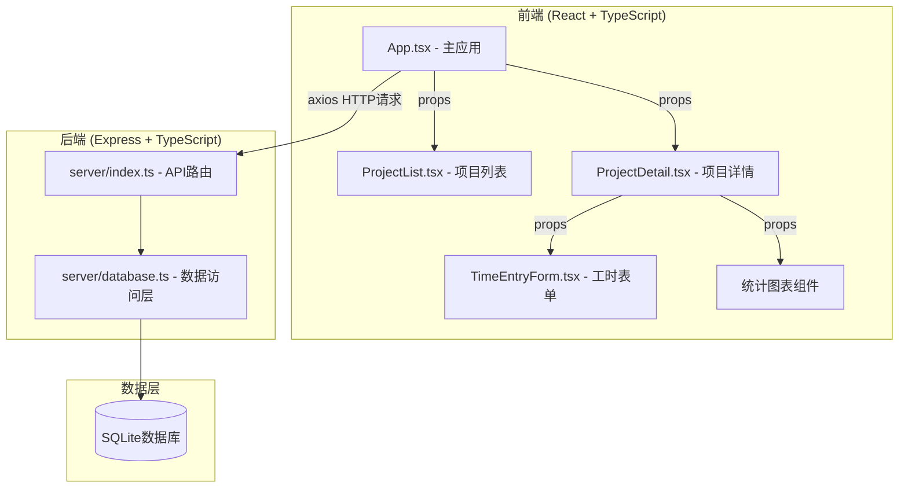
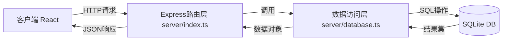
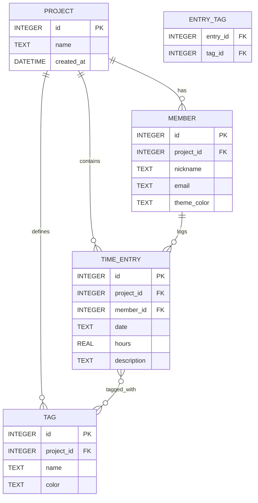

## 1. 架构设计



## 2. 技术说明
- **前端框架**：React 18 + TypeScript（严格模式）
- **构建工具**：Vite + @vitejs/plugin-react
- **图表库**：recharts
- **HTTP客户端**：axios
- **后端**：Express 4 + TypeScript
- **数据库**：better-sqlite3（同步SQLite驱动）
- **跨域支持**：cors

## 3. 路由定义
| 路由 | 用途 |
|------|------|
| / | 项目列表首页 |
| /project/:id | 项目详情页（含工时记录和统计） |

## 4. API 定义

### 项目 API
```typescript
// GET /api/projects - 获取所有项目
// POST /api/projects - 创建新项目
interface Project {
  id: number;
  name: string;
  createdAt: string;
}

// GET /api/projects/:id/members - 获取项目成员
// POST /api/projects/:id/members - 添加项目成员
interface Member {
  id: number;
  projectId: number;
  nickname: string;
  email: string;
  themeColor: string;
}

// GET /api/projects/:id/entries?period=week|month&date=YYYY-MM-DD - 获取工时记录
// POST /api/projects/:id/entries - 新增工时记录
// DELETE /api/entries/:id - 删除工时记录
interface TimeEntry {
  id: number;
  projectId: number;
  memberId: number;
  date: string; // YYYY-MM-DD
  hours: number; // 0.5-24，步进0.5
  description: string;
  tags: Tag[];
}

// GET /api/projects/:id/tags - 获取项目标签
// POST /api/projects/:id/tags - 新增标签
interface Tag {
  id: number;
  projectId: number;
  name: string;
  color: string;
}
```

## 5. 服务器架构图



## 6. 数据模型

### 6.1 ER 图



### 6.2 DDL 语句

```sql
CREATE TABLE IF NOT EXISTS projects (
  id INTEGER PRIMARY KEY AUTOINCREMENT,
  name TEXT NOT NULL,
  created_at DATETIME DEFAULT CURRENT_TIMESTAMP
);

CREATE TABLE IF NOT EXISTS members (
  id INTEGER PRIMARY KEY AUTOINCREMENT,
  project_id INTEGER NOT NULL,
  nickname TEXT NOT NULL,
  email TEXT NOT NULL,
  theme_color TEXT NOT NULL,
  FOREIGN KEY (project_id) REFERENCES projects(id)
);

CREATE TABLE IF NOT EXISTS time_entries (
  id INTEGER PRIMARY KEY AUTOINCREMENT,
  project_id INTEGER NOT NULL,
  member_id INTEGER NOT NULL,
  date TEXT NOT NULL,
  hours REAL NOT NULL CHECK(hours >= 0.5 AND hours <= 24),
  description TEXT NOT NULL,
  FOREIGN KEY (project_id) REFERENCES projects(id),
  FOREIGN KEY (member_id) REFERENCES members(id)
);

CREATE TABLE IF NOT EXISTS tags (
  id INTEGER PRIMARY KEY AUTOINCREMENT,
  project_id INTEGER NOT NULL,
  name TEXT NOT NULL,
  color TEXT NOT NULL,
  FOREIGN KEY (project_id) REFERENCES projects(id)
);

CREATE TABLE IF NOT EXISTS entry_tag (
  entry_id INTEGER NOT NULL,
  tag_id INTEGER NOT NULL,
  PRIMARY KEY (entry_id, tag_id),
  FOREIGN KEY (entry_id) REFERENCES time_entries(id),
  FOREIGN KEY (tag_id) REFERENCES tags(id)
);

CREATE INDEX IF NOT EXISTS idx_entries_date ON time_entries(date);
CREATE INDEX IF NOT EXISTS idx_entries_member ON time_entries(member_id);
CREATE INDEX IF NOT EXISTS idx_entries_project ON time_entries(project_id);
```
