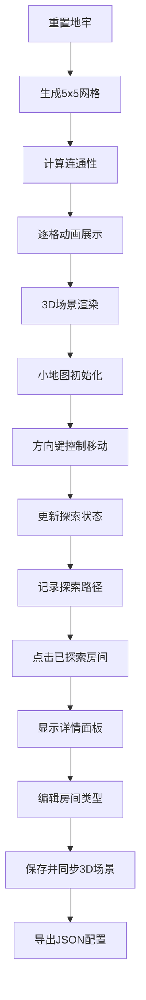

## 1. 产品概述

Roguelike地牢探索可视化工具，用于帮助地牢关卡设计师实时验证房间布局、走廊连通性和隐藏房间出现概率，提供3D地牢场景与2D小地图的双向联动展示。

- 解决问题：设计师在调整地牢参数时缺少实时可视化工具来验证连通性和探索路径逻辑
- 目标用户：游戏关卡设计师、Roguelike游戏开发者
- 核心价值：通过即时可视化反馈提升地牢设计效率和质量

## 2. 核心功能

### 2.1 用户角色

| 角色 | 注册方式 | 核心权限 |
|------|----------|----------|
| 设计师 | 无需注册 | 生成地牢、编辑房间属性、导出配置 |

### 2.2 功能模块

1. **地牢生成模块**：5x5网格随机地牢生成，包含起止房间、隐藏房间、连通性算法
2. **小地图模块**：2D俯视实时小地图，显示探索进度和路径记录
3. **玩家控制模块**：键盘方向键控制角色移动，触发房间探索和路径更新
4. **房间详情模块**：点击已探索房间查看和编辑房间属性
5. **工具模块**：重置生成、导出JSON配置

### 2.3 页面详情

| 页面名称 | 模块名称 | 功能描述 |
|----------|----------|----------|
| 主页面 | 3D地牢场景 | Three.js渲染的45度俯视角地牢，包含房间、走廊、角色 |
| 主页面 | 小地图面板 | 左侧悬浮面板，实时显示探索状态和路径连线 |
| 主页面 | 房间详情面板 | 右侧弹出面板，显示和编辑房间属性 |
| 主页面 | 工具栏 | 底部重置按钮、右上角导出按钮 |

## 3. 核心流程

设计师点击重置按钮 → 地牢逐格生成动画（0.3秒延迟）→ 3D场景和小地图同步显示 → 使用方向键控制角色移动 → 小地图实时更新探索状态和路径 → 点击已探索房间查看详情 → 修改房间类型并保存 → 3D场景同步更新 → 点击导出按钮下载JSON配置

## 4. 用户界面设计

### 4.1 设计风格

- 主背景色：#1a1a2e（深蓝紫色）
- 文字颜色：#e0e0e0（浅灰色）
- 房间颜色：起始房间绿色、出口金色脉冲、隐藏房间半透明闪烁、墙壁深灰色
- 小地图：已探索浅灰色、未探索黑色、当前房间亮蓝色边框、角色青色圆点
- 按钮风格：红色圆角重置按钮、绿色圆角导出按钮
- 动画：0.3秒房间展开动画、0.3秒摄像机过渡、0.2秒路径渐变、0.15秒悬停缩放

### 4.2 页面设计概述

| 页面名称 | 模块名称 | UI元素 |
|----------|----------|--------|
| 主页面 | 3D场景 | 45度俯视角、房间方块、走廊线条、青色角色、雾效 |
| 主页面 | 小地图面板 | 250px宽、半透明悬浮、30x30px方块、细白线走廊 |
| 主页面 | 详情面板 | 300px宽、白底黑字、标签页头、确认/取消按钮 |
| 主页面 | 工具栏 | 底部红色重置按钮、右上角绿色导出按钮 |

### 4.3 响应式

- 桌面端（≥1200px）：左侧小地图、中央3D场景、右侧详情面板
- 平板端（768px-1199px）：保持三栏布局，适当缩小面板宽度
- 移动端（<768px）：小地图和详情面板改为底部横向滚动排列，3D场景占满上部

### 4.4 3D场景设计

- 环境：深蓝紫色背景，四周轻微雾效
- 灯光：环境光 + 方向光，出口房间有金色自发光脉冲动画
- 相机：45度俯视角，房间切换时0.3秒平滑过渡
- 构图：5x5网格居中，房间大小统一，走廊连接房间中心
- 交互：房间可点击，角色移动有动画
- 后处理：轻微抗锯齿，出口房间辉光效果
- 性能：场景帧率≥25fps，小地图帧率≥30fps
