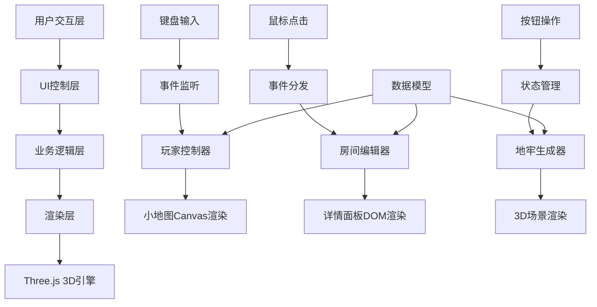

## 1. 架构设计



## 2. 技术描述

- 前端框架：React@18 + TypeScript@5
- 构建工具：Vite@5 + @vitejs/plugin-react
- 3D引擎：Three.js@0.160
- 样式方案：原生CSS + CSS变量
- 无后端、无数据库，纯前端应用

## 3. 项目文件结构

```
项目根目录
├── package.json          # 项目依赖和脚本
├── vite.config.js        # Vite配置
├── tsconfig.json         # TypeScript配置
├── index.html            # 入口HTML
└── src/
    ├── main.ts           # 应用入口
    ├── dungeonGenerator.ts  # 地牢生成逻辑
    ├── minimap.ts        # 小地图渲染
    ├── playerController.ts  # 玩家移动控制
    └── roomPanel.ts      # 房间详情面板
```

## 4. 数据模型

### 4.1 数据类型定义

```typescript
type RoomType = 'normal' | 'start' | 'exit' | 'treasure' | 'monster' | 'hidden';

interface Room {
  x: number;
  y: number;
  type: RoomType;
  explored: boolean;
  cleared: boolean;
  connections: { x: number; y: number }[];
}

interface DungeonData {
  grid: Room[][];
  width: number;
  height: number;
  startRoom: { x: number; y: number };
  exitRoom: { x: number; y: number };
}

interface PlayerState {
  x: number;
  y: number;
  path: { x: number; y: number }[];
}
```

### 4.2 核心数据结构

| 结构名称 | 字段 | 类型 | 说明 |
|----------|------|------|------|
| Room | x | number | 房间X坐标 |
| Room | y | number | 房间Y坐标 |
| Room | type | RoomType | 房间类型 |
| Room | explored | boolean | 是否已探索 |
| Room | cleared | boolean | 是否已清空 |
| Room | connections | Array | 连通房间列表 |
| DungeonData | grid | Room[][] | 房间矩阵 |
| DungeonData | width | number | 地牢宽度 |
| DungeonData | height | number | 地牢高度 |
| PlayerState | x | number | 玩家X坐标 |
| PlayerState | y | number | 玩家Y坐标 |
| PlayerState | path | Array | 探索路径记录 |

## 5. 模块接口定义

### 5.1 地牢生成模块

```typescript
function generateDungeon(
  width: number,
  height: number,
  options?: {
    seed?: number;
    hiddenRoomProbability?: number;
  }
): DungeonData;
```

### 5.2 小地图模块

```typescript
function initMinimap(
  canvas: HTMLCanvasElement,
  dungeon: DungeonData
): void;

function updateMinimap(
  canvas: HTMLCanvasElement,
  dungeon: DungeonData,
  player: PlayerState
): void;
```

### 5.3 玩家控制模块

```typescript
function handleKeyDown(
  event: KeyboardEvent,
  dungeon: DungeonData,
  player: PlayerState,
  onRoomChange: (room: Room) => void
): PlayerState | null;
```

### 5.4 房间详情面板

```typescript
function renderRoomPanel(
  container: HTMLElement,
  room: Room,
  onSave: (room: Room) => void,
  onCancel: () => void
): void;

function updateRoomPanel(
  container: HTMLElement,
  room: Room
): void;
```

## 6. 性能优化策略

- 小地图使用Canvas离屏渲染，帧率≥30fps
- 3D场景使用Three.js实例化渲染，帧率≥25fps
- 房间生成动画使用requestAnimationFrame，避免阻塞主线程
- 路径连线使用渐变动画，减少重绘次数
- 响应式布局使用CSS媒体查询，避免JS频繁计算
