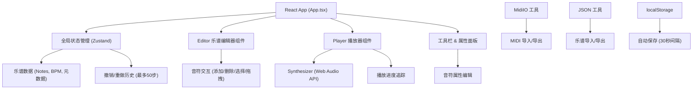
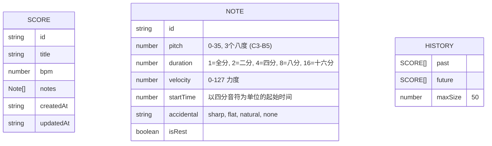

## 1. 架构设计



## 2. 技术描述
- **前端**：React 18 + TypeScript + Vite
- **状态管理**：Zustand
- **样式**：Tailwind CSS 3 + 自定义CSS毛玻璃效果
- **音频引擎**：Web Audio API (原生合成器)
- **MIDI处理**：midi-parser-js
- **图标**：lucide-react

## 3. 路由定义
| 路由 | 用途 |
|------|------|
| / | 主编辑器页面（单页应用，无路由跳转） |

## 4. 数据模型

### 4.1 数据模型定义



### 4.2 核心TypeScript类型定义

```typescript
export type Accidental = 'sharp' | 'flat' | 'natural' | 'none';
export type Duration = 1 | 2 | 4 | 8 | 16;

export interface Note {
  id: string;
  pitch: number;
  duration: Duration;
  velocity: number;
  startTime: number;
  accidental: Accidental;
  isRest: boolean;
}

export interface Score {
  id: string;
  title: string;
  bpm: number;
  notes: Note[];
  createdAt: string;
  updatedAt: string;
}

export interface AppState {
  score: Score;
  selectedNoteIds: string[];
  isPlaying: boolean;
  currentTime: number;
  metronomeEnabled: boolean;
  history: {
    past: Score[];
    future: Score[];
  };
}
```

## 5. 文件结构
```
src/
├── App.tsx                 # 主应用组件，全局状态管理
├── components/
│   ├── Editor.tsx          # 乐谱编辑器组件
│   ├── Player.tsx          # 播放器组件
│   ├── Toolbar.tsx         # 左侧工具栏
│   ├── PropertiesPanel.tsx # 右侧属性面板
│   └── NoteNode.tsx        # 音符节点组件
├── utils/
│   ├── Synthesizer.ts      # Web Audio API合成器引擎
│   ├── MidiIO.ts           # MIDI导入/导出工具
│   ├── ScoreIO.ts          # JSON乐谱导入/导出
│   └── helpers.ts          # 辅助函数 (音高转换、ID生成等)
├── store/
│   └── useStore.ts         # Zustand 全局状态管理
├── types/
│   └── index.ts            # 类型定义
└── index.css               # 全局样式与Tailwind配置
```

## 6. 关键实现要点

### 6.1 Web Audio API 合成器
- 使用 `OscillatorNode` 生成正弦/三角波形
- 通过 `GainNode` 控制音量和ADSR包络
- 节拍器使用独立的高频短音 (800Hz, 50ms)
- 音频延迟控制在 20ms 以内

### 6.2 撤销/重做
- 每次乐谱修改前保存快照到 `history.past`
- 历史记录最多保存 50 步
- 撤销时将当前状态推入 `history.future`

### 6.3 自动保存
- 30秒间隔定时保存到 localStorage
- 使用防抖避免频繁写入

### 6.4 性能优化
- 编辑操作响应时间低于 100ms
- 音符渲染使用 CSS 变换而非 DOM 重排
- 播放进度使用 `requestAnimationFrame` 平滑更新
