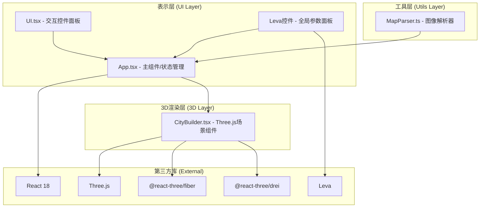

## 1. 架构设计

本项目为纯前端3D交互应用，采用分层架构设计。



## 2. 技术栈描述

- **前端框架**：React 18 + TypeScript
- **构建工具**：Vite 5
- **3D渲染**：Three.js + @react-three/fiber + @react-three/drei
- **参数面板**：Leva
- **状态管理**：React useState/useRef（轻量级，无需全局状态库）
- **Vite模板**：react-ts

## 3. 模块调用关系

### 3.1 文件结构

```
src/
├── main.tsx              # React入口，挂载App
├── App.tsx               # 主组件，状态管理中心
├── components/
│   ├── CityBuilder.tsx   # 3D场景核心组件
│   └── UI.tsx            # 用户交互面板
├── utils/
│   └── MapParser.ts      # 图像解析工具
└── types/
    └── city.ts           # 类型定义
```

### 3.2 数据流向

| 数据类型 | 源模块 | 目标模块 | 流转方式 |
|----------|--------|----------|----------|
| File对象 | UI.tsx | App.tsx | props回调 |
| CityData | MapParser.ts | App.tsx | 函数返回值 |
| CityData | App.tsx | CityBuilder.tsx | props传入 |
| 选中索引数组 | CityBuilder.tsx | App.tsx | props回调 |
| 全局参数 | Leva控件 | App.tsx | useControls返回值 |
| 光照模式 | UI.tsx/App.tsx | CityBuilder.tsx | props传入 |
| 高度/颜色调整 | UI.tsx | App.tsx | props回调 |
| 建筑状态更新 | App.tsx | CityBuilder.tsx | props重新渲染 |

## 4. 数据模型

### 4.1 核心类型定义

```typescript
// 地块类型枚举
enum LandClass {
  COMMERCIAL = 'commercial',   // 红色 - 商业区
  RESIDENTIAL = 'residential', // 蓝色 - 住宅区
  INDUSTRIAL = 'industrial',   // 绿色 - 工业区
  GREENBELT = 'greenbelt',     // 紫色 - 绿化带
  ROAD = 'road',               // 黑色 - 道路
}

// 分类图颜色映射
const CLASS_COLORS: Record<string, LandClass> = {
  '#ff0000': LandClass.COMMERCIAL,
  '#0000ff': LandClass.RESIDENTIAL,
  '#00ff00': LandClass.INDUSTRIAL,
  '#800080': LandClass.GREENBELT,
  '#000000': LandClass.ROAD,
};

// 单个建筑数据
interface Building {
  id: string;
  gridX: number;
  gridZ: number;
  height: number;       // 0-100米
  landClass: LandClass;
  color: string;
  isSelected: boolean;
  highlightTime: number; // 高亮时间戳
}

// 城市数据模型
interface CityData {
  width: number;         // 网格宽度
  height: number;        // 网格高度
  heightMap: number[][]; // 高度值二维数组 0-100
  classMap: LandClass[][]; // 地块类型二维数组
  buildings: Building[]; // 建筑列表
}

// 全局参数
interface GlobalParams {
  density: number;       // 0.6-1.0
  baseSize: number;      // 2-6米
  roadWidth: number;     // 4-16米
}

// 光照模式
type LightMode = 'sunset' | 'night';
```

## 5. 关键技术决策

### 5.1 性能优化策略

1. **InstancedMesh合并渲染**：14400个建筑使用InstancedMesh减少Draw Call
2. **Frustum Culling**：Three.js默认视锥剔除，不可见建筑不渲染
3. **Shadow Map优化**：调整阴影贴图分辨率平衡质量与性能
4. **建筑高度动画**：使用@react-three/fiber的useFrame插值计算
5. **图片解析优化**：使用Uint8ClampedArray直接读取像素，避免重复遍历

### 5.2 框选实现方案

1. **屏幕空间坐标转换**：将鼠标屏幕坐标转换为NDC坐标
2. **Raycaster投射**：对建筑进行射线拾取
3. **矩形区域检测**：遍历建筑投影位置，判断是否在选框内
4. **选框可视化**：CSS渲染覆盖在Canvas上方的半透明矩形

### 5.3 高亮渐隐实现

1. 为每个建筑记录`highlightTime`时间戳
2. useFrame中根据当前时间计算透明度：`opacity = max(0, 1 - (now - highlightTime - 2000) / 800)`
3. EdgesGeometry + LineSegments绘制虚线边框

### 5.4 夜景窗户实现

1. 使用ShaderMaterial或平面Mesh叠加
2. 根据建筑ID哈希生成固定随机种子，确保亮灯位置稳定
3. 窗户占正面15%面积，随机分布0-8个发光方块
4. 使用自发光材质(emissive)或单独的发光层
