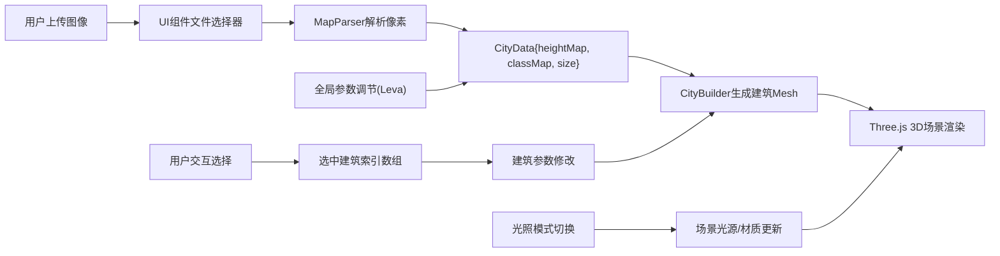

## 1. 产品概述

3D交互式城市建筑群生成与布局调节应用，为数字孪生和城市规划设计师提供从二维地图到三维城市模型的自动化生成工具。用户上传灰度高度图和地块分类图，应用实时生成带有建筑体块、道路网格的三维城市，并支持交互式调整。

- **主要目标**：解决手动建模效率低、布局呆板的问题，实现从2D图像到3D城市模型的快速转换
- **目标用户**：数字孪生设计师、城市规划师、建筑可视化从业者
- **产品价值**：将数小时的手动建模工作缩短至秒级，同时提供灵活的交互式调节能力

## 2. 核心功能

### 2.1 功能模块

1. **图像上传与解析模块**：支持上传PNG灰度高度图和彩色地块分类图，自动解析像素数据
2. **3D城市生成模块**：根据解析数据生成建筑体块阵列，自动添加道路网格
3. **交互选择模块**：鼠标单击/拖拽框选建筑，高亮显示选中对象
4. **建筑调节模块**：滑块调整高度、颜色选择器修改建筑外观
5. **光照模式切换模块**：日落模式与夜景模式一键切换
6. **全局参数调节模块**：通过Leva面板调整建筑密度、基底尺寸、道路宽度

### 2.3 功能详情

| 功能模块 | 子功能 | 描述 |
|----------|--------|------|
| 图像上传 | 灰度高度图上传 | 支持128x128/256x256 PNG，灰度值0-255映射0-100米高度 |
| 图像上传 | 地块分类图上传 | 同尺寸PNG，红/蓝/绿/紫=商业/住宅/工业/绿化，黑色=道路 |
| 3D城市生成 | 建筑体块 | 4x4米基底网格，高度和颜色按像素值映射 |
| 3D城市生成 | 道路网格 | 道路宽度可调（4-16米，默认8米），黑色区域不生成建筑 |
| 交互选择 | 单击选择 | 点击单栋建筑高亮显示 |
| 交互选择 | 拖拽框选 | 出现半透明天蓝色矩形选框，0.2秒缓入动画 |
| 交互选择 | 高亮效果 | 黄色虚线边框2单位粗细，持续2秒后0.8秒渐隐 |
| 建筑调节 | 高度调节 | 滑块0-100米，实时更新选中建筑高度 |
| 建筑调节 | 颜色调节 | 颜色选择器，实时修改选中建筑外观 |
| 光照模式 | 日落模式 | 暖色调光源#ff9a44，柔和阴影，环境光强度0.3 |
| 光照模式 | 夜景模式 | 冷色灯光#4a90d9，环境光0.1，随机窗户灯光 |
| 全局参数 | 建筑密度 | 0.6-1.0，默认0.85，控制非道路区生成比例 |
| 全局参数 | 基底尺寸 | 2-6米步进1米，默认4米，调节建筑大小 |
| 全局参数 | 道路宽度 | 4-16米步进2米，默认8米，调整道路间距 |
| 全局参数 | 再生动画 | 参数变更时0.4秒平移动画 |

## 3. 核心流程

### 3.1 主用户流程

用户进入应用→上传灰度高度图→上传地块分类图→系统自动解析并生成3D城市→用户拖拽旋转/缩放查看→框选或单击选中建筑→调整高度和颜色→切换光照模式→调整全局参数→实时查看效果

### 3.2 数据流图

## 4. 用户界面设计

### 4.1 设计风格

- **主色调**：深灰色#2d3748
- **强调色**：
  - 渐变蓝上传按钮：#3182ce → #2b6cb0
  - 滑块进度条：#63b3ed
  - 框选边框：半透明天蓝色
  - 建筑高亮：黄色虚线边框
- **按钮样式**：圆角矩形，悬停放大1.05倍（0.2秒动画）
- **字体**：现代无衬线字体，建立清晰视觉层级
- **布局风格**：3D场景全屏居中，UI面板左下角浮动

### 4.2 UI组件样式

| 组件 | UI元素 | 样式描述 |
|------|--------|----------|
| 文件上传按钮 | 渐变蓝色按钮 | 线性渐变#3182ce→#2b6cb0，圆角，悬停放大 |
| 高度滑块 | 圆角矩形滑块 | 浅蓝色#63b3ed进度条，圆形拖拽柄 |
| 颜色选择器 | 弹出式面板 | 圆形色块触发，网格色板面板 |
| 光照切换按钮 | 并排圆形图标 | 太阳/月亮图标，白色竖线分隔 |
| Leva参数面板 | 控制面板 | 默认风格，置于右上角 |
| 左下角UI面板 | 毛玻璃容器 | 背景模糊8px，透明度0.85 |
| 响应式折叠 | 浮动图标 | <768px时折叠为可拖拽图标，点击展开 |

### 4.3 响应式设计

- **桌面端（≥1366x768 / 1920x1080）**：UI面板固定左下角，完整展示所有控件，3D场景完整显示
- **移动端（<768px）**：UI面板自动折叠为可拖动的浮动图标，点击图标展开完整面板，优化触控交互

### 4.4 3D场景设计

- **相机设置**：OrbitControls围绕原点旋转，阻尼系数0.2，缩放范围5-200单位
- **光照配置**：
  - 日落模式：方向光#ff9a44 + 环境光0.3强度，启用柔和阴影
  - 夜景模式：方向光#4a90d9 + 环境光0.1强度，窗户发光材质
- **环境氛围**：地面浅灰色，背景色根据光照模式动态调整
- **窗户灯光**：建筑正面随机生成黄色发光小方块，每栋0-8个，窗格占面15%
- **动画效果**：建筑选中2秒高亮后0.8秒渐隐，全局参数变更0.4秒平移动画
