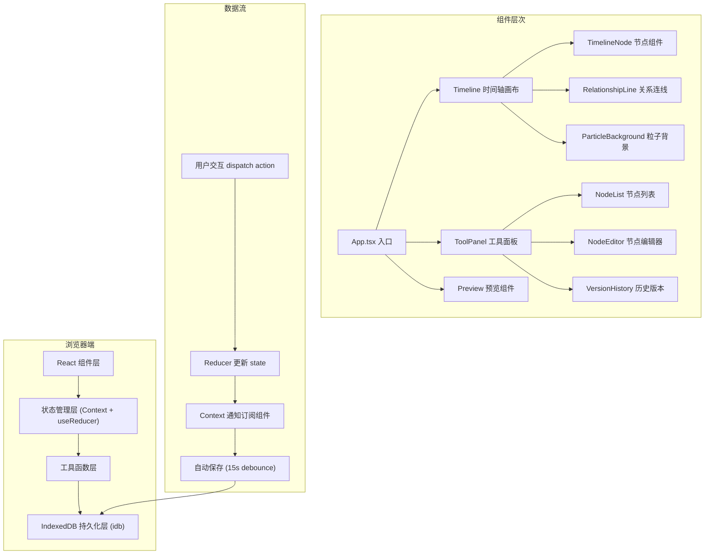
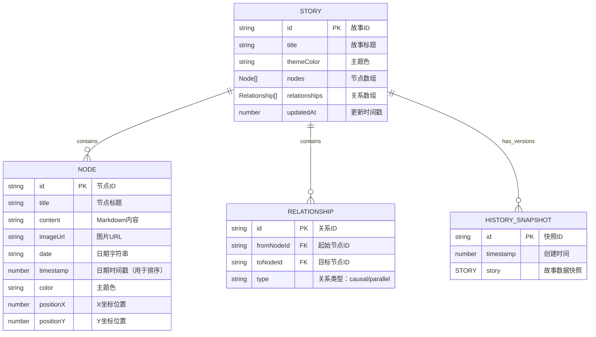

## 1. 架构设计



## 2. 技术选型描述

- **前端框架**：React 18 + TypeScript 5 + Vite 5
- **构建工具**：Vite 5，配置路径别名 `@/` 指向 `src/`
- **状态管理**：React Context + useReducer（轻量级，符合需求）
- **本地存储**：idb（IndexedDB 封装库），支持自动保存和历史版本
- **Markdown 解析**：marked 库
- **工具函数**：lodash.debounce（防抖处理）
- **样式方案**：原生 CSS + CSS Variables（避免额外依赖，性能更优）
- **性能优化**：React.memo 避免不必要重渲染，虚拟列表只渲染视口内节点

## 3. 目录结构与文件定义

```
src/
├── store/
│   └── index.ts          # 状态管理：Context + useReducer，useStoryStore hook
├── components/
│   ├── Timeline.tsx      # 时间轴组件：水平节点渲染、关系连线、滚轮/拖拽交互
│   ├── ToolPanel.tsx     # 工具面板：节点列表、添加/删除、全局设置
│   └── Preview.tsx       # 预览组件：自动播放、播放控制、URL参数解析
├── utils/
│   ├── storage.ts        # IndexedDB 封装：读写、历史快照、Base64编解码
│   └── animation.ts      # 动画辅助：关键帧生成、FPS监控
├── types/
│   └── index.ts          # TypeScript 类型定义
├── App.tsx               # 根组件
├── main.tsx              # 入口文件
└── index.css             # 全局样式 + CSS Variables
```

## 4. 路由定义

| 路由 | 用途 |
|-------|---------|
| `/` | 编辑器主页面（默认） |
| `/preview` | 全屏预览模式（从编辑器进入） |
| `/s/{data}` | 分享链接只读视图（Base64编码数据在URL中） |

## 5. 数据模型定义

### 5.1 核心数据结构



### 5.2 TypeScript 类型定义

```typescript
export type NodeColor = '#5A67D8' | '#ED64A6' | '#DD6B20' | '#38A169' | '#ECC94B';

export type RelationshipType = 'causal' | 'parallel';

export interface StoryNode {
  id: string;
  title: string;
  content: string;
  imageUrl: string;
  date: string;
  timestamp: number;
  color: NodeColor;
  positionX: number;
  positionY: number;
}

export interface Relationship {
  id: string;
  fromNodeId: string;
  toNodeId: string;
  type: RelationshipType;
}

export interface Story {
  id: string;
  title: string;
  themeColor: NodeColor;
  nodes: StoryNode[];
  relationships: Relationship[];
  updatedAt: number;
}

export interface HistorySnapshot {
  id: string;
  timestamp: number;
  story: Story;
}

export type AppMode = 'edit' | 'preview' | 'share';

export interface StoryState {
  story: Story;
  selectedNodeId: string | null;
  mode: AppMode;
  historySnapshots: HistorySnapshot[];
}

export type StoryAction =
  | { type: 'ADD_NODE'; payload: StoryNode }
  | { type: 'UPDATE_NODE'; payload: { id: string; updates: Partial<StoryNode> } }
  | { type: 'DELETE_NODE'; payload: string }
  | { type: 'SELECT_NODE'; payload: string | null }
  | { type: 'ADD_RELATIONSHIP'; payload: Relationship }
  | { type: 'DELETE_RELATIONSHIP'; payload: string }
  | { type: 'UPDATE_STORY_TITLE'; payload: string }
  | { type: 'SET_MODE'; payload: AppMode }
  | { type: 'LOAD_STORY'; payload: Story }
  | { type: 'SAVE_SNAPSHOT'; payload: HistorySnapshot }
  | { type: 'RESTORE_SNAPSHOT'; payload: Story };
```

## 6. 关键技术实现方案

### 6.1 时间轴缩放算法
- 节点按 `timestamp` 排序，计算最大最小时间跨度
- 节点间距 = (时间差 / 总时间跨度) * 最大间距，最小间距 40px
- 拖拽节点后重新计算所有节点位置

### 6.2 虚拟列表实现
- 监听滚动容器的 `scrollLeft`
- 计算视口可见范围，只渲染 X 坐标在可见范围内的节点
- 预留缓冲区避免滚动时空白

### 6.3 惯性滚动实现
- 记录拖拽速度向量 `(vx, vy)`
- 释放后应用 `requestAnimationFrame` 动画
- 每帧速度乘以摩擦系数 0.85，直到速度小于阈值停止

### 6.4 性能监控
- `animation.ts` 中封装 `FPSMonitor` 类
- 使用 `requestAnimationFrame` 统计每秒帧数
- 开发模式下可在控制台输出 FPS 数据

### 6.5 自动保存机制
- 使用 `lodash.debounce` 包装保存函数，延迟 15 秒
- 每次 state 变化触发 debounced save
- 保存时同时维护最近 5 个历史快照

## 7. 配置文件说明

### 7.1 package.json 依赖
```json
{
  "dependencies": {
    "react": "^18.2.0",
    "react-dom": "^18.2.0",
    "idb": "^8.0.0",
    "marked": "^12.0.0",
    "lodash.debounce": "^4.0.8"
  },
  "devDependencies": {
    "typescript": "^5.4.0",
    "vite": "^5.2.0",
    "@vitejs/plugin-react": "^4.2.0",
    "@types/react": "^18.2.0",
    "@types/react-dom": "^18.2.0",
    "@types/lodash.debounce": "^4.0.9"
  }
}
```

### 7.2 vite.config.js 路径别名
```javascript
export default {
  resolve: {
    alias: {
      '@': path.resolve(__dirname, './src')
    }
  }
}
```

### 7.3 tsconfig.json 严格模式
```json
{
  "compilerOptions": {
    "strict": true,
    "baseUrl": ".",
    "paths": {
      "@/*": ["src/*"]
    }
  }
}
```
