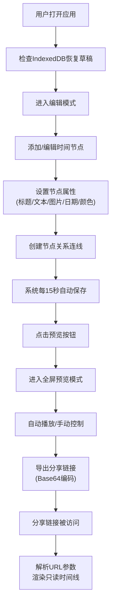

## 1. 产品概述

交互式时间线故事编辑器是一款面向历史爱好者和内容创作者的Web应用，解决了传统静态文章难以直观展示复杂事件脉络的问题，让用户能够创建沉浸式、可交互的多媒体时间线叙事作品。

- **核心价值**：将线性文字叙事转化为可视化时间轴，支持节点拖拽、关系连线、多媒体嵌入，让读者能够按时间滑动探索事件、人物和关系
- **目标用户**：历史研究者、自媒体创作者、教育工作者、故事讲述者

## 2. 核心功能

### 2.1 用户角色

| 角色 | 注册方式 | 核心权限 |
|------|----------|----------|
| 内容创作者 | 无需注册，本地使用 | 创建、编辑、预览、导出时间线故事 |
| 读者 | 无需注册 | 通过分享链接浏览和自动播放时间线故事 |

### 2.2 功能模块

1. **编辑器主界面**：左侧可折叠工具面板 + 右侧时间轴画布
2. **节点管理**：添加、删除、拖拽、编辑时间节点（标题、Markdown文本、图片、日期、主题色）
3. **关系连线**：标记节点间的因果关系（红色）和并行关系（蓝色）
4. **自动播放预览**：全屏沉浸式阅读，节点依次动画出现，可调节播放速度
5. **分享导出**：Base64编码URL参数生成只读分享链接
6. **本地持久化**：IndexedDB自动保存 + 5次历史版本快照管理

### 2.3 页面详情

| 页面名称 | 模块名称 | 功能描述 |
|-----------|-------------|---------------------|
| 编辑器页面 | 工具面板 | 节点列表展示、添加节点按钮、故事标题编辑、主题设置、历史版本管理 |
| 编辑器页面 | 时间轴画布 | 水平时间轴渲染、节点拖拽、关系连线绘制、滚轮滚动、惯性平移 |
| 预览页面 | 自动播放控制 | 播放/暂停、速度调节（0.5x-2x）、进度条跳转、节点切换动画 |
| 分享页面 | 只读视图 | 从URL参数解析数据，展示完整时间线，支持播放但不可编辑 |

## 3. 核心流程

## 4. 用户界面设计

### 4.1 设计风格
- **整体基调**：暗色主题，专业沉稳，突出内容本身
- **主背景色**：#1A202C（深灰蓝），次要底色：#2D3748（中灰蓝）
- **文字主色**：#E2E8F0（浅灰白），高对比度确保可读性
- **主题色系统**：5种预设色 #5A67D8（靛蓝）、#ED64A6（粉红）、#DD6B20（橙色）、#38A169（绿色）、#ECC94B（黄色）
- **交互元素**：所有状态变化伴随 0.2s ease 平滑过渡
- **字体选择**：展示字体使用 "Playfair Display"（优雅衬线，适合历史叙事），正文字体使用 "JetBrains Mono"（清晰等宽，适合代码和时间标注）

### 4.2 页面设计概述

| 页面名称 | 模块名称 | UI元素 |
|-----------|-------------|-------------|
| 编辑器页面 | 工具面板 | 默认宽280px，可折叠仅显图标，水平滑入动画0.2s；节点列表含缩略预览；右下角浮动添加按钮（48px圆形，悬停放大至52px带投影） |
| 编辑器页面 | 时间轴画布 | 节点圆形32px，选中时脉动光环（2s周期，透明度0.3-0.6循环），悬停放大至36px显示tooltip；背景50个粒子缓慢浮动（2-6px，透明度0.1，30FPS）；节点进入视口从下方弹入（0.4s ease-out） |
| 预览页面 | 播放控制 | 底部进度条可点击跳转；文字淡入、图片渐显过渡1s；速度调节0.5x-2x |

### 4.3 响应式设计
- **桌面优先**：最小宽度1024px，标准适配1280px及以上
- **窄屏适配**：宽度小于1024px时，工具面板变为悬浮按钮呼出
- **交互优化**：支持鼠标滚轮横向滚动、拖拽平移（惯性滚动，摩擦系数0.85）

### 4.4 动效设计指引
- **节点入场**：translateY(20px) → translateY(0) + opacity 0 → 1，持续0.4s ease-out
- **选中状态**：box-shadow 光环脉动，scale 1.0 → 1.1 → 1.0，周期2s
- **背景粒子**：50个圆形元素，大小2-6px随机，透明度0.1，位置缓慢随机漂移，30FPS固定刷新率
- **关系连线**：SVG贝塞尔曲线，因果关系红色(#E53E3E)，并行关系蓝色(#3182CE)
