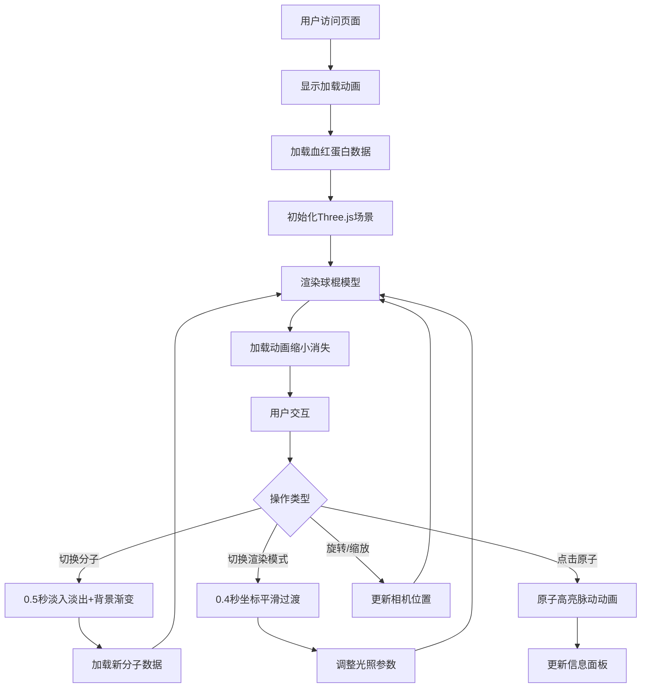

## 1. 产品概述

本产品是一个浏览器端的3D交互式蛋白质分子结构可视化与交互分析应用，旨在解决生物化学教学中学生难以理解蛋白质三维空间结构的痛点。通过真实的3D渲染和交互式探索，帮助学生直观理解蛋白质折叠、原子间相互作用及配体结合位点。

- **目标用户**：生物化学/分子生物学教师、学生、科研人员
- **核心价值**：将抽象的分子结构转化为可交互的3D可视化模型，提供沉浸式学习体验
- **市场定位**：教育科研领域的专业可视化工具，替代传统静态图表和二维动画

## 2. 核心功能

### 2.1 用户角色

| 角色 | 注册方式 | 核心权限 |
|------|----------|----------|
| 普通用户 | 无需注册，浏览器直接访问 | 浏览所有分子模型、进行交互操作、查看原子信息 |

### 2.2 功能模块

1. **分子选择模块**：左侧边栏展示4个预设蛋白质（血红蛋白、胰岛素、绿色荧光蛋白、溶菌酶）的缩略图，点击切换
2. **3D渲染模块**：球棍模型和卡通模型两种渲染模式，支持CPK配色和二级结构配色
3. **交互控制模块**：轨道控制（旋转、平移、缩放），点击原子查询信息
4. **信息展示模块**：右侧信息面板展示选中原子/残基的详细化学属性
5. **加载动画模块**：Three.js环形加载动画，平滑过渡效果

### 2.3 页面详情

| 页面名称 | 模块名称 | 功能描述 |
|----------|----------|----------|
| 主页面 | 左侧边栏 | 4个分子缩略图（64x64px），选中时蓝色边框高亮；渲染模式切换按钮组 |
| 主页面 | 3D主场景 | Three.js渲染的分子模型，支持交互操作，底部显示分子名称和统计信息 |
| 主页面 | 右侧信息面板 | 展示选中原子的元素符号、序号、残基信息、链信息、质量、范德华半径、疏水性等 |
| 主页面 | 帮助浮层 | 点击右上角?按钮弹出操作说明，0.2秒ease-out动画 |
| 主页面 | 加载动画 | 蓝紫渐变RingGeometry旋转动画，加载完成后scale缩小消失 |

## 3. 核心流程

用户进入应用后默认加载血红蛋白分子的球棍模型，可通过左侧边栏切换分子或渲染模式，点击任意原子查看详细信息，支持鼠标交互旋转缩放。

## 4. 用户界面设计

### 4.1 设计风格

- **主色调**：#0d1117 深空背景，#3182ce 蓝色高亮，#2b6cb0 深蓝hover
- **辅助色**：CPK配色（碳#808080、氧#ff0000、氮#0000ff、硫#ffff00、磷#ffa500），二级结构配色（alpha螺旋#ff4444、beta折叠#ffff44、无规卷曲#44ff44）
- **按钮风格**：圆角矩形，#2d3748背景，#a0aec0文字，激活态#3182ce背景白色文字
- **字体**：现代无衬线字体，标题18px，正文14px，小字体12px
- **布局风格**：左右分栏布局，左侧180px固定侧边栏，右侧自适应主场景
- **图标风格**：简洁的线性图标，使用lucide-react

### 4.2 页面设计概述

| 页面名称 | 模块名称 | UI元素 |
|----------|----------|--------|
| 主页面 | 左侧边栏 | 深色#1a202c背景，分子缩略图网格，模式切换按钮组，选中蓝色#3182ce边框 |
| 主页面 | 3D主场景 | 全屏WebGL渲染，底部半透明黑条显示分子名称（白色18px）和统计信息 |
| 主页面 | 右侧信息面板 | #edf2f7浅灰背景，#2d3748深灰字体，滚动列表布局，相邻原子可点击跳转 |
| 主页面 | 帮助按钮 | 圆形#e2e8f0背景，#2d3748文字，悬停#3182ce背景白色文字 |
| 主页面 | 加载动画 | 蓝紫渐变RingGeometry，直径120px，2秒旋转周期 |

### 4.3 响应式设计

- **桌面端**（≥768px）：左右分栏布局，侧边栏180px固定宽度
- **移动端**（<768px）：侧边栏收回为顶部可折叠菜单栏，汉堡图标展开收起，场景全屏
- **触摸优化**：支持双指缩放、单指旋转，点击区域≥44px

### 4.4 3D场景指导

- **环境与氛围**：深蓝到深紫渐变背景，分子切换时平滑过渡
- **光照设置**：
  - 球棍模式：右上角-45度点光源，强度0.8
  - 卡通模式：环境光强度0.6 + 下方背光强度0.3
- **相机设置**：初始位置距离分子中心10个单位正上方俯视，PerspectiveCamera fov=60
- **交互与动画**：
  - 原子点击：半径放大20%，半透明黄色环，0.3秒脉动
  - 分子切换：0.5秒淡入淡出，背景色渐变
  - 模式切换：0.4秒坐标平滑移动到卡通带控制点
- **后处理**：抗锯齿（MSAA），雾化效果增强深度感
- **性能预算**：≥45 FPS，原子点击响应≤100ms，加载≤1.5秒

## 5. 性能约束

- **帧率要求**：普通配置浏览器（Chrome 110，Intel i5，8G内存）≥45 FPS
- **加载时间**：血红蛋白（约6000原子）≤1.5秒
- **响应时间**：原子点击响应≤100毫秒
- **LOD策略**：原子数量超过10000时，远处原子自动降为点云渲染
