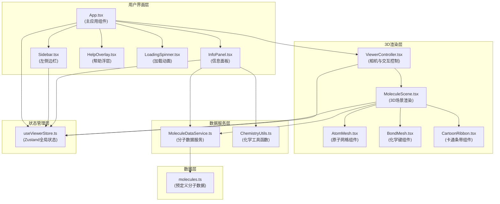
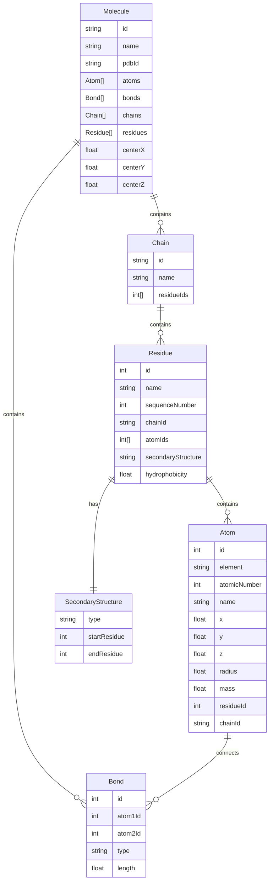

## 1. 架构设计



**数据流说明**：
1. `App.tsx` 作为根组件，从 `MoleculeDataService` 加载分子数据，通过 Zustand store 共享全局状态
2. 左侧边栏 `Sidebar.tsx` 接收用户分子选择和模式切换，更新 store
3. `ViewerController.tsx` 监听 store 变化，控制相机和渲染模式
4. `MoleculeScene.tsx` 根据当前分子和模式，调用 `ChemistryUtils` 计算几何属性，生成 Three.js 网格
5. 用户点击原子时，`MoleculeScene` 触发回调，`InfoPanel` 从 store 获取选中原子信息并展示

## 2. 技术描述

### 2.1 前端技术栈
- **框架**：React 18 + TypeScript
- **构建工具**：Vite 5
- **3D渲染**：Three.js 0.160 + @react-three/fiber 8.15 + @react-three/drei 9.92
- **状态管理**：Zustand 4.4
- **HTTP客户端**：Axios 1.6
- **图标库**：lucide-react 0.294
- **样式方案**：Tailwind CSS 3.4 + CSS Modules

### 2.2 核心依赖版本
```json
{
  "react": "^18.2.0",
  "react-dom": "^18.2.0",
  "typescript": "^5.3.0",
  "vite": "^5.0.0",
  "@vitejs/plugin-react": "^4.2.0",
  "three": "^0.160.0",
  "@react-three/fiber": "^8.15.0",
  "@react-three/drei": "^9.92.0",
  "zustand": "^4.4.0",
  "axios": "^1.6.0",
  "lucide-react": "^0.294.0",
  "tailwindcss": "^3.4.0"
}
```

## 3. 路由定义

| 路由 | 用途 |
|------|------|
| / | 主页面，3D分子可视化场景（单页应用，无多路由） |

## 4. 数据模型定义

### 4.1 核心数据结构



### 4.2 TypeScript 类型定义

```typescript
// 原子类型
interface Atom {
  id: number;
  element: string;
  atomicNumber: number;
  name: string;
  x: number;
  y: number;
  z: number;
  radius: number;
  mass: number;
  residueId: number;
  chainId: string;
}

// 化学键类型
interface Bond {
  id: number;
  atom1Id: number;
  atom2Id: number;
  type: 'single' | 'double' | 'triple' | 'aromatic';
  length: number;
}

// 残基类型
interface Residue {
  id: number;
  name: string;
  sequenceNumber: number;
  chainId: string;
  atomIds: number[];
  secondaryStructure: 'helix' | 'sheet' | 'coil';
  hydrophobicity: number;
}

// 链类型
interface Chain {
  id: string;
  name: string;
  residueIds: number[];
}

// 分子类型
interface Molecule {
  id: string;
  name: string;
  pdbId: string;
  atoms: Atom[];
  bonds: Bond[];
  chains: Chain[];
  residues: Residue[];
  center: [number, number, number];
}

// 渲染模式
type RenderMode = 'ballstick' | 'cartoon';

// 全局状态
interface ViewerState {
  currentMolecule: Molecule | null;
  selectedAtom: Atom | null;
  renderMode: RenderMode;
  isLoading: boolean;
  backgroundColor: string;
  showHelp: boolean;
  sidebarCollapsed: boolean;
  actions: {
    setMolecule: (mol: Molecule) => void;
    selectAtom: (atom: Atom | null) => void;
    setRenderMode: (mode: RenderMode) => void;
    setLoading: (loading: boolean) => void;
    toggleHelp: () => void;
    toggleSidebar: () => void;
  };
}
```

## 5. 项目文件结构

```
src/
├── App.tsx                      # 主应用组件
├── main.tsx                     # 应用入口
├── index.css                    # 全局样式
├── components/
│   ├── MoleculeScene.tsx        # 3D场景渲染组件
│   ├── ViewerController.tsx     # 相机与交互控制
│   ├── InfoPanel.tsx            # 原子信息面板
│   ├── Sidebar.tsx              # 左侧边栏
│   ├── LoadingSpinner.tsx       # 加载动画
│   ├── HelpOverlay.tsx          # 帮助浮层
│   ├── AtomMesh.tsx             # 原子网格组件
│   ├── BondMesh.tsx             # 化学键组件
│   └── CartoonRibbon.tsx        # 卡通条带组件
├── services/
│   └── MoleculeDataService.ts   # 分子数据服务
├── utils/
│   └── ChemistryUtils.ts        # 化学工具函数
├── data/
│   └── molecules.ts             # 预定义分子数据
├── store/
│   └── useViewerStore.ts        # Zustand全局状态
└── types/
    └── index.ts                 # TypeScript类型定义
```

**文件调用关系**：
1. `App.tsx` → 调用 `ViewerController`、`Sidebar`、`InfoPanel`、`LoadingSpinner`、`HelpOverlay`
2. `ViewerController.tsx` → 调用 `MoleculeScene`，使用 `OrbitControls`
3. `MoleculeScene.tsx` → 调用 `AtomMesh`、`BondMesh`、`CartoonRibbon`，使用 `MoleculeDataService` 和 `ChemistryUtils`
4. `InfoPanel.tsx` → 使用 `ChemistryUtils` 查询属性
5. `Sidebar.tsx` → 使用 `MoleculeDataService` 获取分子列表
6. `MoleculeDataService.ts` → 导入 `molecules.ts` 数据

## 6. 性能优化策略

### 6.1 渲染性能
- **InstancedMesh**：使用 Three.js InstancedMesh 批量渲染同类原子，减少 draw call
- **LOD策略**：超过10000原子时，远处原子使用 Points 点云渲染
- **几何体复用**：预创建 SphereGeometry 和 CylinderGeometry 实例共享
- **材质缓存**：CPK配色材质预创建并缓存

### 6.2 交互性能
- **Raycaster优化**：限制射线检测对象为可见原子，使用 BVH 加速
- **事件节流**：mousemove 事件使用 requestAnimationFrame 节流
- **状态批处理**：Zustand 状态更新使用 batch 减少重渲染

### 6.3 加载性能
- **Web Worker**：分子数据解析在 Web Worker 中进行
- **数据分块**：大模型原子数据按需加载
- **资源预加载**：启动时预加载常用几何体和材质

## 7. 动画实现方案

### 7.1 原子高亮动画
使用 `@react-three/fiber` 的 `useFrame` hook，实现 0.3 秒脉动缩放：
```typescript
const scale = 1 + 0.2 * Math.sin(clock.elapsedTime * 10);
```

### 7.2 模式切换动画
使用 Three.js `lerp` 线性插值，0.4秒平滑过渡：
```typescript
targetPosition.lerp(cartoonPosition, 0.02);
```

### 7.3 分子切换动画
使用 CSS opacity 过渡 + Three.js 场景背景色 lerp：
```css
transition: opacity 0.5s ease-in-out;
```
