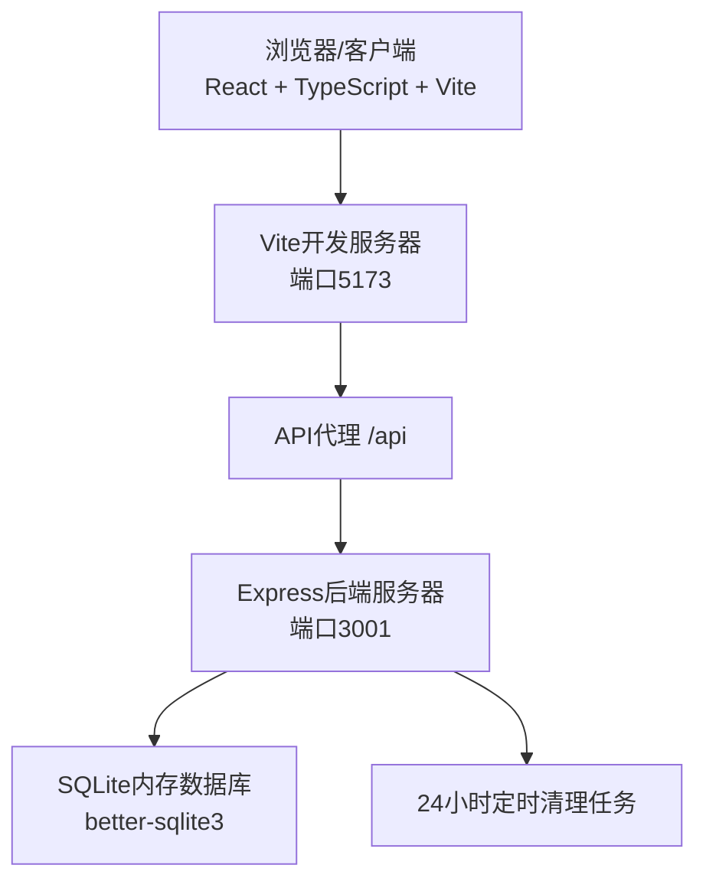
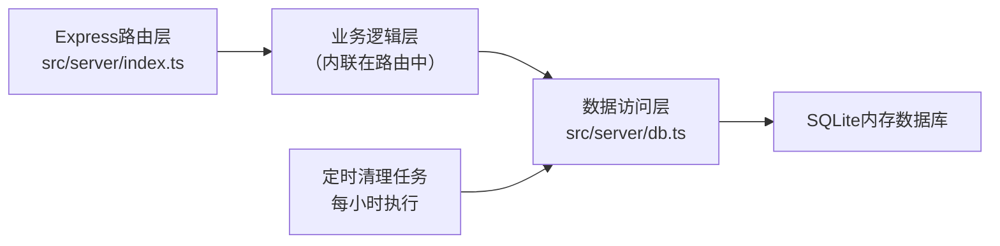
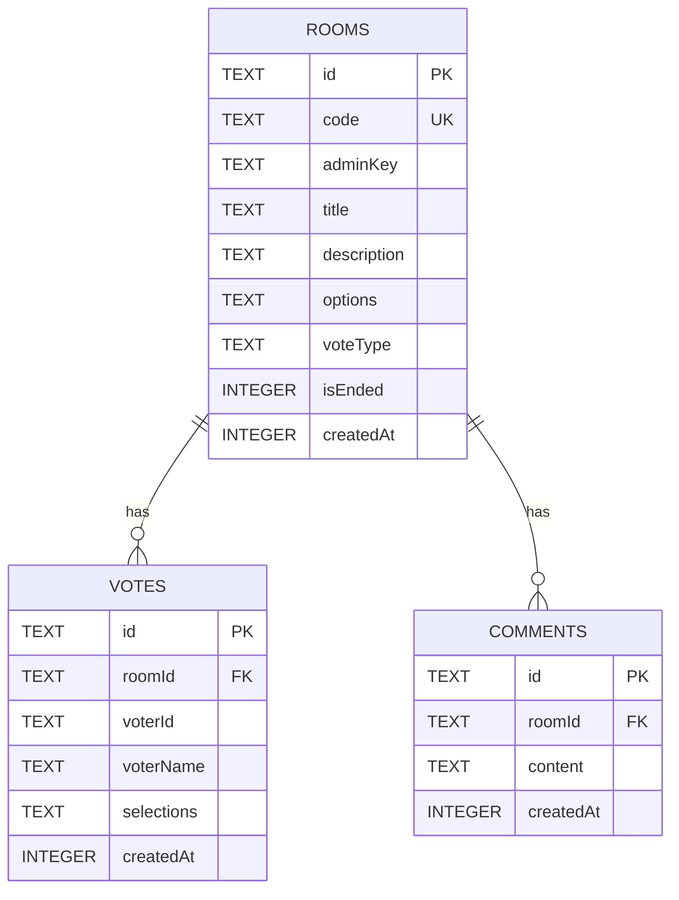

## 1. 架构设计



## 2. 技术说明

- **前端框架**：React@18 + TypeScript@5 + Vite@5
- **前端路由**：React Router（轻量Hash路由实现）
- **前端构建**：Vite，配置/api代理到后端3001端口
- **后端框架**：Express@4 + TypeScript
- **后端运行**：ts-node直接运行TypeScript源码
- **数据库**：better-sqlite3 内存模式（:memory:），无需持久化存储
- **并发启动**：concurrently 同时启动Vite前端和Express后端
- **ID生成**：uuid库用于生成投票者ID和评论ID

## 3. 路由定义

| 前端路由 | 页面组件 | 用途 |
|----------|----------|------|
| / | LobbyPage | 大厅页面 - 创建/加入房间 |
| /vote/:code | VotePage | 投票页面 - 选项选择与提交 |
| /result/:code | ResultPage | 结果页面 - 图表展示与讨论区 |

## 4. API接口定义

### 4.1 类型定义
```typescript
enum VoteType {
  SINGLE = 'single',
  MULTIPLE = 'multiple',
  RANKING = 'ranking'
}

interface Room {
  id: string;
  code: string;
  adminKey: string;
  title: string;
  description: string;
  options: string[];
  voteType: VoteType;
  isEnded: boolean;
  createdAt: number;
}

interface Vote {
  id: string;
  roomId: string;
  voterId: string;
  voterName: string | null;
  selections: number[];
  createdAt: number;
}

interface Comment {
  id: string;
  roomId: string;
  content: string;
  createdAt: number;
}

interface VoteResult {
  optionIndex: number;
  optionText: string;
  count: number;
  percentage: number;
  weightedScore?: number;
  voters: { voterId: string; voterName: string | null }[];
}
```

### 4.2 REST API端点

| 方法 | 路径 | 请求体 | 响应 | 说明 |
|------|------|--------|------|------|
| POST | /api/room | { title, description, options, voteType } | { code, adminKey, room } | 创建投票房间 |
| GET | /api/room/:code | - | Room | 获取房间信息 |
| POST | /api/room/:code/vote | { voterId, voterName?, selections } | { success } | 提交投票（同voterId覆盖） |
| GET | /api/room/:code/results | - | { results, totalVotes } | 获取实时投票结果 |
| POST | /api/room/:code/comment | { content } | { comment } | 发布匿名评论 |
| GET | /api/room/:code/comments | - | Comment[] | 获取评论列表（倒序） |
| DELETE | /api/room/:code/admin?key=xxx&action=end | - | { success } | 结束投票 |
| DELETE | /api/room/:code/admin?key=xxx&action=reset | - | { success } | 重置投票数据 |
| GET | /api/room/:code/export?key=xxx | - | CSV文件 | 导出投票结果CSV |
| DELETE | /api/room/:code/admin?key=xxx&action=delete | - | { success } | 删除整个房间 |

## 5. 服务端架构



- **Express路由层**：处理HTTP请求、参数校验、CORS、JSON解析
- **数据访问层**：封装SQLite CRUD操作，房间/投票/评论表操作
- **定时清理**：每小时检查一次，删除createdAt超过24小时的房间及其关联数据

## 6. 数据模型

### 6.1 ER图


### 6.2 DDL语句
```sql
CREATE TABLE IF NOT EXISTS rooms (
  id TEXT PRIMARY KEY,
  code TEXT UNIQUE NOT NULL,
  adminKey TEXT NOT NULL,
  title TEXT NOT NULL,
  description TEXT DEFAULT '',
  options TEXT NOT NULL,
  voteType TEXT NOT NULL,
  isEnded INTEGER DEFAULT 0,
  createdAt INTEGER NOT NULL
);

CREATE TABLE IF NOT EXISTS votes (
  id TEXT PRIMARY KEY,
  roomId TEXT NOT NULL,
  voterId TEXT NOT NULL,
  voterName TEXT,
  selections TEXT NOT NULL,
  createdAt INTEGER NOT NULL,
  FOREIGN KEY (roomId) REFERENCES rooms(id) ON DELETE CASCADE
);

CREATE UNIQUE INDEX IF NOT EXISTS idx_votes_room_voter ON votes(roomId, voterId);

CREATE TABLE IF NOT EXISTS comments (
  id TEXT PRIMARY KEY,
  roomId TEXT NOT NULL,
  content TEXT NOT NULL,
  createdAt INTEGER NOT NULL,
  FOREIGN KEY (roomId) REFERENCES rooms(id) ON DELETE CASCADE
);

CREATE INDEX IF NOT EXISTS idx_comments_room ON comments(roomId);
CREATE INDEX IF NOT EXISTS idx_rooms_createdAt ON rooms(createdAt);
```

## 7. 文件结构

```
project-root/
├── package.json
├── tsconfig.json
├── vite.config.js
├── index.html
└── src/
    ├── shared/
    │   └── types.ts          # 前后端共享类型
    ├── server/
    │   ├── index.ts          # Express服务器 + REST API
    │   └── db.ts             # SQLite数据库初始化与操作
    └── client/
        ├── App.tsx           # 主应用与路由
        ├── pages/
        │   ├── LobbyPage.tsx    # 大厅页
        │   ├── VotePage.tsx     # 投票页
        │   └── ResultPage.tsx   # 结果页
        └── components/
            ├── ChartBar.tsx     # 条形图组件
            └── ChartPie.tsx     # 饼图组件
```
