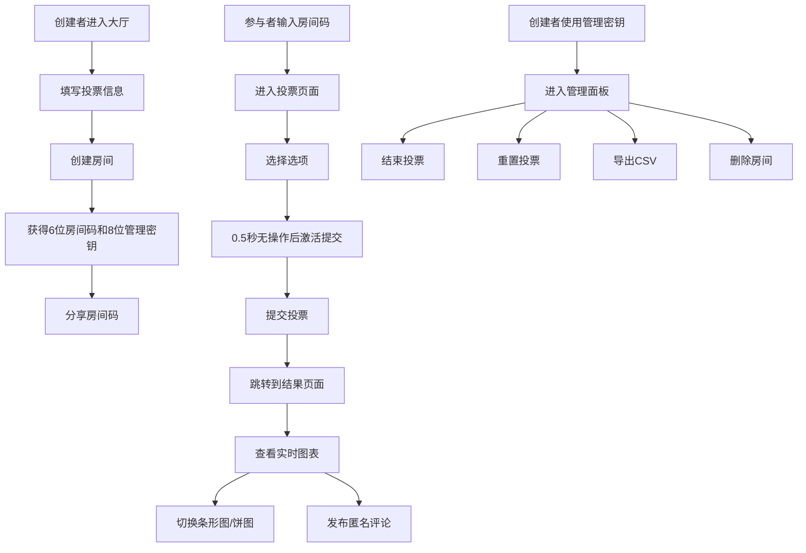

## 1. 产品概述
QuickVote 是一款面向小型创业团队和临时活动组织者的轻量级投票与观点收集应用。解决了现有投票工具功能过于正式（需注册、复杂规则）或缺乏直观实时展示与讨论功能的痛点，通过极简的房间码机制和实时互动体验，提升团队决策效率和参与率。

- 核心价值：无需注册、6位房间码快速加入、实时结果可视化、匿名讨论
- 目标用户：创业团队、项目组、临时活动组织者、课堂教学

## 2. 核心功能

### 2.1 用户角色
| 角色 | 进入方式 | 核心权限 |
|------|----------|----------|
| 房间创建者 | 创建房间自动成为创建者 | 设置投票主题/选项/类型、结束投票、重置投票、导出CSV、删除房间、查看管理密钥 |
| 投票参与者 | 输入6位房间码加入 | 查看投票、提交投票（可更改）、查看实时结果、发布匿名评论 |

### 2.2 功能模块
1. **大厅页面**：创建房间表单、加入房间输入框
2. **投票页面**：投票主题展示、选项卡片交互、提交投票
3. **结果页面**：图表切换展示（条形图/饼图）、实时数据更新、讨论区评论
4. **管理面板**：结束投票、重置投票、导出CSV、删除房间

### 2.3 页面详情
| 页面名称 | 模块名称 | 功能描述 |
|----------|----------|----------|
| 大厅页面 | 创建房间区域 | 输入主题、描述、添加选项（最多8个）、选择投票类型（单选/多选/排序），生成房间码和8位管理密钥 |
| 大厅页面 | 加入房间区域 | 输入6位房间码即可进入投票页面 |
| 投票页面 | 主题区域 | 大标题、投票描述、投票类型提示、房间码展示 |
| 投票页面 | 选项卡片区域 | 网格布局卡片，浅灰#edf2f7未选中/紫色#6b46c1选中，弹簧缩放动画，悬浮上浮效果 |
| 投票页面 | 提交区域 | 选择后0.5秒无操作自动激活提交按钮，支持随时更改选项 |
| 结果页面 | 图表区域 | 条形图/饼图切换（0.4秒淡入动画），水平条形图8种柔和色调，饼图可点击查看投票者 |
| 结果页面 | 讨论区 | 匿名评论输入（最多200字），时间倒序排列，淡入上滑动画（0.3s ease-out） |
| 管理面板 | 操作区域 | 结束投票（禁止新投票保留查看）、重置投票（清空记录）、导出CSV（选项名/票数/百分比）、删除房间 |

## 3. 核心流程

创建者在大厅填写投票信息并创建房间 → 系统生成6位房间码和8位管理密钥 → 创建者分享房间码给参与者 → 参与者输入房间码进入投票页面 → 参与者选择选项并提交投票 → 提交后自动跳转到结果页面查看实时图表 → 所有用户可在讨论区发布评论 → 创建者通过管理密钥进入管理面板进行结束/重置/导出/删除操作

## 4. 用户界面设计

### 4.1 设计风格
- 主背景：深灰蓝#1a202c
- 卡片背景：稍浅灰蓝#2d3748
- 文字主色：浅灰#e2e8f0
- 品牌色：紫色#6b46c1（按钮、选中状态、关键交互）
- 未选中卡片：浅灰#edf2f7
- 卡片圆角：16px大圆角，柔和投影
- 导航栏：56px高度，半透明毛玻璃效果，固定顶部
- 字体：现代无衬线字体，大标题醒目，正文清晰

### 4.2 页面设计概览
| 页面名称 | 模块名称 | UI元素 |
|----------|----------|--------|
| 大厅页面 | 创建/加入区域 | 双栏布局（桌面）/单栏（移动端），卡片式表单，紫色渐变按钮 |
| 投票页面 | 选项卡片 | 桌面4列/平板2列/手机1列网格，选中缩放弹簧动画，悬浮y轴-2px上浮 |
| 结果页面 | 图表区域 | 桌面横向图表/移动端垂直可滚动卡片，饼图扇形可交互，切换淡入动画 |
| 结果页面 | 讨论区 | 底部固定输入框，评论卡片时间倒序，新评论淡入上滑 |
| 管理面板 | 操作按钮 | 红色警告按钮（删除/重置），紫色主按钮（结束/导出），密钥展示区 |

### 4.3 响应式设计
- 桌面优先（Desktop-first）设计
- 断点：≥1024px桌面4列选项、768-1023px平板2列、<768px手机1列
- 移动端：柱状图隐藏Y轴标签，改用数值悬浮显示；图表区域变为垂直排列可滚动卡片
- 触摸优化：增大点击区域至44x44px，移除悬浮效果改用点击反馈

### 4.4 动效规范
- 选项卡选中：0.2秒弹簧缩放动画
- 选项卡悬浮：0.15秒y轴-2px上浮
- 图表切换：0.4秒淡入切换动画
- 新评论出现：0.3秒ease-out淡入上滑
- 按钮激活：平滑过渡效果
- 页面切换：淡入过渡

## 5. 性能要求
- 投票提交后结果刷新响应时间 ≤ 500ms
- 8个选项 + 50条评论初始加载 ≤ 2秒
- 数据24小时自动清理，支持手动删除
- 图表渲染使用CSS/SVG，避免重型图表库
