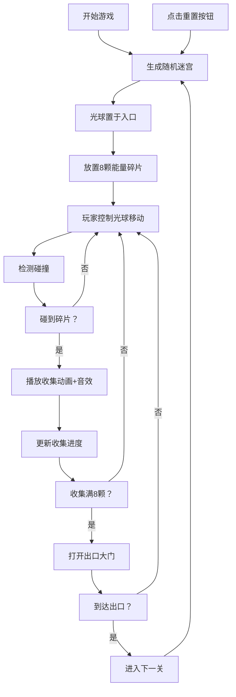

## 1. 产品概述

迷宫探险与动态光源收集是一款基于Canvas 2D的休闲益智小游戏。玩家操控发光光球在随机生成的迷宫中探索，收集散落的能量碎片以解锁通往下一关的大门。

- **核心玩法**：在黑暗迷宫中借助光球的动态照明探索路径，躲避墙壁，收集8颗能量碎片
- **目标用户**：休闲游戏玩家，喜欢解谜和探索类游戏的用户
- **市场价值**：每次游戏随机生成迷宫，提供高重复可玩性；动态光影效果带来沉浸式体验

## 2. 核心特性

### 2.1 用户角色
| 角色 | 注册方式 | 核心权限 |
|------|----------|----------|
| 玩家 | 无需注册 | 直接开始游戏，控制光球移动，收集碎片，重置关卡 |

### 2.2 功能模块
1. **游戏主界面**：迷宫渲染、光球控制、碎片收集、动态光照
2. **迷宫生成系统**：递归回溯算法生成10x10随机迷宫
3. **玩家控制系统**：方向键/WASD移动、惯性滑行、碰撞检测
4. **碎片系统**：8颗金色旋转碎片、粒子效果、收集动画
5. **UI界面**：关卡信息、计时、收集进度、重置按钮、性能统计

### 2.3 页面详情
| 页面名称 | 模块名称 | 功能描述 |
|----------|----------|----------|
| 游戏主页面 | 迷宫渲染 | 10x10网格迷宫，深蓝色墙壁，浅灰白色通道网格线 |
| 游戏主页面 | 光球控制 | 径向渐变发光圆，200像素/秒移动速度，0.15秒惯性衰减 |
| 游戏主页面 | 动态光照 | 半径60像素照明圈，圈内高亮，圈外黑暗渐变 |
| 游戏主页面 | 碎片系统 | 8颗金色三角星碎片，旋转动画，粒子效果 |
| 游戏主页面 | UI界面 | 左上角关卡+计时，右上角收集进度，底部重置按钮，左下角粒子数，右下角FPS |
| 游戏主页面 | 重置功能 | 重新生成迷宫，重置状态，按钮缩放闪烁动画 |

## 3. 核心流程

## 4. 用户界面设计

### 4.1 设计风格
- **主色调**：深蓝色(#1a365d)墙壁，浅灰白色(#e2e8f0)通道，背景色(#0f172a)
- **强调色**：金色(#fbbf24)碎片，青色(#38b2ac)性能统计文字
- **按钮样式**：圆角矩形，背景(#2d3748)，悬停(#4a5568)，0.2秒颜色过渡
- **字体**：等宽字体，14px性能统计，16px主UI文字
- **布局**：迷宫居中显示，四周深色渐变边框，UI元素分布在四角和底部
- **动画效果**：碎片旋转、粒子飘动、收集缩放动画、重置按钮闪烁

### 4.2 页面设计概述
| 页面名称 | 模块名称 | UI元素 |
|----------|----------|--------|
| 游戏主页面 | 迷宫区域 | 居中显示，10x10网格，深蓝色墙壁，浅灰色网格线 |
| 游戏主页面 | 光球 | 径向渐变发光圆，中心亮边缘透明，半径20像素 |
| 游戏主页面 | 照明圈 | 半径60像素，透明度从边缘0.7渐变到外围0.9 |
| 游戏主页面 | 碎片 | 金色四角星，16x16像素，每秒2圈旋转 |
| 游戏主页面 | 进度条 | 光球上方，高度6px，宽度等于迷宫宽度，深蓝到金色渐变 |
| 游戏主页面 | 左上UI | 关卡编号 + 已用时间（秒） |
| 游戏主页面 | 右上UI | 收集进度 x/8 |
| 游戏主页面 | 底部按钮 | 重置按钮，圆角矩形，悬停变色 |
| 游戏主页面 | 左下UI | 粒子数统计 |
| 游戏主页面 | 右下UI | FPS计数器，青绿色文字 |

### 4.3 响应式
- **桌面优先**：适配1920x1080及以上分辨率
- **Canvas自适应**：迷宫尺寸固定，整体居中显示
- **性能优化**：60粒子时FPS不低于55

### 4.4 性能要求
- 渲染帧率：目标60 FPS
- 粒子上限：60个活动粒子
- 性能监控：实时FPS和粒子数显示
