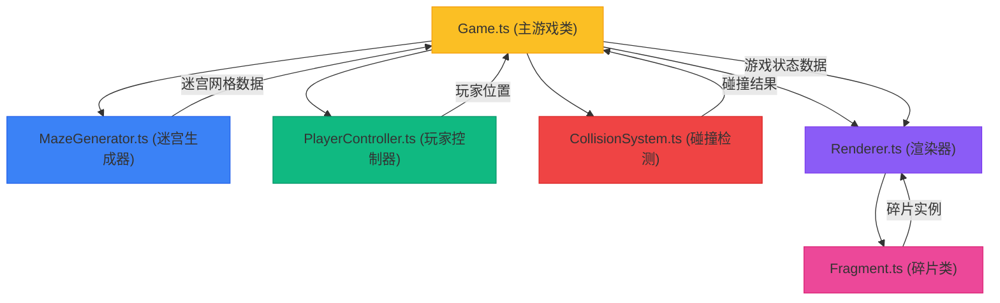
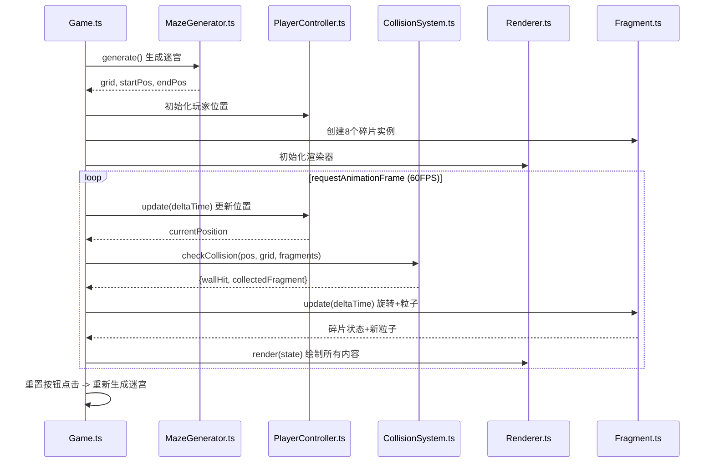

## 1. 架构设计



## 2. 技术描述

- **前端技术栈**：TypeScript 5.x + Vite 5.x + Canvas 2D API
- **构建工具**：Vite 5.x，提供快速开发服务器和热更新
- **语言**：TypeScript 5.x，严格模式（strict: true）
- **无后端**：纯前端Canvas游戏，无需后端服务
- **无数据库**：游戏状态内存管理，无需持久化存储

## 3. 项目结构

```
auto61/
├── package.json          # 项目依赖和脚本
├── vite.config.js        # Vite构建配置
├── tsconfig.json         # TypeScript配置（严格模式）
├── index.html            # 入口HTML文件
└── src/
    ├── Game.ts           # 主游戏类 - 管理游戏状态、主循环、输入、UI
    ├── MazeGenerator.ts  # 迷宫生成器 - 递归回溯算法生成10x10迷宫
    ├── Renderer.ts       # 渲染器 - 所有画面绘制逻辑
    ├── PlayerController.ts # 玩家控制器 - 光球位置、速度、惯性
    ├── CollisionSystem.ts  # 碰撞系统 - 墙壁碰撞、碎片收集检测
    └── Fragment.ts       # 碎片类 - 碎片属性、旋转、粒子、绘制
```

## 4. 数据流向



## 5. 核心数据模型

### 5.1 迷宫网格数据
```typescript
// 0 = 通道, 1 = 墙壁
type Grid = number[][];  // 10x10二维数组

interface MazeData {
  grid: Grid;
  startPosition: { x: number; y: number };
  endPosition: { x: number; y: number };
}
```

### 5.2 玩家状态
```typescript
interface PlayerState {
  x: number;           // 像素坐标X
  y: number;           // 像素坐标Y
  vx: number;          // 速度X
  vy: number;          // 速度Y
  direction: { up: boolean; down: boolean; left: boolean; right: boolean };
  inertiaTime: number; // 惯性剩余时间
}
```

### 5.3 碎片状态
```typescript
interface FragmentState {
  id: number;
  x: number;           // 格子坐标X
  y: number;           // 格子坐标Y
  rotation: number;    // 当前旋转角度
  rotationSpeed: number; // 旋转速度（弧度/秒）
  collected: boolean;  // 是否已收集
  scale: number;       // 缩放比例（收集动画用）
  disappearing: boolean; // 是否正在消失
}
```

### 5.4 粒子数据
```typescript
interface Particle {
  x: number;
  y: number;
  vx: number;
  vy: number;
  life: number;        // 剩余寿命（秒）
  maxLife: number;     // 最大寿命
  radius: number;
  color: string;
}
```

## 6. 模块职责

### 6.1 MazeGenerator.ts
- **职责**：使用递归回溯算法生成10x10迷宫
- **核心方法**：
  - `generate()`: 生成新迷宫
  - `getGrid()`: 获取迷宫网格数据
  - `getStartPosition()`: 获取入口位置
  - `getEndPosition()`: 获取出口位置
  - `getRandomFragmentPositions(count: number)`: 获取n个随机碎片位置

### 6.2 PlayerController.ts
- **职责**：管理光球的位置、速度、移动方向和惯性逻辑
- **核心方法**：
  - `update(deltaTime: number)`: 更新位置和速度
  - `getPosition()`: 获取当前像素坐标
  - `setDirection(direction)`: 设置移动方向
  - `releaseDirection()`: 释放方向键，开始惯性衰减

### 6.3 Fragment.ts
- **职责**：定义碎片属性、旋转动画、粒子生成和绘制
- **核心方法**：
  - `update(deltaTime: number)`: 更新旋转和粒子
  - `draw(ctx: CanvasRenderingContext2D, cellSize: number)`: 绘制碎片
  - `collect()`: 触发收集动画
  - `emitParticles()`: 生成光晕粒子

### 6.4 CollisionSystem.ts
- **职责**：处理所有碰撞检测逻辑
- **核心方法**：
  - `checkCollision(position, grid, fragments)`: 检测墙壁碰撞和碎片收集
  - `checkWallCollision(x, y, grid, cellSize)`: 基于网格的墙壁碰撞
  - `checkFragmentCollision(position, fragments)`: 基于距离的碎片碰撞

### 6.5 Renderer.ts
- **职责**：所有画面渲染逻辑
- **核心方法**：
  - `render(state)`: 主渲染入口，每帧调用
  - `drawMaze(grid)`: 绘制墙壁和通道网格线
  - `drawLightingCircle(x, y)`: 绘制动态照明圈
  - `drawPlayer(x, y)`: 绘制光球
  - `drawFragments(fragments)`: 绘制所有碎片
  - `drawParticles(particles)`: 绘制粒子
  - `drawProgressBar(progress)`: 绘制收集进度条
  - `drawUI(state)`: 绘制所有UI文字

### 6.6 Game.ts
- **职责**：主游戏控制器，协调整个游戏流程
- **核心方法**：
  - `init()`: 初始化游戏
  - `gameLoop(timestamp)`: requestAnimationFrame主循环
  - `handleInput()`: 键盘输入处理
  - `resetGame()`: 重置游戏状态
  - `updateTimer()`: 更新游戏计时

## 7. 性能优化策略

1. **离屏Canvas**：迷宫墙壁可预渲染到离屏Canvas，避免每帧重绘
2. **对象池**：粒子使用对象池复用，避免频繁GC
3. **脏矩形渲染**：只重绘变化区域（可选优化）
4. **帧率控制**：使用deltaTime确保移动速度与帧率无关
5. **粒子上限**：限制最大60个粒子，确保FPS≥55

## 8. 颜色常量定义

```typescript
const COLORS = {
  BACKGROUND: '#0f172a',
  WALL: '#1a365d',
  GRID_LINE: '#e2e8f0',
  PLAYER_CENTER: '#ffffff',
  PLAYER_EDGE: 'rgba(255, 255, 255, 0)',
  FRAGMENT: '#fbbf24',
  FRAGMENT_GLOW: 'rgba(251, 191, 36, 0.5)',
  PROGRESS_START: '#1a365d',
  PROGRESS_END: '#fbbf24',
  UI_TEXT: '#e2e8f0',
  FPS_TEXT: '#38b2ac',
  BUTTON_BG: '#2d3748',
  BUTTON_HOVER: '#4a5568',
  DARK_OVERLAY: 'rgba(15, 23, 42, ',
} as const;
```
