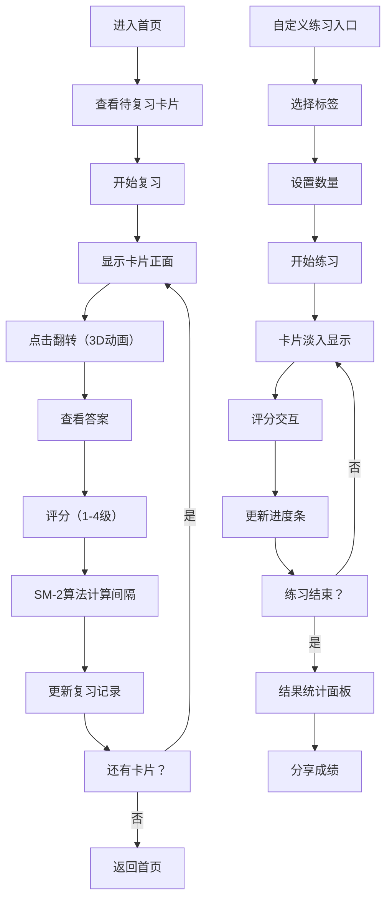

## 1. 产品概述

知识卡片闪卡复习系统是一款轻量级网页工具，帮助语言学习者和备考者通过科学的间隔重复算法高效记忆知识点。用户可快速创建正反面卡片，系统基于SM-2算法智能安排复习计划，解决传统纸质卡片不便携带、专业应用复杂付费的痛点。

- 核心价值：开箱即用的科学记忆工具，零学习成本，免费提供间隔重复算法
- 目标用户：语言学习者、考试备考者、需要记忆大量知识点的学生和职场人士

## 2. 核心功能

### 2.1 用户角色
| 角色 | 注册方式 | 核心权限 |
|------|----------|----------|
| 普通用户 | 无需注册，本地存储 | 创建/编辑/删除卡片，标签管理，复习练习，查看统计 |

### 2.2 功能模块
1. **首页仪表盘**：待复习卡片摘要、快速入口、卡片集列表预览
2. **卡片管理**：创建/编辑/删除卡片，Markdown支持，标签分类，3D卡片预览
3. **复习引擎**：SM-2间隔重复算法，1-4级评分，智能排序待复习卡片
4. **自定义练习**：标签筛选、数量设置、进度条、练习结果统计与分享

### 2.3 页面详情
| 页面名称 | 模块名称 | 功能描述 |
|----------|----------|----------|
| 首页 | 导航栏 | 固定顶部，深绿色背景，白色文字，0.5px底部阴影 |
| 首页 | 待复习摘要 | 显示今日待复习数量、已完成卡片绿色对勾徽章 |
| 首页 | 快速入口 | 开始复习、创建卡片、自定义练习按钮 |
| 首页 | 卡片集列表 | 卡片预览（正面），点击翻转查看背面，支持编辑删除 |
| 卡片编辑 | Markdown编辑器 | 正反面文本输入，支持Markdown格式 |
| 卡片编辑 | 标签管理 | 添加/删除标签，预设常用标签 |
| 复习页面 | 3D翻转卡片 | 0.3秒3D翻转动画，渐变分割线，ease-out缓动 |
| 复习页面 | 评分按钮 | 1-4级评分（完全忘记、困难、正常、轻松） |
| 练习模式 | 筛选设置 | 多标签选择、练习数量（10/20/50/全部） |
| 练习模式 | 进度条 | 显示当前练习位置，淡入动画切换卡片 |
| 练习结果 | 统计面板 | 正确率、平均评分、耗时统计 |
| 练习结果 | 分享功能 | 一键复制成绩文本到剪贴板 |

## 3. 核心流程

### 3.1 复习流程
用户进入首页查看待复习卡片 → 点击开始复习 → 卡片显示正面问题 → 点击翻转查看答案（3D动画） → 选择回忆难易程度评分 → 系统计算下次复习时间 → 继续下一张或返回首页

### 3.2 自定义练习流程
用户选择自定义练习 → 选择标签筛选卡片 → 设置练习数量 → 开始练习 → 逐张卡片复习（淡入动画） → 练习结束 → 查看结果统计 → 分享成绩或返回

## 4. 用户界面设计

### 4.1 设计风格
- **主色调**：深绿色 #1b4332（文字、导航栏）
- **背景色**：浅灰色 #f5f5f5（页面背景）、暖白色 #fef9ef（卡片背景）
- **卡片样式**：轻微阴影（box-shadow: 0 2px 8px rgba(0,0,0,0.08)），圆角8px
- **按钮风格**：圆角6px，悬停0.2秒背景色过渡动画
- **字体**：无衬线字体，标题18px粗体，正文14px常规
- **布局**：居中单列流式，最大宽度740px，卡片间距24px
- **图标风格**：简约线性图标，使用lucide-react

### 4.2 页面设计概述
| 页面名称 | 模块名称 | UI元素 |
|----------|----------|--------|
| 首页 | 导航栏 | 固定顶部，#1b4332背景，白色文字，0.5px底部阴影 |
| 首页 | 待复习卡片 | 暖白色卡片，轻微阴影，正面显示问题预览 |
| 首页 | 徽章 | 已完成卡片右上角绿色小对勾 |
| 卡片翻转 | 3D动画 | 0.3秒，ease-out，中间渐变分割线 |
| 练习模式 | 进度条 | 卡片下方，显示当前位置/总数 |
| 练习结果 | 统计面板 | 三列布局：正确率、平均评分、耗时 |
| 练习结果 | 分享按钮 | 右上角，复制文本到剪贴板 |

### 4.3 响应式设计
- **桌面端**（>600px）：最大宽度740px，卡片间距24px
- **手机端**（<600px）：卡片宽度100%，间距12px，字体缩小1-2号，触摸优化按钮尺寸
- **触控优化**：按钮最小高度44px，评分按钮横向排列适合拇指操作

### 4.4 动画效果
- **卡片翻转**：3D旋转180度，transform-style: preserve-3d，0.3s ease-out
- **翻转分割线**：渐变线从透明到#1b4332再到透明，动画同步进行
- **淡入动画**：opacity 0→1，0.3s ease-out，练习时卡片切换
- **按钮悬停**：背景色变化0.2s transition
- **进度条**：宽度变化0.3s ease-out

## 5. 性能要求
- 翻转动画帧率稳定在30fps以上
- 卡片集加载时间不超过500ms
- 首次启动自动创建数据库并插入5张示例卡片
