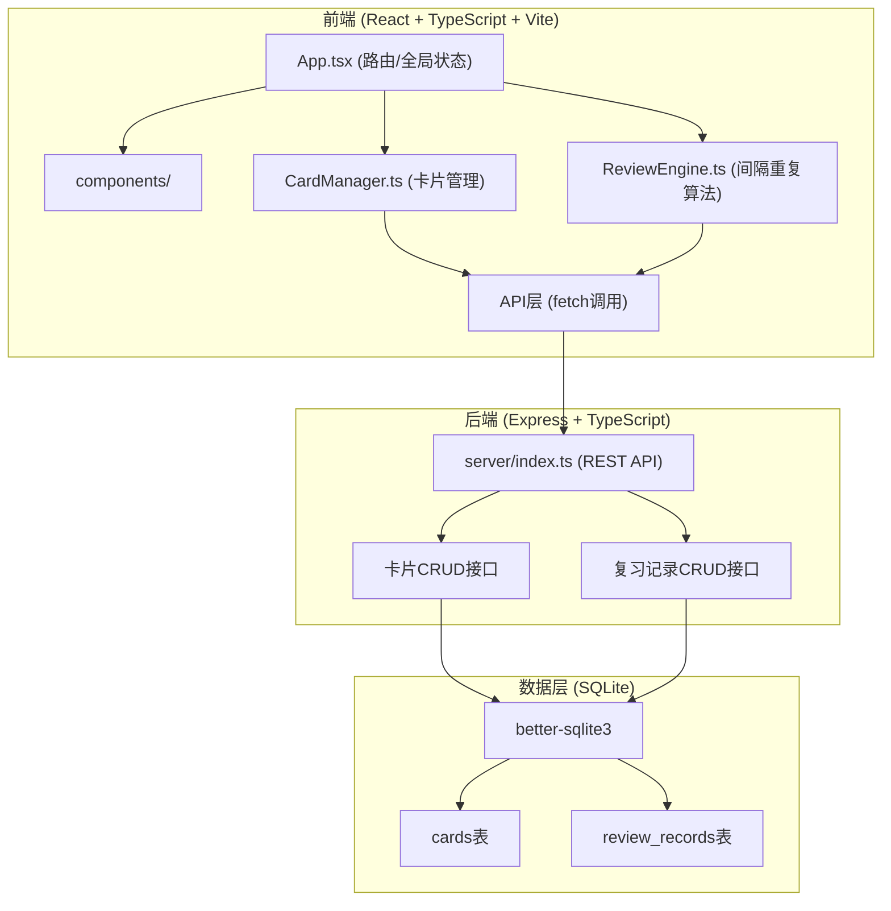
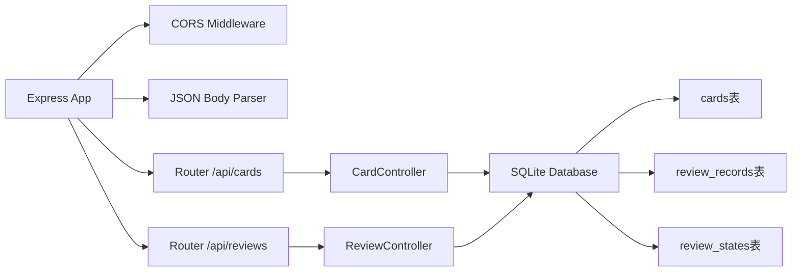

## 1. 架构设计



## 2. 技术描述

- **前端框架**：React 18 + TypeScript 5 + Vite 5
- **状态管理**：React useState/useEffect（轻量场景，无需额外状态库）
- **样式方案**：原生CSS（CSS变量 + 响应式媒体查询）
- **Markdown渲染**：react-markdown
- **图标库**：lucide-react
- **后端框架**：Express 4 + TypeScript
- **数据库**：SQLite（better-sqlite3驱动，同步API）
- **跨域处理**：cors中间件
- **构建工具**：Vite（前端）+ ts-node（后端开发）
- **包管理器**：npm

## 3. 项目结构

```
auto68/
├── package.json
├── vite.config.js
├── tsconfig.json
├── index.html
├── src/
│   ├── App.tsx              # 主应用组件，路由和全局状态
│   ├── CardManager.ts       # 卡片增删改查和标签筛选逻辑
│   ├── ReviewEngine.ts      # 间隔重复算法实现
│   ├── types.ts             # 类型定义
│   └── components/
│       ├── CardFlip.tsx     # 可翻转卡片组件
│       ├── Dashboard.tsx    # 首页仪表盘
│       ├── CardList.tsx     # 卡片列表组件
│       ├── CardEditor.tsx   # 卡片编辑器
│       ├── PracticeMode.tsx # 自定义练习模式
│       ├── PracticeResult.tsx # 练习结果面板
│       └── Navbar.tsx       # 顶部导航栏
└── server/
    └── index.ts             # Express服务器
```

## 4. 路由定义

| 路由 | 页面 | 说明 |
|------|------|------|
| / | 首页仪表盘 | 待复习卡片摘要、快速入口、卡片列表 |
| /review | 复习模式 | 按间隔重复算法复习卡片 |
| /practice | 自定义练习 | 标签筛选、数量设置、练习模式 |
| /cards | 卡片管理 | 卡片列表、创建/编辑/删除 |
| /cards/new | 新建卡片 | 创建新卡片表单 |
| /cards/:id/edit | 编辑卡片 | 编辑现有卡片 |

## 5. API定义

### 5.1 TypeScript类型定义

```typescript
// 卡片
interface Card {
  id: number;
  front: string;          // 正面（问题），Markdown
  back: string;           // 背面（答案），Markdown
  tags: string[];         // 标签数组
  createdAt: number;      // 创建时间戳
  updatedAt: number;      // 更新时间戳
}

// 复习记录
interface ReviewRecord {
  id: number;
  cardId: number;
  rating: 1 | 2 | 3 | 4;  // 评分：1-4
  reviewDate: number;     // 复习时间戳
  nextReviewDate: number; // 下次复习时间戳
  easeFactor: number;     // 难度系数
  interval: number;       // 间隔天数
  repetitions: number;    // 复习次数
}

// 复习状态
interface CardReviewState {
  cardId: number;
  easeFactor: number;     // 默认2.5
  interval: number;       // 默认0
  repetitions: number;    // 默认0
  nextReviewDate: number; // 默认今天
}

// 练习结果
interface PracticeResult {
  totalCards: number;
  correctCount: number;   // 评分>=3视为正确
  averageRating: number;
  durationMs: number;
  startTime: number;
  endTime: number;
  ratings: number[];
}
```

### 5.2 REST API接口

| 方法 | 路径 | 说明 | 请求体 | 响应 |
|------|------|------|--------|------|
| GET | /api/cards | 获取所有卡片 | - | Card[] |
| GET | /api/cards/:id | 获取单张卡片 | - | Card |
| POST | /api/cards | 创建卡片 | {front, back, tags} | Card |
| PUT | /api/cards/:id | 更新卡片 | {front, back, tags} | Card |
| DELETE | /api/cards/:id | 删除卡片 | - | {success: true} |
| GET | /api/cards/tags | 获取所有标签 | - | string[] |
| GET | /api/reviews/due | 获取待复习卡片 | - | Card[] |
| GET | /api/reviews/state/:cardId | 获取卡片复习状态 | - | CardReviewState |
| POST | /api/reviews | 提交复习评分 | {cardId, rating} | ReviewRecord |
| GET | /api/reviews/card/:cardId | 获取卡片复习历史 | - | ReviewRecord[] |

## 6. 服务器架构



## 7. 数据模型

### 7.1 ER图

```mermaid
erDiagram
    CARDS ||--o{ REVIEW_RECORDS : has
    CARDS ||--|| REVIEW_STATES : has
    
    CARDS {
        INTEGER id PK
        TEXT front
        TEXT back
        TEXT tags
        INTEGER created_at
        INTEGER updated_at
    }
    
    REVIEW_RECORDS {
        INTEGER id PK
        INTEGER card_id FK
        INTEGER rating
        INTEGER review_date
        INTEGER next_review_date
        REAL ease_factor
        INTEGER interval
        INTEGER repetitions
    }
    
    REVIEW_STATES {
        INTEGER id PK
        INTEGER card_id FK UNIQUE
        REAL ease_factor
        INTEGER interval
        INTEGER repetitions
        INTEGER next_review_date
    }
```

### 7.2 DDL语句

```sql
-- 卡片表
CREATE TABLE IF NOT EXISTS cards (
  id INTEGER PRIMARY KEY AUTOINCREMENT,
  front TEXT NOT NULL,
  back TEXT NOT NULL,
  tags TEXT NOT NULL DEFAULT '[]',
  created_at INTEGER NOT NULL,
  updated_at INTEGER NOT NULL
);

-- 复习记录表
CREATE TABLE IF NOT EXISTS review_records (
  id INTEGER PRIMARY KEY AUTOINCREMENT,
  card_id INTEGER NOT NULL,
  rating INTEGER NOT NULL CHECK(rating BETWEEN 1 AND 4),
  review_date INTEGER NOT NULL,
  next_review_date INTEGER NOT NULL,
  ease_factor REAL NOT NULL,
  interval INTEGER NOT NULL,
  repetitions INTEGER NOT NULL,
  FOREIGN KEY (card_id) REFERENCES cards(id) ON DELETE CASCADE
);

-- 复习状态表
CREATE TABLE IF NOT EXISTS review_states (
  id INTEGER PRIMARY KEY AUTOINCREMENT,
  card_id INTEGER NOT NULL UNIQUE,
  ease_factor REAL NOT NULL DEFAULT 2.5,
  interval INTEGER NOT NULL DEFAULT 0,
  repetitions INTEGER NOT NULL DEFAULT 0,
  next_review_date INTEGER NOT NULL,
  FOREIGN KEY (card_id) REFERENCES cards(id) ON DELETE CASCADE
);

-- 索引
CREATE INDEX IF NOT EXISTS idx_review_records_card_id ON review_records(card_id);
CREATE INDEX IF NOT EXISTS idx_review_states_next_review ON review_states(next_review_date);
CREATE INDEX IF NOT EXISTS idx_cards_tags ON cards(tags);

-- 示例卡片
INSERT OR IGNORE INTO cards (id, front, back, tags, created_at, updated_at) VALUES
(1, '**JavaScript** 中 `const` 和 `let` 的区别是什么？', '`const` 声明的变量不能重新赋值，`let` 可以。两者都是块级作用域。', '["编程","JavaScript"]', UNIXEPOCH(), UNIXEPOCH()),
(2, '**光合作用**的总反应式是什么？', '6CO₂ + 6H₂O → C₆H₁₂O₆ + 6O₂（需要光能和叶绿体）', '["生物","科学"]', UNIXEPOCH(), UNIXEPOCH()),
(3, '**英语语法**：`affect` 和 `effect` 的区别？', '`affect` 通常是动词（影响），`effect` 通常是名词（效果）。', '["英语","语法"]', UNIXEPOCH(), UNIXEPOCH()),
(4, '**二战**中诺曼底登陆的日期是？', '1944年6月6日（D-Day）', '["历史","二战"]', UNIXEPOCH(), UNIXEPOCH()),
(5, '**React** 中 `useEffect` 的第二个参数是什么作用？', '依赖数组。当数组中的值变化时，effect 才会重新执行。空数组表示只在挂载和卸载时执行。', '["编程","React"]', UNIXEPOCH(), UNIXEPOCH());

-- 为示例卡片初始化复习状态
INSERT OR IGNORE INTO review_states (card_id, ease_factor, interval, repetitions, next_review_date)
SELECT id, 2.5, 0, 0, UNIXEPOCH() FROM cards WHERE id <= 5;
```

## 8. 间隔重复算法（SM-2简化版）

### 算法逻辑
```typescript
// 输入：评分(1-4)、当前状态
// 输出：新状态（下次复习时间、间隔、难度系数、复习次数）

function calculateNextReview(
  rating: 1 | 2 | 3 | 4,
  currentState: CardReviewState
): CardReviewState {
  let { easeFactor, interval, repetitions } = currentState;
  
  if (rating < 3) {
    // 评分1-2：重置为学习阶段，明天再复习
    repetitions = 0;
    interval = 1;
  } else {
    // 评分3-4：正常递增
    if (repetitions === 0) {
      interval = 1;  // 1天后
    } else if (repetitions === 1) {
      interval = 3;  // 3天后
    } else {
      interval = Math.round(interval * easeFactor);
    }
    repetitions++;
  }
  
  // 更新难度系数
  easeFactor = easeFactor + (0.1 - (4 - rating) * (0.08 + (4 - rating) * 0.02));
  if (easeFactor < 1.3) easeFactor = 1.3;
  
  // 评分1：明天；评分2：1天后；评分3：按间隔；评分4：间隔×1.5
  if (rating === 1) interval = 1;
  if (rating === 2) interval = 1;
  if (rating === 4) interval = Math.round(interval * 1.5);
  
  const nextReviewDate = Date.now() + interval * 24 * 60 * 60 * 1000;
  
  return {
    cardId: currentState.cardId,
    easeFactor,
    interval,
    repetitions,
    nextReviewDate
  };
}
```

## 9. 性能优化

- **SQLite查询优化**：为常用查询字段建立索引
- **前端缓存**：使用React.memo优化卡片组件渲染
- **动画性能**：使用CSS transform（GPU加速）而非left/top属性
- **数据库连接**：better-sqlite3使用同步API，减少异步开销
- **懒加载**：Markdown渲染组件按需加载
- **数据批量获取**：待复习卡片一次查询完成
