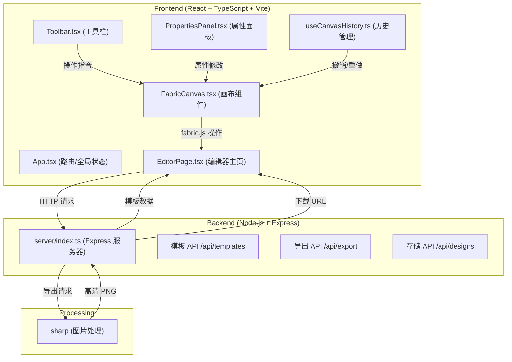
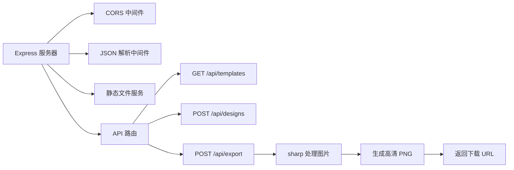
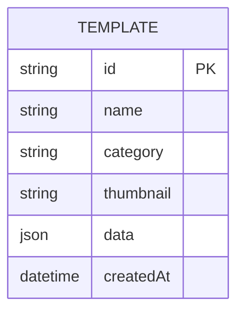
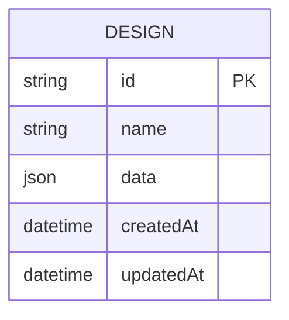

## 1. 架构设计



## 2. 技术描述

- **前端框架**：React 18 + TypeScript + Vite 5
- **画布引擎**：fabric.js 6.x
- **构建工具**：Vite 5
- **后端框架**：Express 4.x
- **图片处理**：sharp 0.33.x
- **跨域处理**：cors 2.8.x
- **开发模式**：前后端分离，Vite 代理 API 请求到 Express 服务器

## 3. 目录结构

```
.
├── package.json
├── vite.config.js
├── tsconfig.json
├── index.html
├── server/
│   └── index.ts
└── src/
    ├── App.tsx
    ├── pages/
    │   └── EditorPage.tsx
    ├── components/
    │   ├── Canvas/
    │   │   └── FabricCanvas.tsx
    │   ├── Toolbar.tsx
    │   └── PropertiesPanel.tsx
    └── hooks/
        └── useCanvasHistory.ts
```

## 4. 路由定义

| 路由 | 用途 |
|------|------|
| / | 编辑器主页面 |

## 5. API 定义

### 5.1 获取模板列表
```typescript
GET /api/templates

Response:
{
  templates: Array<{
    id: string;
    name: string;
    category: string;
    thumbnail: string;
    data: object; // fabric.js 画布 JSON 数据
  }>;
}
```

### 5.2 保存设计
```typescript
POST /api/designs

Request:
{
  name: string;
  data: object; // fabric.js 画布 JSON 数据
}

Response:
{
  id: string;
  name: string;
  createdAt: string;
}
```

### 5.3 导出图片
```typescript
POST /api/export

Request:
{
  dataUrl: string; // 画布 base64 数据
  dpi?: number; // 默认 300
}

Response:
{
  downloadUrl: string;
  filename: string;
}
```

## 6. 服务器架构



## 7. 数据模型

### 7.1 模板数据模型



### 7.2 设计数据模型



### 7.3 画布元素类型定义

```typescript
interface CanvasElement {
  type: 'text' | 'rect' | 'circle';
  id: string;
  left: number;
  top: number;
  width: number;
  height: number;
  angle: number;
  fill: string;
  stroke?: string;
  strokeWidth?: number;
}

interface TextElement extends CanvasElement {
  type: 'text';
  text: string;
  fontFamily: string;
  fontSize: number;
  fontWeight: 'normal' | 'bold';
  fontStyle: 'normal' | 'italic';
  underline: boolean;
  textAlign: 'left' | 'center' | 'right';
}

interface RectElement extends CanvasElement {
  type: 'rect';
  rx?: number;
  ry?: number;
}

interface CircleElement extends CanvasElement {
  type: 'circle';
  radius: number;
}
```

## 8. 性能优化策略

1. **画布性能**：使用 fabric.js 的 `requestRenderAll` 替代 `renderAll`，减少重绘次数
2. **历史管理**：快照压缩，只存储差异而非完整画布状态
3. **导出优化**：前端生成低分辨率预览，后端使用 sharp 进行高性能图片处理
4. **懒加载**：模板数据按需加载，避免初始加载过大
5. **防抖处理**：属性编辑时使用防抖，减少画布重绘
