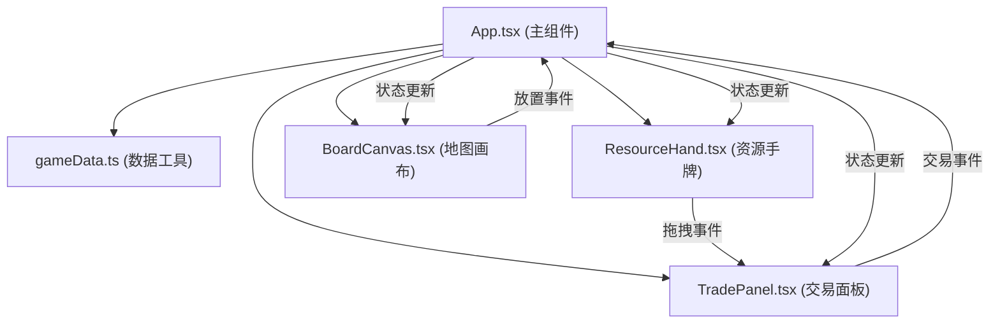
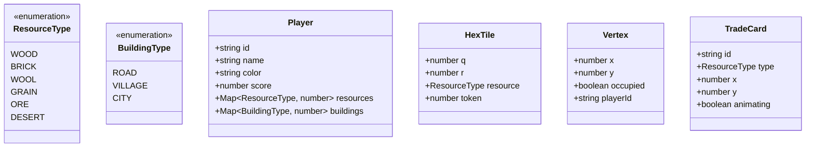

## 1. 架构设计



## 2. 技术描述

- **前端框架**：React 18 + TypeScript + Vite 5
- **构建工具**：Vite 5，配置 React 插件和 TypeScript 支持
- **样式方案**：CSS Modules 内联样式，CSS 变量管理主题色
- **图形渲染**：Canvas 2D API 绘制六边形网格和建筑
- **拖拽实现**：原生 HTML5 Drag and Drop API + 自定义拖拽状态管理
- **动画方案**：CSS Transition + requestAnimationFrame + Canvas 帧动画
- **状态管理**：React useState/useReducer 本地状态管理，无需额外状态库

## 3. 文件结构

| 文件路径 | 用途 |
|---------|------|
| `package.json` | 项目依赖配置，启动脚本 `npm run dev` |
| `vite.config.js` | Vite 构建配置，React 插件 |
| `tsconfig.json` | TypeScript 严格模式配置 |
| `index.html` | 入口页面，包含根容器 `div#root` |
| `src/components/App.tsx` | 主组件，游戏状态管理，子组件调用 |
| `src/components/ResourceHand.tsx` | 资源手牌组件，卡片渲染和拖拽逻辑 |
| `src/components/TradePanel.tsx` | 交易面板组件，卡片接收和交易动画 |
| `src/components/BoardCanvas.tsx` | Canvas 地图组件，六边形绘制和建筑放置 |
| `src/utils/gameData.ts` | 游戏数据定义，资源类型、玩家结构、地图生成 |

## 4. 数据模型

### 4.1 TypeScript 类型定义



### 4.2 资源配置

| 资源 | 颜色 | 图标 | 初始数量 |
|------|------|------|----------|
| 木材 | #4a7c3f | 木纹 | 4 |
| 砖石 | #b87333 | 砖块 | 4 |
| 羊毛 | #f0e68c | 羊毛团 | 4 |
| 谷物 | #ffd700 | 麦穗 | 4 |
| 矿石 | #a0a0a0 | 矿石 | 4 |

### 4.3 建筑消费配置

| 建筑 | 木材 | 砖石 | 羊毛 | 谷物 | 矿石 |
|------|------|------|------|------|------|
| 道路 | 2 | 2 | 0 | 0 | 0 |
| 村庄 | 2 | 2 | 1 | 1 | 0 |
| 城市 | 0 | 0 | 0 | 2 | 3 |

## 5. 核心算法

### 5.1 六边形坐标系统

采用轴向坐标系统 (q, r)，19个六边形布局：
- 内圈：1个 (0,0)
- 中圈：6个，环绕内圈
- 外圈：12个，环绕中圈

像素坐标转换：
```
x = hexRadius * (3/2 * q)
y = hexRadius * (sqrt(3)/2 * q + sqrt(3) * r)
```

### 5.2 顶点位置计算

每个六边形有6个顶点，相邻六边形共享顶点。顶点位置预先计算并去重，存储为全局顶点数组。

### 5.3 建筑放置验证

点击位置与顶点距离阈值判断，验证：
1. 顶点未被占用
2. 不与已有建筑相邻（距离检查）

### 5.4 交易资源验证

检查手牌资源是否满足建筑消费需求，支持多次拖拽累积。

## 6. 性能优化

- Canvas 使用 requestAnimationFrame 实现 60fps 动画
- 建筑顶点位置缓存，避免重复计算
- React.memo 优化子组件重渲染
- 拖拽时使用 transform 而非 top/left 提升性能
- 资源卡片使用 CSS 硬件加速（transform + opacity）
