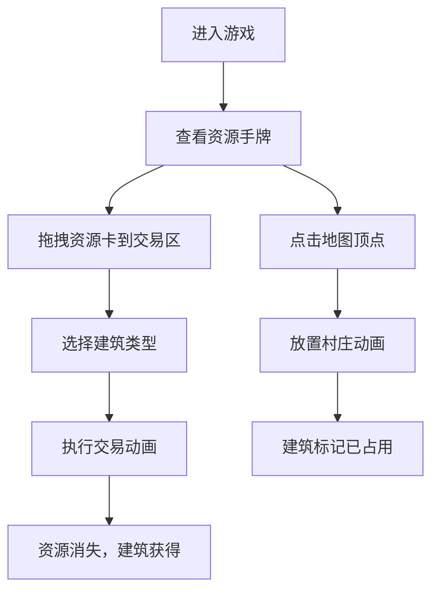

## 1. 产品概述

本产品是一个《卡坦岛》桌游的浏览器端模拟应用，专注于资源卡牌的拖拽交换、建筑放置交互和视觉反馈体验。面向桌游爱好者和前端交互设计学习者，提供沉浸式的资源交易和建筑放置模拟体验。

产品价值在于通过流畅的拖拽动画、丰富的视觉反馈和直观的Canvas地图交互，让用户体验桌游的核心乐趣，无需完整的规则判断即可享受资源管理和策略规划的乐趣。

## 2. 核心功能

### 2.1 用户角色

| 角色 | 注册方式 | 核心权限 |
|------|---------|----------|
| 玩家 | 无需注册，直接进入 | 管理资源手牌、执行交易、放置建筑 |

### 2.2 功能模块

1. **资源手牌区**：展示5种资源卡牌，支持拖拽、悬停动画效果
2. **交易面板**：接收拖入的资源卡，显示可交换建筑，执行交易动画
3. **地图画布**：Canvas绘制六边形网格，支持点击放置建筑
4. **玩家信息**：显示当前玩家头像、名字、积分

### 2.3 页面详情

| 页面名称 | 模块名称 | 功能描述 |
|---------|---------|----------|
| 主游戏页面 | 玩家信息栏 | 顶部显示玩家头像、名字、积分10分 |
| 主游戏页面 | 资源手牌区 | 中部左侧展示5种资源卡（各4张），可拖拽到交易区 |
| 主游戏页面 | 交易面板 | 中部右侧接收拖入卡片，显示建筑交换按钮 |
| 主游戏页面 | 地图画布 | 底部Canvas绘制19个六边形地块，支持放置建筑 |

## 3. 核心流程

用户进入游戏后，首先看到完整的游戏界面，包含玩家信息、资源手牌、交易面板和地图。用户可以将资源卡拖拽到交易区，选择想要交换的建筑类型，执行交易后资源卡片飞入资源池，同时建筑图标飞出。用户也可以点击地图上的顶点位置放置村庄，建筑会播放弹出动画。

## 4. 用户界面设计

### 4.1 设计风格
- **主色调**：深色背景 #1a202c，营造桌游沉浸感
- **资源配色**：木材#4a7c3f、砖石#b87333、羊毛#f0e68c、谷物#ffd700、矿石#a0a0a0
- **玩家颜色**：红#e53e3e、蓝#3182ce、黄#ecc94b，默认红色
- **按钮样式**：圆角卡片式，点击有0.1秒按压效果（缩放至0.95）
- **字体**：采用现代无衬线字体，标题加粗，正文清晰易读
- **布局风格**：分栏式布局，顶部信息栏，中部左右分栏，底部全宽地图
- **图标风格**：简约几何图标，使用SVG绘制资源和建筑图标

### 4.2 页面设计概述

| 页面名称 | 模块名称 | UI元素 |
|---------|---------|--------|
| 主游戏页面 | 玩家信息栏 | 深色背景、玩家头像、名字标签、积分数字、右侧辅助信息 |
| 主游戏页面 | 资源手牌区 | 圆角矩形卡片（80px×120px）、资源图标、数量徽章、悬停上浮5px动画、拖拽放大1.2倍效果 |
| 主游戏页面 | 交易面板 | 虚线拖拽区域、卡片排列行、红色删除按钮、建筑卡片按钮、交易动画效果 |
| 主游戏页面 | 地图画布 | 六边形网格（半径40px，间距2px）、浅色填充、深灰边线、极简房屋图标、放置弹出动画 |

### 4.3 响应式
- 桌面端优先设计，固定布局确保交互精度
- 地图区域采用Canvas自适应宽度，保持六边形比例
- 手牌区域最小宽度保证卡片可完整显示

### 4.4 动画与交互
- 所有交互元素0.2秒过渡动画
- 卡片拖拽时半透明阴影（rgba(0,0,0,0.5) 4px）
- 建筑放置0.2秒放大回弹动画
- 交易时资源卡片依次飞入资源池缩小消失
- 建筑按钮获得时图标飞出场外列表
