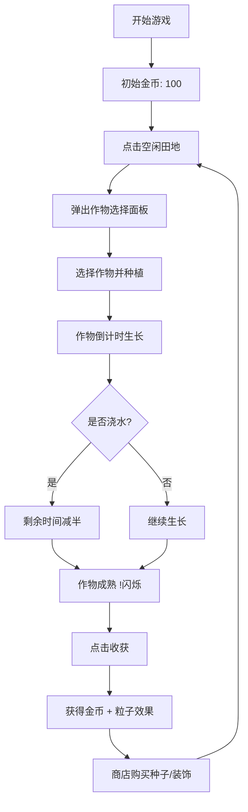

## 1. 产品概述

像素风格的休闲种植农场经营管理模拟器，玩家在网格化田地中开垦、种植、浇水、收获四种作物，换取金币解锁种子和装饰。

- 面向休闲游戏玩家，提供轻松治愈的种植体验
- 核心价值：像素美术风格 + 简单有趣的经营循环

## 2. 核心功能

### 2.1 功能模块

1. **田地网格系统**：6×8 方格田地，支持种植、浇水、收获交互
2. **作物生长系统**：4种作物（胡萝卜/小麦/番茄/向日葵），3阶段生长 + 倒计时
3. **浇水加速机制**：每作物限浇1次，剩余时间减少50%，水滴动画反馈
4. **收获与金币系统**：成熟作物闪烁"!"提示，收获得金币，金币飘字+粒子效果
5. **商店系统**：购买种子（库存限制）+ 农场装饰（稻草人/木栅栏/风车）
6. **装饰系统**：装饰物随机放置在田地边缘，纯视觉展示

### 2.2 页面详情

| 页面名称 | 模块名称 | 功能描述 |
|---------|---------|---------|
| 主游戏页 | 金币显示区 | 左上角显示金币数量 + 金币图标 |
| 主游戏页 | 田地网格区 | 6×8 方格，展示作物生长状态和进度条 |
| 主游戏页 | 底部工具栏 | 商店按钮、操作提示 |
| 主游戏页 | 作物选择面板 | 点击空格弹出，展示4种作物信息 |
| 主游戏页 | 商店面板 | 购买种子和装饰 |

## 3. 核心流程

玩家点击空闲田地 → 弹出作物选择面板 → 选择作物（消耗金币+种子）→ 作物开始生长 → 可浇水加速 → 成熟后闪烁"!" → 点击收获获得金币 → 金币用于购买种子/装饰

## 4. 用户界面设计

### 4.1 设计风格

- **主题色**：深绿色 #2d5016（草地背景）、深棕色 #5c3a21（木框）、深灰 #2d3748（工具栏）
- **强调色**：亮绿色 #48bb78（按钮）、金色 #ecc94b（金币）、橙色/红色（作物）
- **按钮风格**：像素块风格，16px粗边框，按下下沉2px效果
- **字体**：Google Fonts "Press Start 2P" 像素字体
- **整体风格**：复古像素风，硬边几何图形，无抗锯齿

### 4.2 页面设计

| 页面名称 | 模块名称 | UI 元素 |
|---------|---------|---------|
| 主游戏页 | 金币显示区 | 18px 金色字体 + 黄色圆形金币图标（带$），左上角定位 |
| 主游戏页 | 田地网格 | 6×8方格，每格 60×60px，2px 棕色边框，内部草地纹理 |
| 主游戏页 | 作物图标 | 像素风格：种子（小点）→ 发芽（梯形）→ 成熟（完整外形） |
| 主游戏页 | 生长进度条 | 方格下方，绿色到黄色渐变，像素风格 |
| 主游戏页 | 底部工具栏 | 高度 80px，深灰背景，商店按钮 |
| 主游戏页 | 水滴动画 | 浇水后从上方滴落溅开，0.5秒 |
| 主游戏页 | 收获特效 | 金币粒子弹出 + "+N" 飘字，0.4秒 |
| 主游戏页 | 点击反馈 | 目标元素下沉2px弹回，0.15秒 |
| 主游戏页 | 音效文字 | "噗""滴""叮" 短文字显示0.3秒 |

### 4.3 响应式设计

- **大屏（≥768px）**：田地居中显示，60px方格
- **小屏（<768px）**：田地和工具栏上下堆叠，方格缩小至40px
- 画布自适应屏幕，保持像素风格清晰

## 5. 性能要求

- 游戏循环稳定 60FPS
- 作物计时器基于帧时间差计算（不使用 setInterval），每秒更新
- 面板切换响应 < 100ms
