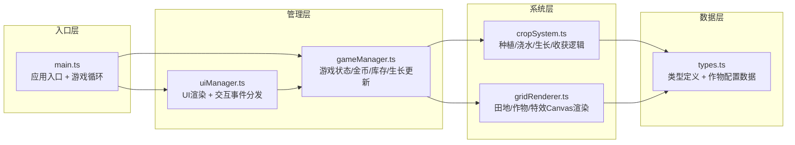

## 1. 架构设计



**数据流向**：
1. 用户点击 → uiManager.ts 捕获 → 分发给 gameManager.ts
2. gameManager.ts 调用 cropSystem.ts 处理业务逻辑 → 更新作物数据
3. 每帧 main.ts 驱动 gameManager.update(dt) → 更新生长计时
4. gameManager 调用 gridRenderer.ts 渲染田地、作物、特效
5. uiManager.ts 渲染工具栏、金币、面板等 UI 层

## 2. 技术选型

- **前端框架**：纯 TypeScript（无 UI 框架，Canvas 2D 渲染）
- **构建工具**：Vite 5
- **语言**：TypeScript 5（严格模式）
- **渲染**：HTML5 Canvas 2D API
- **字体**：Google Fonts - Press Start 2P
- **无后端**：纯前端游戏，状态保存在内存

## 3. 文件结构与职责

| 文件路径 | 职责说明 |
|---------|---------|
| `package.json` | 依赖：typescript, vite；脚本：npm run dev |
| `vite.config.js` | Vite 构建配置 |
| `tsconfig.json` | TypeScript 严格模式配置 |
| `index.html` | 入口 HTML，全屏 canvas + UI 容器 div |
| `src/types.ts` | 类型定义 + 作物配置常量（新增：用户未指定但必需） |
| `src/main.ts` | 应用入口：初始化画布/UI，启动 requestAnimationFrame 游戏循环 |
| `src/gameManager.ts` | 主管理器：金币、库存、生长更新、游戏状态，协调 cropSystem 和 gridRenderer |
| `src/cropSystem.ts` | 作物系统：种植、浇水、生长计时、收获逻辑 |
| `src/gridRenderer.ts` | 网格渲染：6×8 方格、作物像素图标、进度条、粒子特效 |
| `src/uiManager.ts` | UI 管理：底部工具栏、金币显示、作物选择面板、商店面板、点击反馈 |

## 4. 核心数据模型

### 4.1 类型定义

```typescript
// 作物类型枚举
type CropType = 'carrot' | 'wheat' | 'tomato' | 'sunflower';

// 生长阶段
type GrowthStage = 0 | 1 | 2; // 0=种子, 1=发芽, 2=成熟

// 单个田地格子
interface Tile {
  x: number;
  y: number;
  crop: Crop | null;
  watered: boolean;
  decoration: DecorationType | null;
}

// 作物实例
interface Crop {
  type: CropType;
  stage: GrowthStage;
  growthProgress: number; // 0~1
  totalTime: number; // 秒
  remainingTime: number; // 秒
}

// 作物配置
interface CropConfig {
  name: string;
  seedPrice: number;
  harvestReward: number;
  growthTime: number; // 秒
  color: string;
}

// 装饰类型
type DecorationType = 'scarecrow' | 'fence' | 'windmill';

// 装饰配置
interface DecorationConfig {
  name: string;
  price: number;
}

// 库存
interface Inventory {
  seeds: Record<CropType, number>; // -1 表示无限
  decorations: DecorationType[];
}

// 粒子特效
interface Particle {
  x: number;
  y: number;
  vx: number;
  vy: number;
  life: number;
  maxLife: number;
  type: 'coin' | 'water' | 'text';
  text?: string;
  color?: string;
}

// 音效文字提示
interface FloatingText {
  x: number;
  y: number;
  text: string;
  life: number;
  maxLife: number;
}
```

### 4.2 常量配置

```typescript
// 网格尺寸
const GRID_COLS = 8;
const GRID_ROWS = 6;
const TILE_SIZE = 60;
const TILE_SIZE_SMALL = 40;
const GRID_LINE_WIDTH = 2;
const TOOLBAR_HEIGHT = 80;

// 作物配置
const CROP_CONFIGS: Record<CropType, CropConfig> = {
  carrot: { name: '胡萝卜', seedPrice: 5, harvestReward: 10, growthTime: 30, color: '#f97316' },
  wheat: { name: '小麦', seedPrice: 3, harvestReward: 8, growthTime: 45, color: '#fbbf24' },
  tomato: { name: '番茄', seedPrice: 8, harvestReward: 12, growthTime: 60, color: '#ef4444' },
  sunflower: { name: '向日葵', seedPrice: 10, harvestReward: 15, growthTime: 90, color: '#facc15' },
};

// 初始种子库存
const INITIAL_SEEDS: Record<CropType, number> = {
  carrot: -1, // 无限
  wheat: 20,
  tomato: 10,
  sunflower: 5,
};

// 装饰配置
const DECORATION_CONFIGS: Record<DecorationType, DecorationConfig> = {
  scarecrow: { name: '稻草人', price: 50 },
  fence: { name: '木栅栏', price: 20 },
  windmill: { name: '风车', price: 80 },
};

// 初始金币
const INITIAL_COINS = 100;

// 颜色常量
const COLORS = {
  grass: '#2d5016',
  wood: '#5c3a21',
  toolbar: '#2d3748',
  btnGreen: '#48bb78',
  btnGreenPressed: '#38a169',
  btnGreenBorder: '#2f855a',
  gold: '#ecc94b',
  white: '#ffffff',
};
```

## 5. 游戏循环设计

```typescript
// main.ts 中实现
let lastTime = performance.now();

function gameLoop(currentTime: number) {
  const deltaTime = (currentTime - lastTime) / 1000; // 转换为秒
  lastTime = currentTime;

  gameManager.update(deltaTime); // 更新生长计时
  gameManager.render();          // 渲染田地和作物
  uiManager.render();            // 渲染 UI 层

  requestAnimationFrame(gameLoop);
}

requestAnimationFrame(gameLoop);
```

- 作物生长：每秒累加 progress，每 1/3 总时间切换阶段
- 粒子/文字特效：每帧更新位置和生命周期
- 浇水效果：remainingTime *= 0.5，只允许一次
