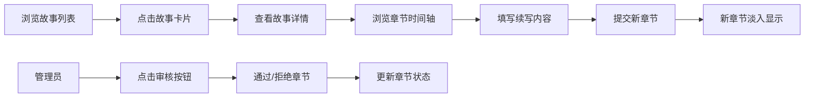

## 1. 产品概述
在线故事接龙写作平台，让用户可以创建故事、添加章节并共同续写。通过多人协作的方式，激发创意，共同创作有趣的故事内容。

- 主要目的：提供一个多人协作的故事创作平台，让用户可以共同参与故事创作
- 解决的问题：单人创作缺乏互动性，通过接龙形式增加创作乐趣
- 目标用户：喜欢写作、创意表达的用户群体
- 市场价值：构建创作社区，促进内容生成和用户互动

## 2. 核心功能

### 2.1 用户角色
| 角色 | 注册方式 | 核心权限 |
|------|----------|----------|
| 普通用户 | 无需注册（模拟） | 浏览故事、创建故事、添加章节、续写故事 |
| 管理员 | 前端角色模拟 | 审核章节、查看统计数据 |

### 2.2 功能模块
1. **故事列表页**：故事卡片网格展示、创建故事按钮、创建故事模态框
2. **故事详情页**：故事信息展示、章节时间轴、续写表单、审核功能、新增章节统计

### 2.3 页面详情
| 页面名称 | 模块名称 | 功能描述 |
|-----------|-------------|---------------------|
| 故事列表页 | 卡片网格 | 以每行3张卡片展示所有故事，显示标题、简介、章节数 |
| 故事列表页 | 创建故事模态框 | 输入标题、简介、初始内容，创建新故事 |
| 故事详情页 | 故事信息区 | 显示故事标题、简介、审核按钮、新增章节统计 |
| 故事详情页 | 章节时间轴 | 左侧竖线和圆点标识，展示所有章节内容和作者 |
| 故事详情页 | 续写表单 | 输入章节内容和作者姓名，提交新章节 |
| 故事详情页 | 审核功能 | 管理员可通过/拒绝章节，更新章节状态颜色 |

## 3. 核心流程

用户浏览首页查看所有故事卡片 → 点击卡片进入故事详情页 → 查看章节时间轴了解故事发展 → 在底部填写内容续写故事 → 提交后新章节淡入显示 → 管理员可审核章节内容

## 4. 用户界面设计

### 4.1 设计风格
- 主色调：浅蓝(#e0f2fe)到浅紫(#e9d5ff)渐变
- 文字色：深灰(#1e293b)、辅助灰(#64748b)
- 背景色：白色(#ffffff)用于卡片和弹窗
- 按钮风格：圆角8px，文字16px，内边距12px 24px，悬停变暗
- 字体：使用优雅的衬线/无衬线字体组合，标题加粗
- 布局风格：卡片式布局，最大宽度1200px居中
- 图标风格：使用lucide-react图标库，简洁线性风格

### 4.2 页面设计概述
| 页面名称 | 模块名称 | UI元素 |
|-----------|-------------|-------------|
| 故事列表页 | 卡片网格 | 渐变背景卡片、圆角12px、阴影效果、悬停上浮动画 |
| 故事列表页 | 创建故事模态框 | 半透明蒙层、缩放+透明度动画、表单输入框 |
| 故事详情页 | 章节时间轴 | 左侧竖线、彩色圆点标识状态、白色内容卡片 |
| 故事详情页 | 续写表单 | 圆角输入框、边框过渡动画、加载状态按钮 |

### 4.3 响应式
- 桌面端（>768px）：卡片每行3张，章节卡片宽度60%
- 平板（≤768px）：卡片每行2张
- 移动端（≤480px）：卡片每行1张宽度100%，章节卡片宽度90%
- 桌面优先设计，媒体查询适配移动端

### 4.4 动效设计
- 卡片悬停：上浮4px，阴影加深，过渡0.3s ease
- 模态框：缩放0.9→1，透明度0→1，过渡0.3s
- 新章节：淡入动画opacity 0→1，过渡0.5s
- 输入框边框：border-color 0.2s ease过渡
- 页面切换：平滑过渡效果
