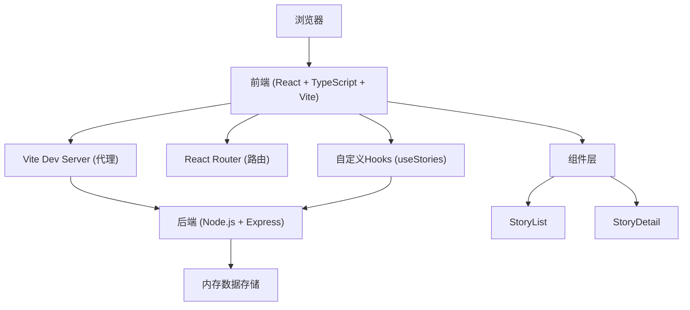
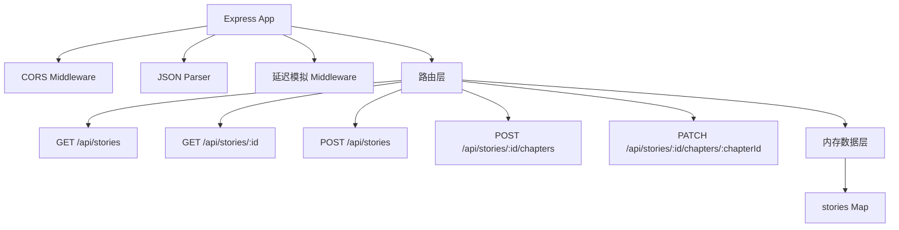
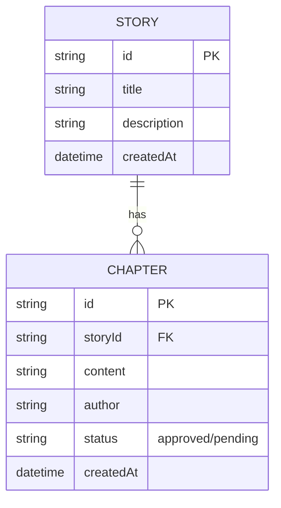

## 1. 架构设计



## 2. 技术描述
- 前端：React@18 + TypeScript@5 + Vite@5 + react-router-dom@6
- 后端：Node.js + Express@4 + cors + uuid
- 构建工具：Vite
- 数据存储：内存存储（模拟）
- 初始化工具：vite-init
- 样式方案：CSS Modules / 内联样式（按需求实现）
- 性能优化：react-window 虚拟滚动

## 3. 路由定义
| 路由 | 用途 |
|-------|---------|
| / | 故事列表页（首页） |
| /story/:id | 故事详情页 |

## 4. API 定义

### TypeScript 类型定义
```typescript
interface StorySummary {
  id: string;
  title: string;
  description: string;
  chapterCount: number;
}

interface Chapter {
  id: string;
  content: string;
  author: string;
  status: 'approved' | 'pending';
  createdAt: number;
}

interface StoryDetail {
  id: string;
  title: string;
  description: string;
  chapters: Chapter[];
  createdAt: number;
}

interface CreateStoryRequest {
  title: string;
  description: string;
  initialContent: string;
}

interface AddChapterRequest {
  content: string;
  author: string;
}
```

### API 接口
| 方法 | 路径 | 描述 | 请求体 | 响应 |
|------|------|------|--------|------|
| GET | /api/stories | 获取所有故事摘要 | - | StorySummary[] |
| GET | /api/stories/:id | 获取故事详情（含章节） | - | StoryDetail |
| POST | /api/stories | 创建新故事 | CreateStoryRequest | StoryDetail |
| POST | /api/stories/:id/chapters | 添加新章节 | AddChapterRequest | Chapter |
| PATCH | /api/stories/:id/chapters/:chapterId | 更新章节审核状态 | { status: 'approved' \| 'rejected' } | Chapter |

### 后端接口特性
- 所有接口模拟100-200ms延迟
- 内存数据存储，服务重启数据重置
- 预置6个示例故事用于性能测试

## 5. 服务器架构图



## 6. 数据模型

### 6.1 数据模型定义



### 6.2 数据结构设计

```javascript
// 内存数据存储结构
const stories = new Map();
// key: storyId, value: StoryDetail 对象
```

## 7. 性能优化方案

1. **首页加载优化**：
   - 组件懒加载（按需）
   - 图片资源优化（暂不涉及）
   - 接口数据gzip压缩
   - 目标：6个故事2秒内完成渲染

2. **长列表渲染优化**：
   - 使用react-window实现虚拟滚动
   - 只渲染可视区域内的章节
   - 目标：滚动帧率稳定60fps

3. **响应时间优化**：
   - 后端模拟延迟控制在100-200ms
   - 前端乐观更新UI
   - 目标：添加章节响应<800ms

## 8. 项目文件结构

```
├── package.json
├── vite.config.js
├── tsconfig.json
├── index.html
├── src/
│   ├── components/
│   │   ├── StoryList.tsx
│   │   └── StoryDetail.tsx
│   ├── hooks/
│   │   └── useStories.ts
│   ├── App.tsx
│   └── main.tsx
└── server/
    └── index.js
```
