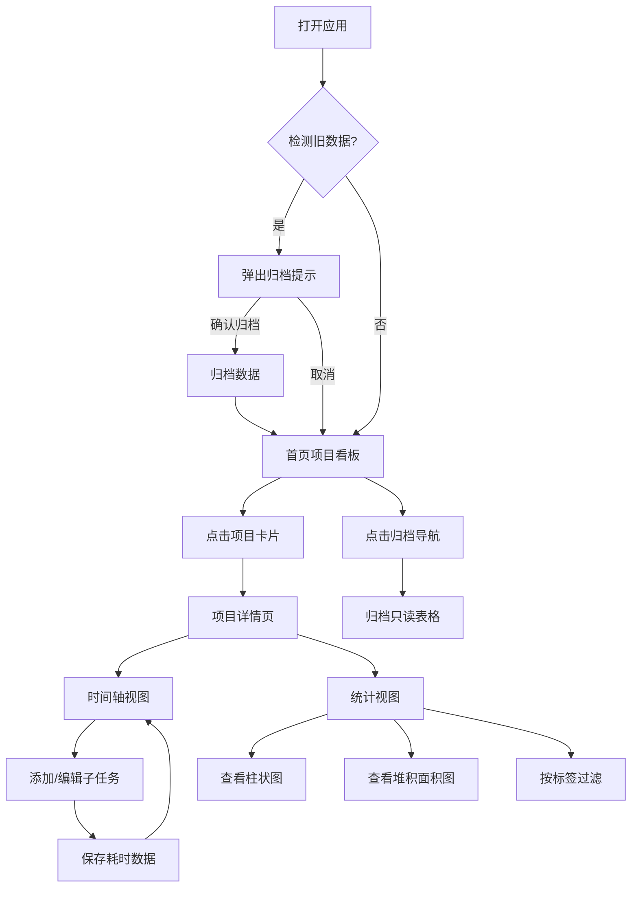

## 1. 产品概述

工时管理可视化应用，面向自由职业者和小型团队，解决多项目并行时手动记录时间容易遗忘或混乱、传统表格工具缺乏视觉化趋势分析和项目对比的问题。通过项目卡片、时间轴视图、环形进度条、柱状图和堆积面积图，提供直观的工时记录、统计与趋势分析能力。

- 目标用户：自由职业者、小型团队（1-10人）
- 核心价值：降低工时记录的认知负担，提供可视化趋势分析，支持多项目并行管理

## 2. 核心功能

### 2.1 用户角色

| 角色 | 注册方式 | 核心权限 |
|------|----------|----------|
| 单用户 | 无需注册 | 全部功能（项目创建、工时记录、统计查看、归档管理） |

### 2.2 功能模块

1. **首页（项目看板）**：项目卡片网格展示、项目创建模态框、归档检测提示
2. **项目详情页**：时间轴视图（按日显示子任务+环形进度条）、统计视图（柱状图+堆积面积图）
3. **归档页**：只读表格查看已归档的历史数据
4. **侧边栏导航**：应用名称、导航链接（项目/统计/归档）

### 2.3 页面详情

| 页面名称 | 模块名称 | 功能描述 |
|----------|----------|----------|
| 首页 | 项目卡片网格 | 响应式网格展示所有项目卡片（宽240px，圆角12px，白色背景+阴影，顶部项目色条，悬停上浮6px+阴影加深0.25s过渡），点击进入项目详情 |
| 首页 | 项目创建模态框 | 输入项目名称、选择颜色标签（12种柔和色板）、设置日工时上限，创建后添加到网格 |
| 项目详情页 | 时间轴视图 | 按日显示时间轴，每天可添加多条子任务（名称+耗时分钟1-480），保存后格子变为项目色（饱和度随耗时占比10%-100%渐变），下方环形进度条（半径28px，描边6px，stroke-dasharray动画0.6s ease-out）和耗时文字 |
| 项目详情页 | 统计视图 | 7天一屏柱状图（柱宽20px间距8px，柱顶显示分钟数，x轴标签旋转30度），周/月周期选择器，底部堆积面积图（x轴日期，y轴总分钟数，项目色面积，右下角图例可点击隐藏/显示，悬停工具提示） |
| 项目详情页 | 标签过滤 | 统计视图中可按自定义标签过滤堆积面积图数据，过滤/取消过渡动画0.3s |
| 项目详情页 | 视图切换 | 胶囊形状切换按钮（时间轴/统计），选中态项目色填充，未选中半透明灰色 |
| 归档页 | 归档表格 | 只读表格，每行一个子任务，列包含项目名、日期、子任务名、耗时，表头固定 |
| 全局 | 归档检测提示 | 启动时检测7天以上旧数据，弹窗确认是否自动归档 |

## 3. 核心流程

用户打开应用 → 首页展示所有项目卡片 → 点击卡片进入项目详情 → 在时间轴视图中记录每日子任务耗时 → 切换到统计视图查看柱状图和面积图趋势 → 可按标签过滤统计数据 → 旧数据自动检测提示归档 → 在归档页面查看历史数据

## 4. 用户界面设计

### 4.1 设计风格

- 主色调：浅色主题（背景#f7fafc，卡片#ffffff，主文字#2d3748，次要文字#718096）
- 侧边栏：深色（#2d3748背景，白色文字），激活项4px宽彩色左边框（#4299e1）
- 项目颜色：12种柔和色板（#f6ad55, #fc8181, #f687b3, #b794f4, #9f7aea, #6b9fff, #63b3ed, #4fd1c5, #68d391, #9ae6b4, #fbd38d, #feb2b2）
- 按钮样式：圆角胶囊形，悬停0.2s背景色过渡，点击scale 0.95/0.1s
- 字体：Inter或系统无衬线字体
- 布局：侧边栏固定200px + 主内容区

### 4.2 页面设计概览

| 页面名称 | 模块名称 | UI元素 |
|----------|----------|--------|
| 首页 | 项目卡片网格 | 响应式网格（320px→1列，480px→2列，768px→3列，1024px→4列），卡片240px宽/12px圆角/白色+阴影/顶部色条/悬停上浮6px |
| 首页 | 项目创建模态框 | 居中弹窗，表单字段（名称输入、颜色选择器12色、日上限数字输入），确认/取消按钮 |
| 项目详情页 | 视图切换 | 胶囊形切换按钮，选中态项目色背景，未选中半透明灰 |
| 项目详情页 | 时间轴视图 | 日格子排列，格子填充项目色（饱和度渐变），环形SVG进度条（r=28, stroke=6），耗时文字 |
| 项目详情页 | 统计视图-柱状图 | 7天柱状图（柱宽20px/间距8px/柱顶分钟数/x轴旋转30度），周/月选择器 |
| 项目详情页 | 统计视图-面积图 | 堆积面积图（项目色/右下角图例/悬停工具提示），标签过滤按钮组 |
| 归档页 | 归档表格 | 只读表格（列：项目名/日期/子任务名/耗时），固定表头 |

### 4.3 响应式设计

- 桌面优先设计，侧边栏始终固定200px
- 项目卡片网格响应式：≥1024px 4列，≥768px 3列，≥480px 2列，<480px 1列
- 统计图表自适应容器宽度

### 4.4 性能要求

- 初始加载时间不超过1秒
- 依赖包总量控制在10MB以下
- 单次localStorage读写耗时不超过10ms
- 统计数据绘制帧率保持30fps以上
