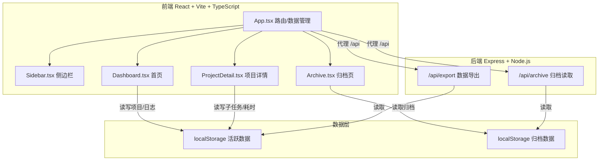
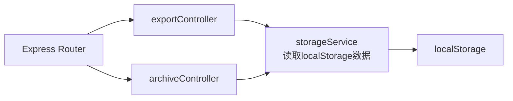
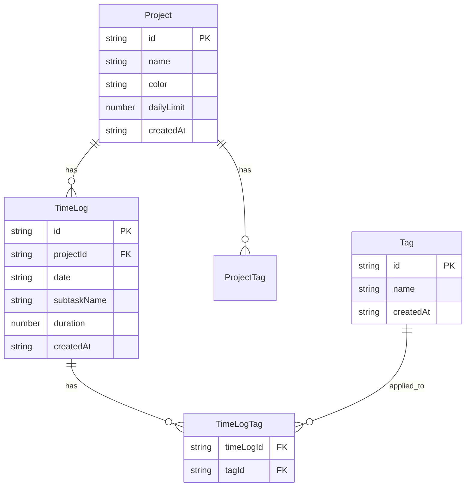

## 1. 架构设计



## 2. 技术说明

- **前端**：React@18 + TypeScript + Vite + TailwindCSS
- **初始化工具**：vite-init (react-express-ts 模板)
- **图表库**：recharts（柱状图、堆积面积图）
- **状态管理**：zustand
- **后端**：Express@4 + cors
- **数据存储**：localStorage（核心数据持久化）
- **HTTP客户端**：axios（与后端API通信）
- **ID生成**：uuid

## 3. 路由定义

| 路由 | 用途 |
|------|------|
| / | 首页，项目卡片网格展示 |
| /project/:id | 项目详情页，时间轴视图和统计视图 |
| /archive | 归档页面，只读表格查看历史数据 |

## 4. API 定义

### 4.1 数据导出

```
GET /api/export
Response: { projects: Project[], logs: TimeLog[], tags: Tag[] }
```

导出所有活跃项目及其工时日志为JSON格式。

### 4.2 归档读取

```
GET /api/archive
Response: { archives: ArchiveEntry[] }

ArchiveEntry = {
  projectName: string
  date: string
  subtaskName: string
  duration: number
  tags: string[]
}
```

读取所有已归档数据。

### 4.3 归档操作

```
POST /api/archive
Body: { cutoffDate: string }
Response: { archived: number }
```

将指定日期之前的数据归档。

## 5. 服务器架构图



## 6. 数据模型

### 6.1 数据模型定义



### 6.2 数据定义语言（localStorage JSON结构）

```typescript
interface Project {
  id: string
  name: string
  color: string
  dailyLimit: number
  createdAt: string
}

interface TimeLog {
  id: string
  projectId: string
  date: string
  subtaskName: string
  duration: number
  tagIds: string[]
  createdAt: string
}

interface Tag {
  id: string
  name: string
}

interface ArchiveEntry {
  projectName: string
  date: string
  subtaskName: string
  duration: number
  tags: string[]
}

interface AppData {
  projects: Project[]
  timeLogs: TimeLog[]
  tags: Tag[]
  archives: ArchiveEntry[]
}
```

### 6.3 localStorage 键值设计

| 键名 | 值类型 | 说明 |
|------|--------|------|
| timetracker_projects | Project[] | 所有活跃项目 |
| timetracker_logs | TimeLog[] | 所有活跃工时记录 |
| timetracker_tags | Tag[] | 所有自定义标签 |
| timetracker_archives | ArchiveEntry[] | 所有归档数据 |
