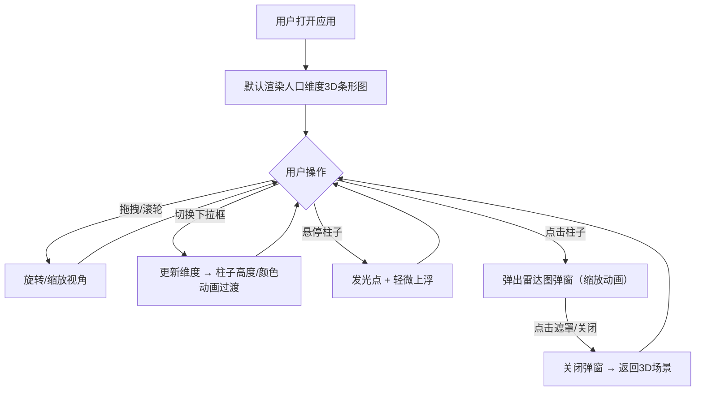

## 1. 产品概述

3D交互式立体数据面板是一个面向数据可视化和新闻媒体领域的浏览器端应用，将复杂的多维度城市统计数据以直观的3D条形图形式呈现，通过交互引导观众探索数据细节。

- 主要用途：将人口普查、经济指标等多维度数据以3D立体条形图展示，支持视角旋转、缩放、点击查看详情
- 目标用户：数据可视化制作者、新闻媒体编辑、数据分析师
- 产品价值：打破传统静态图表的局限，提供沉浸式空间交互体验，让数据探索更具吸引力和洞察力

## 2. 核心功能

### 2.1 功能模块

1. **主数据面板页**：维度选择栏、3D条形图场景、雷达图详情弹窗

### 2.2 页面详情

| 页面名称 | 模块名称 | 功能描述 |
|-----------|-------------|---------------------|
| 主数据面板 | 维度选择栏 | 顶部半透明毛玻璃风格下拉选择框，包含6个数据维度（人口、GDP、面积、教育支出、医疗支出、平均收入），切换后3D柱子高度和颜色立即更新，0.5秒弹性过渡动画 |
| 主数据面板 | 3D条形图场景 | 由10个立方体柱组成的3D场景，每个柱子代表一个城市，柱高映射数值，颜色随数值渐变（青绿→橙黄→品红），支持鼠标拖拽旋转（俯仰角-30°~60°）、滚轮缩放（1~8倍），含环境光和方向光产生立体阴影，半透明网格地面 |
| 主数据面板 | 柱子交互反馈 | 悬停时柱顶出现白色发光点、柱子轻微上浮0.1单位、鼠标变手型；点击触发雷达图弹窗 |
| 主数据面板 | 雷达图弹窗 | 模态框展示城市六维度雷达图，深色背景、高亮数据线条、半透明填充，中心扩散缩放动画，点击遮罩或按钮关闭 |

## 3. 核心流程

用户打开应用 → 默认展示人口维度3D条形图 → 拖拽/缩放探索数据 → 切换维度查看不同指标 → 悬停柱子查看高亮反馈 → 点击柱子弹出雷达图详情 → 关闭弹窗继续探索

## 4. 用户界面设计

### 4.1 设计风格
- **主色调**：深色背景 #0f172a，柱状图三色渐变（低值青绿#48bb78，中值橙黄#ecc94b，高值品红#d53f8c）
- **点缀色**：天空蓝 #38bdf8（雷达图线条、悬停高亮）
- **文字色**：浅灰 #cbd5e1
- **边框色**：深灰 #334155
- **按钮/控件**：圆角8px，悬停背景 rgba(56,189,248,0.1)
- **顶部栏**：半透明毛玻璃效果 background: rgba(255,255,255,0.08)，backdrop-filter: blur(8px)
- **字体**：现代无衬线字体，清晰易读
- **布局风格**：顶部导航栏 + 全屏3D场景，弹窗居中模态展示

### 4.2 页面设计概述

| 页面名称 | 模块名称 | UI元素 |
|-----------|-------------|-------------|
| 主数据面板 | 维度选择栏 | 毛玻璃半透明横条、左侧标签文字、圆角下拉选择框、浅灰文字 |
| 主数据面板 | 3D条形图场景 | 深色全景背景、10个彩色立方体柱呈环形/网格排列、半透明网格地面、方向光投影效果 |
| 主数据面板 | 柱子悬停态 | 柱顶白色发光粒子、柱体Y轴轻微上浮、手型鼠标指针 |
| 主数据面板 | 雷达图弹窗 | 半透明黑色遮罩、居中卡片、深色卡片背景#1e293b、六边形雷达图、右上角关闭按钮 |

### 4.3 响应式
- 桌面端优先设计（>768px）：顶部栏水平布局，下拉框右对齐，3D场景占满剩余空间
- 移动端适配（≤768px）：顶部栏垂直布局，选择框宽度100%，3D场景高度60vh，弹窗自适应屏幕宽度
- 触控设备优化：支持单指拖拽旋转、双指缩放

### 4.4 3D场景指引
- **环境**：纯深色背景 #0f172a，营造沉浸式数据宇宙氛围
- **光照**：强度0.2的环境光 + 右上角方向光产生立体阴影，突出柱子体积感
- **相机**：默认透视相机，初始角度略微俯视，轨道控制限制俯仰角-30°~60°
- **构图**：10个城市柱子按网格或环形均匀排列，留出足够间距便于交互
- **交互动画**：柱子高度变化0.5秒弹性缓动，悬停0.1单位上浮，弹窗0.3秒ease-out中心缩放
- **性能**：最多10个柱子（每个72个三角面），目标60FPS，雷达图渲染≤50ms
