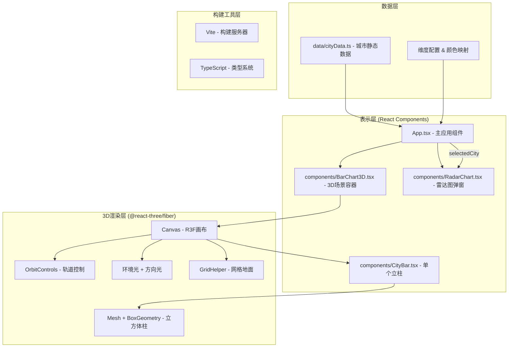
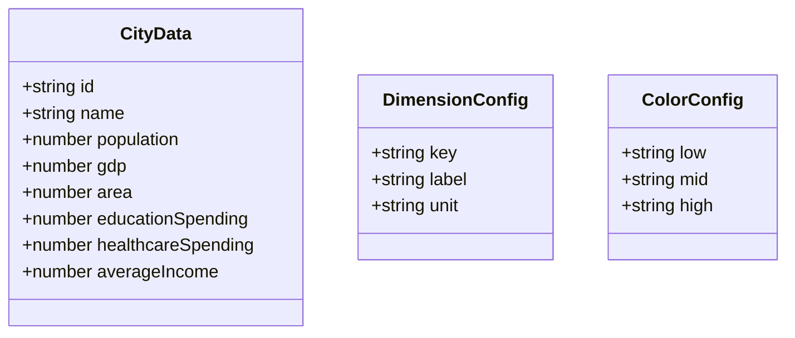

## 1. 架构设计



## 2. 技术描述

- **前端框架**：React 18 + TypeScript 5
- **构建工具**：Vite 5（极速热更新，路径别名 @ → src）
- **3D渲染**：Three.js + @react-three/fiber 8 + @react-three/drei 9
- **图表库**：Recharts 2（雷达图）
- **动画库**：@react-spring/three（柱高弹性缓动过渡）
- **后端**：无（纯浏览器端静态数据）
- **数据来源**：src/data/cityData.ts 内置10个城市的6维度模拟数据

## 3. 文件结构与调用关系

| 文件路径 | 职责 | 输入/依赖 | 输出/被调用 |
|----------|------|-----------|-------------|
| package.json | 依赖管理与脚本配置 | - | npm run dev 启动项目 |
| vite.config.js | Vite构建配置，路径别名@→src | - | 被Vite读取 |
| tsconfig.json | TypeScript严格模式配置 | - | 被TSC读取 |
| index.html | 入口HTML，div#root容器，背景#0f172a | - | 浏览器加载入口 |
| src/main.tsx | React入口，挂载App到#root | App.tsx | 被index.html引用 |
| src/App.tsx | 主应用：维度选择下拉框、3D场景容器、雷达图弹窗状态管理 | cityData.ts, BarChart3D.tsx, RadarChart.tsx | 被main.tsx渲染 |
| src/components/BarChart3D.tsx | 3D条形图场景：R3F Canvas、OrbitControls、光照、网格、循环渲染CityBar | CityBar.tsx | 被App.tsx调用（props: cities, selectedDimension, onBarClick） |
| src/components/CityBar.tsx | 单个城市立柱：BoxGeometry立方体、高度/颜色映射、悬停发光点、上浮动画、点击回调 | @react-spring/three | 被BarChart3D.tsx循环调用（props: city, dimension, index, total, onClick） |
| src/components/RadarChart.tsx | 雷达图弹窗：Recharts RadarChart、模态框、缩放动画、关闭功能 | recharts | 被App.tsx调用（props: city, onClose） |
| src/data/cityData.ts | 静态数据模块：10城市6维度模拟数据、维度名称、颜色映射配置 | - | 被App.tsx、CityBar.tsx导入 |

**数据流向**：
```
cityData.ts → App.tsx (cities数组, 维度配置)
    ↓ selectedDimension (state)
    ↓ onCityClick (state: selectedCity)
    ├──→ BarChart3D.tsx (cities, selectedDimension, onBarClick)
    │       ↓
    │       └──→ CityBar.tsx (city, dimension, onClick)
    │               ↓ (点击触发)
    │               └──→ App.tsx (更新selectedCity)
    └──→ RadarChart.tsx (selectedCity, onClose)
            ↓ (关闭触发)
            └──→ App.tsx (清空selectedCity)
```

## 4. 数据模型

### 4.1 数据模型定义



### 4.2 维度定义

| 维度Key | 显示名称 | 单位 | 说明 |
|---------|---------|------|------|
| population | 人口 | 万人 | 城市常住人口 |
| gdp | GDP | 亿元 | 城市地区生产总值 |
| area | 面积 | 平方公里 | 城市行政区域面积 |
| educationSpending | 教育支出 | 亿元 | 年度教育财政支出 |
| healthcareSpending | 医疗支出 | 亿元 | 年度医疗卫生财政支出 |
| averageIncome | 平均收入 | 元 | 城镇居民人均可支配收入 |

## 5. 核心技术决策

1. **@react-three/fiber**：选择R3F而非原生Three.js，以声明式方式编写3D场景，与React状态管理无缝集成
2. **@react-spring/three**：用于柱子高度变化的弹性缓动动画，比gsap更贴合React生态
3. **Recharts**：React生态最成熟的图表库，雷达图组件开箱即用，主题定制灵活
4. **OrbitControls**：来自@react-three/drei，提供成熟的拖拽旋转/缩放交互，支持俯仰角和缩放范围限制
5. **纯静态数据**：用户需求明确使用预设城市数据，无需后端服务
