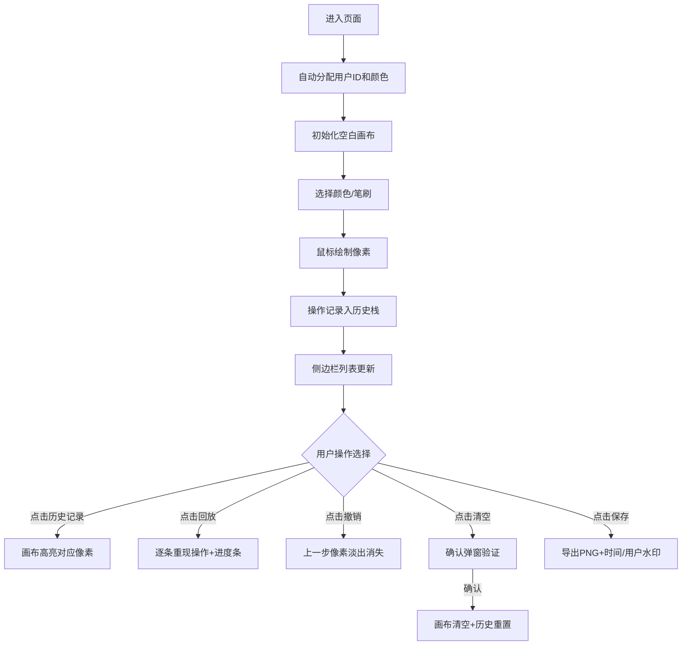

## 1. 产品概述
LiveCode像素风协作白板是一款面向远程创意会议和线上教学的轻量级网页协作工具。通过像素风格的网格画布，让团队成员能够同时涂鸦、绘制示意图和添加文字批注，解决传统屏幕共享和文字聊天难以实时表达创意的痛点。

- 核心价值：低门槛的视觉协作，提升远程沟通的趣味性和效率
- 目标用户：设计团队、产品团队、在线教育师生、远程创意工作者

## 2. 核心功能

### 2.1 用户角色
| 角色 | 进入方式 | 核心权限 |
|------|----------|----------|
| 参与者 | 打开网页自动加入 | 绘制像素、选择颜色、切换笔刷、查看历史、回放操作、导出画布 |
| 本地模拟用户 | localStorage自动分配 | 展示多光标效果，模拟多人协作场景 |

### 2.2 功能模块
1. **像素画布模块**：网格渲染、鼠标绘图、笔刷粗细切换、颜色选择、视觉反馈动效
2. **多人协作模块**：用户自动分配、在线列表、多光标跟随、移出画布渐隐效果
3. **操作历史模块**：操作列表展示、单条记录高亮跳转、时间轴回放、进度指示
4. **工具栏模块**：清空画布（带确认弹窗）、撤销操作、导出PNG（带水印）

### 2.3 页面详情
| 页面名称 | 模块名称 | 功能描述 |
|----------|----------|----------|
| 主页面 | 像素画布 | 8x8像素格子，深灰背景#2d3748，浅灰网格线#4a5568，支持点击/拖拽填色 |
| 主页面 | 调色板 | 底部24种霓虹色板，包含#ff007f、#00ff88、#7f00ff等亮色 |
| 主页面 | 笔刷控制 | 细笔刷(1格)和粗笔刷(4格)切换 |
| 主页面 | 用户列表 | 右上角在线用户卡片，显示名字+专属颜色 |
| 主页面 | 多光标显示 | 半透明圆点+名字标签跟随鼠标移动 |
| 主页面 | 侧边栏 | 操作历史列表，每条可点击高亮对应像素区域 |
| 主页面 | 回放控制 | 回放按钮、进度条、当前步骤/总步骤数显示 |
| 主页面 | 底部工具栏 | 清空、撤销、保存三个功能按钮 |
| 主页面 | 确认弹窗 | 清空画布时弹出，背景模糊10px，红/白按钮 |

## 3. 核心流程
用户进入页面后自动分配用户名和专属颜色，选择颜色和笔刷后即可在画布上绘制。每一步操作会实时同步到历史列表，可随时点击历史记录查看对应像素，或点击回放按钮按顺序重现整个创作过程。完成后可导出带水印的PNG图片。

## 4. 用户界面设计

### 4.1 设计风格
- **主色调**：深色背景 #1a1f2e，搭配霓虹亮色点缀
- **画布色**：背景 #2d3748，网格线 #4a5568
- **霓虹色板**：24色，包含荧光粉#ff007f、薄荷绿#00ff88、电紫#7f00ff、霓虹蓝#00e5ff、日光橙#ff8800等
- **按钮风格**：圆角8px，hover上浮3px + 发光阴影，0.2秒过渡
- **分割线**：画布与侧边栏之间1px霓虹绿 #00ff88
- **滚动条**：自定义细条圆角滑块，霓虹绿高亮

### 4.2 页面设计详情
| 区域 | 模块 | UI元素 |
|------|------|--------|
| 左侧70% | 画布容器 | 带内发光边框，固定比例滚动区 |
| 左侧70% | 用户列表卡 | 右上角悬浮，半透明毛玻璃，彩色圆点标识 |
| 左侧70% | 调色板 | 底部固定，24个色块网格，选中态外发光 |
| 左侧70% | 笔刷切换 | 调色板左侧，两个图标按钮 |
| 右侧30% | 侧边栏 | 标题栏+历史列表+回放控制区 |
| 右侧30% | 历史条目 | 操作图标+颜色块+坐标+相对时间，hover高亮 |
| 右侧30% | 回放进度条 | 霓虹绿渐变，带步骤文字 |
| 底部 | 工具栏 | 三按钮横向排列，等分宽度 |
| 模态层 | 清空确认 | 居中卡片，背景模糊10px，按钮大圆角 |
| 画布层 | 多光标 | 半透明实心圆 + 名字标签，带偏移 |

### 4.3 响应式设计
- **桌面端（≥768px）**：左右布局，画布70% / 侧边栏30%
- **移动端（<768px）**：上下布局，侧边栏折叠到底部横向条，可拖拽调整高度

### 4.4 交互动效
- **填色反馈**：松开鼠标时格子边缘0.1秒亮闪过渡
- **撤销动画**：被撤销像素0.2秒快速淡出
- **历史高亮**：脉动光圈闪烁两次
- **按钮hover**：0.2秒上浮+阴影增强
- **光标渐隐**：移出画布后0.3秒标签透明度渐变至0
- **回放间隔**：每步0.3秒，误差≤0.1秒
