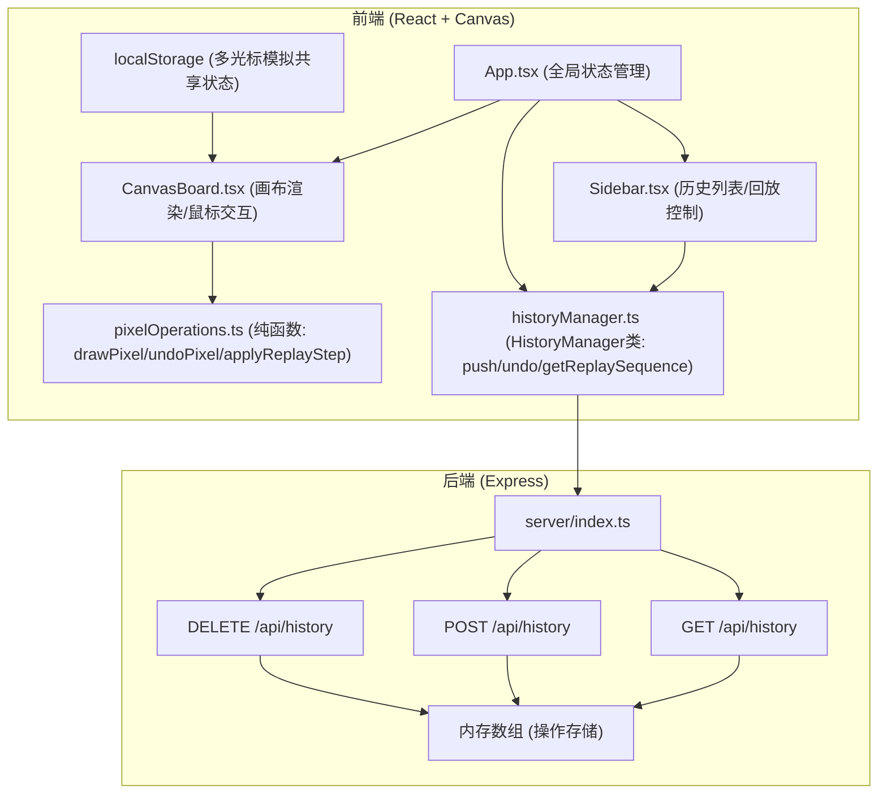
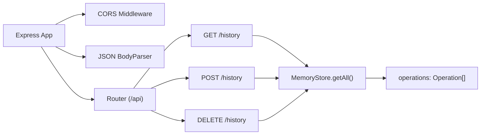
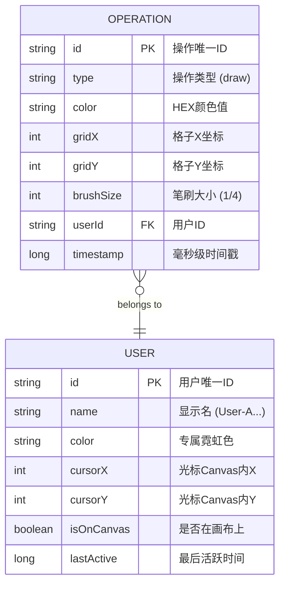

## 1. 架构设计
本项目采用前后端分离的轻量级架构，前端基于React + Canvas 2D负责渲染与交互，后端基于Express提供操作记录的RESTful API。状态通过React组件层次管理，底层数据模块（像素操作、历史管理）保持纯函数特性，便于测试和复用。



## 2. 技术说明
- **前端框架**：React@18 + TypeScript（严格模式）
- **构建工具**：Vite@5
- **渲染引擎**：Canvas 2D API（像素级局部重绘优化）
- **后端**：Express@4 + CORS中间件
- **数据存储**：后端内存数组 + 前端localStorage（多光标模拟）
- **唯一ID**：uuid@9
- **启动脚本**：`npm run dev`（Vite开发服务器）
- **后端运行**：单独进程运行 `tsx server/index.ts` 或合并至Vite代理

## 3. 路由定义
| 路由 | 用途 |
|------|------|
| / | 主白板页面（单页应用，Canvas + Sidebar） |

## 4. API定义

### 4.1 TypeScript类型定义
```typescript
interface Operation {
  id: string;
  type: 'draw';
  color: string;
  gridX: number;
  gridY: number;
  brushSize: 1 | 4;
  userId: string;
  timestamp: number;
}

interface User {
  id: string;
  name: string;
  color: string;
  cursorX: number;
  cursorY: number;
  isOnCanvas: boolean;
  lastActive: number;
}

interface CanvasState {
  pixels: (string | null)[][];  // [row][col] = color or null
  width: number;   // 格子数（列）
  height: number;  // 格子数（行）
}

type ReplaySequence = Operation[];
```

### 4.2 接口规范
| 方法 | 路径 | 请求体 | 响应 | 说明 |
|------|------|--------|------|------|
| GET | /api/history | - | `{ operations: Operation[] }` | 获取全部操作记录 |
| POST | /api/history | `Operation` | `{ success: boolean, id: string }` | 添加单条操作 |
| DELETE | /api/history | - | `{ success: boolean }` | 清空所有操作 |

## 5. 服务器架构图



## 6. 数据模型

### 6.1 数据模型ER图



### 6.2 常量配置
```typescript
// 画布常量
const CELL_SIZE = 8;           // 每格像素大小
const GRID_COLS = 80;          // 画布横向格子数
const GRID_ROWS = 60;          // 画布纵向格子数
const BG_COLOR = '#2d3748';    // 画布背景
const GRID_COLOR = '#4a5568';  // 网格线色
const DIVIDER_COLOR = '#00ff88'; // 侧边栏分割线

// 24色霓虹调色板
const NEON_PALETTE = [
  '#ff007f', '#ff00aa', '#aa00ff', '#7f00ff',
  '#0000ff', '#0055ff', '#00aaff', '#00e5ff',
  '#00ffff', '#00ffaa', '#00ff88', '#00ff00',
  '#88ff00', '#ccff00', '#ffff00', '#ffcc00',
  '#ff8800', '#ff5500', '#ff0000', '#ff2244',
  '#ffffff', '#cccccc', '#888888', '#444444'
];

// 动画常量
const FLASH_DURATION = 100;    // 填色亮闪(ms)
const UNDO_FADE_DURATION = 200; // 撤销淡出(ms)
const REPLAY_INTERVAL = 300;   // 回放步间隔(ms)
const HIGHLIGHT_PULSES = 2;    // 高亮脉动次数
```

## 7. 性能保障策略
1. **Canvas局部重绘**：每次绘图仅重绘受影响的格子区域（brushSize半径范围内），而非整画布
2. **requestAnimationFrame**：所有鼠标移动、动画效果统一走RAF调度，确保60fps
3. **像素数据二维数组**：内存中维护`(string|null)[][]`状态表，渲染时仅diff变化区域
4. **防抖节流**：鼠标移动事件使用RAF节流，光标状态批量更新
5. **回放定时器校准**：基于`performance.now()`校准每步延迟，控制误差≤0.1秒
6. **Vite HMR**：开发时模块热更新，生产构建Tree-shaking优化
