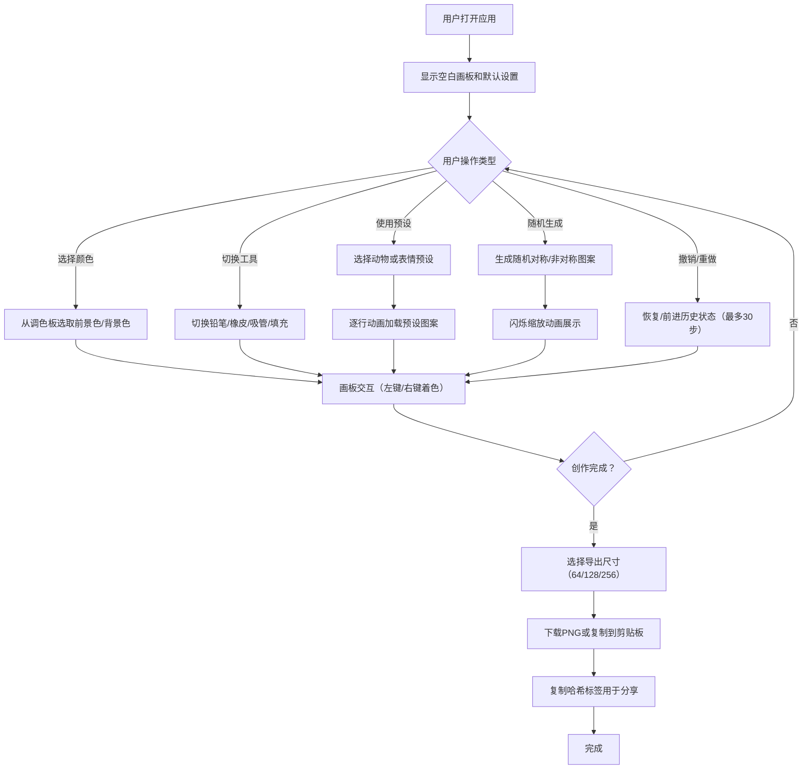

## 1. 产品概述

像素艺术头像编辑器是一款基于浏览器的在线像素画创作工具，解决用户在社交媒体个性化头像制作过程中缺乏灵活性、无法精细调整像素、以及导出尺寸不标准的痛点。用户可通过直观的网格画板进行像素级创作，支持多种工具、预设模板和一键导出功能。

- **核心目的**：为用户提供简单易用、功能完善的像素艺术头像制作工具
- **目标用户**：社交媒体用户、游戏玩家、设计师、像素艺术爱好者
- **市场价值**：填补像素级头像编辑工具市场空白，提供比现有AI头像生成器更高的用户控制力

## 2. 核心功能

### 2.1 用户角色
本产品为单角色产品，无需权限区分。

| 角色 | 注册方式 | 核心权限 |
|------|----------|----------|
| 普通用户 | 无需注册，直接使用 | 全部编辑、导出、预设功能 |

### 2.2 功能模块

1. **画板编辑模块**：16×16像素网格、实时预览、像素着色操作
2. **调色板模块**：32色调色板、最近使用颜色、颜色选择
3. **工具栏模块**：工具切换（铅笔/橡皮/吸管/填充）、撤销/重做、预设加载、随机生成、导出
4. **导出模块**：多尺寸PNG导出、剪贴板复制、哈希标签生成

### 2.3 页面详情

| 页面名称 | 模块名称 | 功能描述 |
|----------|----------|----------|
| 主编辑页 | 实时预览区 | 左上角显示64×64放大预览，带倒角阴影效果 |
| 主编辑页 | 画板编辑区 | 中央16×16网格，左键前景色、右键背景色/清除、悬停高亮 |
| 主编辑页 | 调色板区 | 右侧32色调色板（含最近5色），色块悬停放大1.2倍 |
| 主编辑页 | 工具栏区 | 工具选择按钮、撤销重做、动物/表情预设、随机生成、导出面板 |
| 主编辑页 | 导出面板 | 三种尺寸选择（64/128/256）、下载/复制按钮、哈希标签显示 |

## 3. 核心流程

### 3.1 主要用户流程描述

1. 用户打开应用，看到空白16×16画板和默认调色板
2. 从调色板选择颜色，或使用工具（铅笔/橡皮/吸管/填充）进行创作
3. 可随时加载动物或表情预设作为起点
4. 点击随机生成获得创意灵感
5. 创作过程中可随时撤销/重做操作（最多30步）
6. 完成后选择导出尺寸，下载PNG或复制到剪贴板
7. 复制哈希标签用于社交媒体分享

### 3.2 Mermaid流程图

## 4. 用户界面设计

### 4.1 设计风格

- **设计基调**：赛博朋克夜间深色主题，科技感与艺术感结合
- **主背景色**：#1a1a2e（深靛蓝紫）
- **画板背景色**：#16213e（深蓝）
- **调色板背景色**：#0f3460（宝蓝）
- **强调色渐变**：#e94560 → #c23152（玫红渐变，用于按钮）
- **网格线**：#ffffff20（白色半透明，营造悬浮感）
- **字体**：Roboto Mono（等宽字体，强化像素艺术的数字感）
- **按钮风格**：圆角8px，渐变填充，点击下沉0.1s动画
- **交互反馈**：全部采用0.3s ease-in-out平滑过渡
- **空间布局**：主画板居中，预览窗悬浮左上，调色板居右，工具栏居底

### 4.2 页面设计概览

| 页面名称 | 模块名称 | UI元素描述 |
|----------|----------|------------|
| 主编辑页 | 实时预览 | 64×64像素放大图，圆角8px，多重阴影（外发光+投影），边框1px描边 |
| 主编辑页 | 画板网格 | 16×16格，每格24-32px，悬停格白色半透明边框高亮，右键菜单禁用 |
| 主编辑页 | 调色板 | 4×8色块网格（32色），每格28px圆角方形，下方另加最近5色行 |
| 主编辑页 | 工具按钮组 | 4个工具图标按钮，选中状态为渐变边框+发光效果 |
| 主编辑页 | 预设按钮组 | 动物5个+表情5个，图标+文字标签，悬停上浮效果 |
| 主编辑页 | 随机生成按钮 | 特殊渐变样式，带闪光图标，点击触发0.5s缩放动画 |
| 主编辑页 | 导出面板 | 尺寸选择器（三个按钮组）、下载按钮、复制按钮、哈希标签文本 |
| 主编辑页 | 撤销/重做 | 一对按钮，禁用状态半透明，快捷键Ctrl+Z/Ctrl+Shift+Z提示 |

### 4.3 响应式设计

- **设计原则**：桌面优先（Desktop-First），移动端自适应
- **断点设置**：768px为主要响应式断点
- **≥768px（桌面）**：三栏布局——预览+画板居中，调色板居右，工具栏分布在画板底部和右侧
- **<768px（移动）**：垂直堆叠布局——预览区顶部，画板居中缩放自适应，调色板移至底部变为横向滚动，工具栏整合在画板下方
- **触控优化**：移动端色块和按钮最小触控区域44px，画板格子自动放大适配屏幕

## 5. 非功能性需求

### 5.1 性能指标
- 画板交互响应时间：≤50ms（点击、撤销、填充等操作）
- 内存占用：≤50MB
- 填充算法时间复杂度：O(n)，n为相连同色像素数
- 动画帧率：≥60fps

### 5.2 浏览器兼容性
- Chrome/Edge：最新两个版本
- Firefox：最新两个版本
- Safari：最新两个版本

### 5.3 安全要求
- 所有操作均在浏览器本地完成，无数据上传
- Clipboard API使用需符合浏览器安全策略（HTTPS或localhost）
