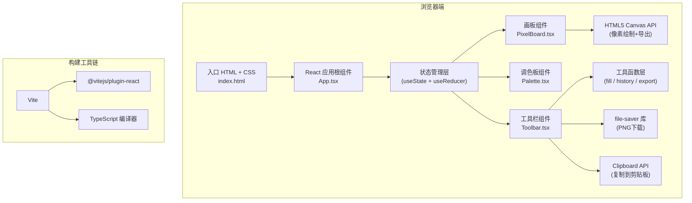

## 1. 架构设计

本项目为纯前端单页应用，采用组件化架构，所有逻辑运行于浏览器端。



## 2. 技术选型说明

| 技术栈 | 版本 | 用途说明 |
|--------|------|----------|
| React | ^18.x | UI组件框架，提供状态管理和组件化能力 |
| React DOM | ^18.x | DOM渲染层 |
| TypeScript | ^5.x | 类型安全，严格模式（strict: true） |
| Vite | ^5.x | 开发服务器和构建工具，HMR热更新 |
| @vitejs/plugin-react | ^4.x | Vite React 插件，支持JSX/TSX |
| file-saver | ^2.0.5 | 客户端文件下载，保存PNG图片 |
| HTML5 Canvas | 原生 | 像素级画板渲染和图片导出 |
| Clipboard API | 原生 | 将图片Blob复制到系统剪贴板 |
| Google Fonts | CDN | Roboto Mono 字体引入 |

### 项目初始化方式
- 手动创建项目结构，不使用 `npm create vite` 脚手架，按用户指定文件组织
- 通过 `npm install` 安装依赖，`npm run dev` 启动开发服务器

## 3. 路由定义

本项目为单页应用（SPA），无需多路由。

| 路由 | 页面组件 | 用途 |
|------|----------|------|
| / | App.tsx | 主编辑页面，包含所有编辑器功能 |

## 4. 数据模型与核心类型定义

### 4.1 TypeScript 核心类型

```typescript
// 颜色格式：HEX字符串，如 "#e94560" 或 "transparent"
type Color = string;

// 画板数据：16x16 二维数组，每个元素为颜色值
// null 表示透明像素
type PixelBoard = (Color | null)[][];

// 工具类型枚举
type ToolType = 'pencil' | 'eraser' | 'eyedropper' | 'fill';

// 预设分类
type PresetCategory = 'animal' | 'emotion';

// 动物预设类型
type AnimalPreset = 'cat' | 'dog' | 'rabbit' | 'fox' | 'bear';

// 表情预设类型
type EmotionPreset = 'smile' | 'cool' | 'surprised' | 'wink' | 'tongue';

// 预设数据结构：14x14 图案（上下左右各留1行空白边框）
interface PresetData {
  name: string;
  icon: string;
  pattern: (Color | null)[][]; // 14x14
}

// 导出尺寸类型
type ExportSize = 64 | 128 | 256;

// 历史记录项
interface HistoryEntry {
  board: PixelBoard;
  timestamp: number;
}

// 画板状态（App组件state）
interface EditorState {
  board: PixelBoard;
  foregroundColor: Color;
  backgroundColor: Color;
  currentTool: ToolType;
  recentColors: Color[]; // 最近5色
  history: HistoryEntry[];
  historyIndex: number; // 当前历史位置
  hoveredPixel: { x: number; y: number } | null;
  isAnimating: boolean; // 填充/预设动画进行中
  eyeDropperFlash: { x: number; y: number; color: Color } | null;
}
```

### 4.2 常量定义

```typescript
const BOARD_SIZE = 16;           // 画板尺寸 16x16
const PRESET_SIZE = 14;          // 预设图案尺寸 14x14
const PRESET_OFFSET = 1;         // 预设偏移量（居中放置）
const MAX_HISTORY = 30;          // 最大历史记录数
const RECENT_COLORS_COUNT = 5;   // 最近使用颜色数
const EXPORT_SIZES: ExportSize[] = [64, 128, 256];

// 默认32色调色板（含常用色、灰度、肤色等）
const DEFAULT_PALETTE: Color[] = [
  '#000000', '#ffffff', '#7f7f7f', '#c3c3c3',
  '#880015', '#ed1c24', '#ff7f27', '#fff200',
  '#22b14c', '#00a2e8', '#3f48cc', '#a349a4',
  '#b97a57', '#ffaec9', '#ffc90e', '#efe4b0',
  '#b5e61d', '#99d9ea', '#7092be', '#c8bfe7',
  '#f44336', '#e91e63', '#9c27b0', '#673ab7',
  '#3f51b5', '#2196f3', '#03a9f4', '#00bcd4',
  '#009688', '#4caf50', '#8bc34a', '#cddc39',
];

// 默认前景色/背景色
const DEFAULT_FOREGROUND = '#ffffff';
const DEFAULT_BACKGROUND = '#000000';
```

## 5. 组件架构与职责

| 组件 | 文件 | 核心职责 | Props |
|------|------|----------|-------|
| App | src/App.tsx | 全局状态管理、工具分发、历史记录、导出逻辑、预设加载 | 无（根组件） |
| PixelBoard | src/PixelBoard.tsx | 渲染16x16画板网格、Canvas绘制、鼠标/触控事件处理、工具交互执行 | board, tool, fgColor, bgColor, hoveredPixel, onPixelAction, onHover, eyeDropperFlash |
| Palette | src/Palette.tsx | 32色调色板渲染、最近5色展示、颜色选择回调 | palette, recentColors, fgColor, bgColor, onSelectColor |
| Toolbar | src/Toolbar.tsx | 工具选择、撤销重做按钮、动物/表情预设按钮、随机生成、导出面板（尺寸选择+下载+复制+哈希标签） | currentTool, onToolChange, canUndo, canRedo, onUndo, onRedo, animalPresets, emotionPresets, onLoadPreset, onRandom, onExport, hashTag |

## 6. 核心算法设计

### 6.1 泛洪填充算法（Flood Fill）
- **算法**：BFS（广度优先搜索）迭代实现，避免递归栈溢出
- **输入**：起点(x,y)、目标颜色targetColor、替换颜色replaceColor
- **时间复杂度**：O(n)，n为相连同色像素数
- **动画实现**：将BFS访问顺序按距离分层，每30ms渲染一层，总时长约0.3秒

### 6.2 历史记录管理
- 采用 **Linear History（线性历史）** 模式
- 新操作推入后，截断当前位置之后的重做历史
- 历史数组超过MAX_HISTORY时，移除最旧记录
- 深拷贝策略：每次操作前保存当前board快照（16×16=256元素，内存可忽略）

### 6.3 随机图案生成
- 步骤：
  1. 随机选择是否对称（50%概率）
  2. 从调色板中随机抽取5-12种颜色
  3. 随机"走形"5-10步：每步随机选择若干像素块（3-8像素）填充随机颜色
  4. 若对称模式，将左半部分水平镜像到右半
- 动画：CSS transform scale(0.8) → scale(1)，0.5s ease-out

### 6.4 导出PNG实现
- 使用离屏Canvas（document.createElement('canvas')）
- 尺寸：目标尺寸（64/128/256）px
- 绘制逻辑：每个像素点绘制为 size/16 × size/16 的正方形（保持像素感，不使用平滑缩放）
- 描边：最后绘制1px细边框（#ffffff40半透明白色）
- 导出：canvas.toBlob(type='image/png') → 通过file-saver下载或写入Clipboard API

### 6.5 哈希标签生成
- 格式：`#PixelArt#16x16#YYYYMMDD`
- 日期取当前本地日期

## 7. 状态管理方案

### 7.1 状态位置
- 全部状态集中于 **App.tsx**（单源真相）
- 子组件通过 props + callback 与父组件通信（不引入 Redux/Zustand 等额外状态库）

### 7.2 关键状态更新逻辑
| 操作 | 状态变化 | 是否写入历史 |
|------|----------|--------------|
| 铅笔点击像素 | board[x][y] = fgColor，recentColors 更新 | 是（mousedown时快照，拖拽连续操作合并为一次历史） |
| 橡皮点击像素 | board[x][y] = null | 是 |
| 填充点击 | BFS更新多个像素 | 是 |
| 吸管取色 | fgColor = 取色值，显示flash 0.2s | 否 |
| 加载预设 | 逐行更新board（0.2s/行间隔） | 是（动画完成后写入） |
| 随机生成 | 整体替换board | 是 |
| 撤销 | historyIndex--，board恢复快照 | 否 |
| 重做 | historyIndex++，board恢复快照 | 否 |
| 切换工具 | currentTool 变更 | 否 |
| 选择颜色 | fgColor/bgColor 变更 | 否 |

## 8. 性能优化策略

1. **画板渲染优化**
   - 使用Canvas而非DOM元素渲染16x16网格，避免256个DOM节点的重排开销
   - 重绘时仅绘制变更像素（脏矩形局部重绘）

2. **事件节流**
   - 鼠标拖拽事件使用 requestAnimationFrame 合并，避免高频触发重绘

3. **历史记录内存控制**
   - 限制最大30步，每步仅256个字符串引用（约<10KB）
   - 不存储未修改的冗余快照

4. **动画性能**
   - 纯CSS动画优先（transform/opacity，不触发重排）
   - Canvas动画使用 requestAnimationFrame 循环

## 9. 文件组织结构

```
auto9/
├── package.json
├── vite.config.js
├── tsconfig.json
├── index.html
└── src/
    ├── main.tsx        (React入口)
    ├── App.tsx         (主组件+状态管理+导出工具函数)
    ├── PixelBoard.tsx  (画板组件)
    ├── Palette.tsx     (调色板组件)
    ├── Toolbar.tsx     (工具栏+预设+导出组件)
    ├── types.ts        (类型定义+常量)
    ├── presets.ts      (动物/表情预设数据)
    ├── utils.ts        (算法工具: floodFill, 随机生成, 导出函数)
    └── index.css       (全局样式+主题变量)
```

> 注：按用户明确要求的文件列表，将类型、预设、工具函数逻辑可内聚到对应组件文件中，或单独提取以保持文件清晰。核心必须存在的文件严格遵循用户指定。
