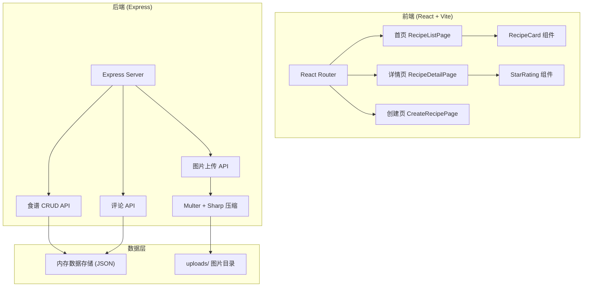
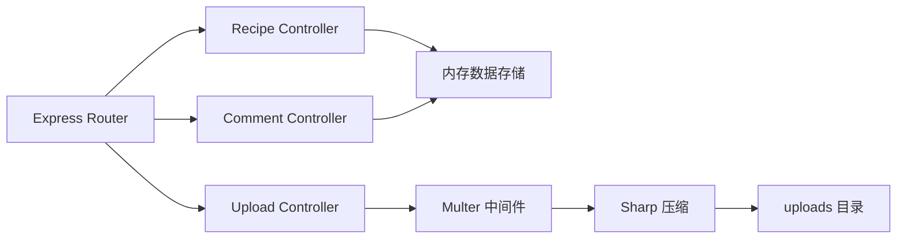
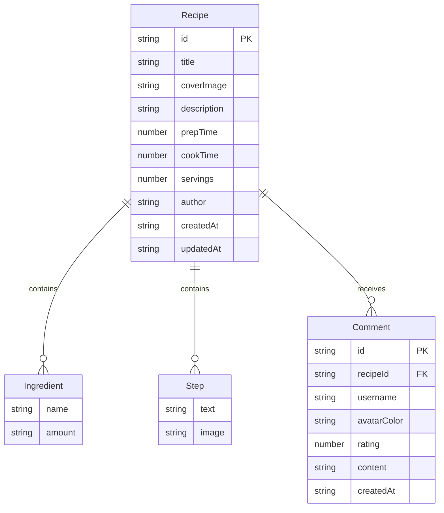

## 1. 架构设计



## 2. 技术说明

- 前端：React@18 + TypeScript + Vite + Tailwind CSS
- 初始化工具：vite-init（react-express-ts 模板）
- 后端：Express@4 + TypeScript（ESM格式）
- 数据库：内存JSON数据存储（无需外部数据库）
- 图片处理：Multer（上传）+ Sharp（压缩至800px宽/300KB以下）
- 状态管理：Zustand
- 路由：react-router-dom

## 3. 路由定义

| 路由 | 用途 |
|------|------|
| / | 首页，展示食谱网格列表 |
| /recipe/:id | 食谱详情页，展示完整食谱、评论和评分 |
| /create | 创建食谱页面（分步表单） |
| /create/:id | 编辑已有食谱 |

## 4. API定义

### 食谱相关

```typescript
interface Recipe {
  id: string;
  title: string;
  coverImage: string;
  description: string;
  prepTime: number;
  cookTime: number;
  servings: number;
  ingredients: Ingredient[];
  steps: Step[];
  author: string;
  createdAt: string;
  updatedAt: string;
}

interface Ingredient {
  name: string;
  amount: string;
}

interface Step {
  text: string;
  image?: string;
}

interface Comment {
  id: string;
  recipeId: string;
  username: string;
  avatarColor: string;
  rating: number;
  content: string;
  createdAt: string;
}

// GET /api/recipes - 获取食谱列表（支持分页，默认20条）
// GET /api/recipes/:id - 获取食谱详情
// POST /api/recipes - 创建食谱
// PUT /api/recipes/:id - 更新食谱
// DELETE /api/recipes/:id - 删除食谱

// GET /api/recipes/:id/comments - 获取食谱评论
// POST /api/recipes/:id/comments - 发表评论
// POST /api/recipes/:id/rate - 提交评分

// POST /api/upload - 上传图片（返回图片URL）
```

## 5. 服务端架构图



## 6. 数据模型

### 6.1 数据模型定义



### 6.2 数据定义语言

使用内存数据存储，初始数据以JSON格式硬编码在服务端代码中，无需DDL语句。初始包含3条示例食谱数据。
