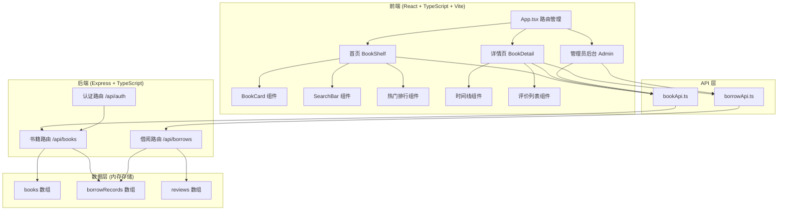
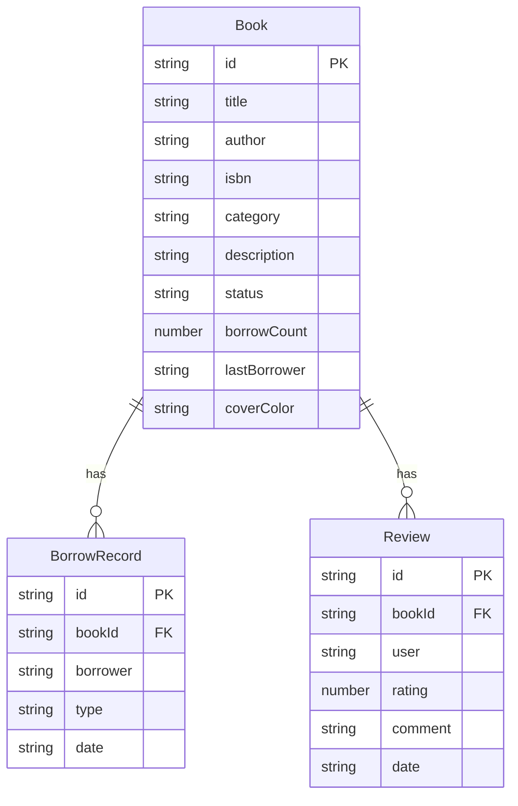

## 1. 架构设计



## 2. 技术说明
- 前端：React@18 + TypeScript + Vite + TailwindCSS
- 初始化工具：vite-init (react-express-ts 模板)
- 后端：Express@4 + TypeScript (ESM格式)
- 数据库：内存存储（数组模拟），预置示例数据
- 状态管理：Zustand
- 路由：react-router-dom
- 图标：lucide-react

## 3. 路由定义
| 路由 | 用途 |
|------|------|
| / | 首页，展示动态书架、搜索、分类筛选、热门排行 |
| /book/:id | 书籍详情弹窗页，展示完整信息、借阅时间线、读者评价 |
| /admin | 管理员后台，书籍管理表格、借出/归还操作 |

## 4. API定义

### 4.1 认证API
| 方法 | 路径 | 描述 | 请求体 | 响应 |
|------|------|------|--------|------|
| POST | /api/auth/login | 管理员登录 | { password: string } | { success: boolean, token: string } |

### 4.2 书籍API
| 方法 | 路径 | 描述 | 请求体/参数 | 响应 |
|------|------|------|-------------|------|
| GET | /api/books | 获取所有书籍 | query: category, status | Book[] |
| GET | /api/books/:id | 获取单本书籍 | - | Book |
| POST | /api/books | 添加新书 | Book (无id) | Book |
| PATCH | /api/books/:id/status | 更新借出/归还状态 | { status: 'borrowed'/'available', borrower: string } | Book |
| GET | /api/books/search?q=keyword | 搜索书籍 | query: q | Book[] |
| GET | /api/books/popular | 获取热门排行 | - | Book[] (前5) |
| GET | /api/books/:id/reviews | 获取书籍评价 | - | Review[] |

### 4.3 借阅API
| 方法 | 路径 | 描述 | 请求体 | 响应 |
|------|------|------|--------|------|
| GET | /api/borrows/:bookId | 获取借阅时间线 | - | BorrowRecord[] |
| POST | /api/borrows/borrow | 添加借出记录 | { bookId, borrower } | BorrowRecord |
| POST | /api/borrows/return | 添加归还记录 | { bookId } | BorrowRecord |

### 4.4 TypeScript类型定义
```typescript
interface Book {
  id: string;
  title: string;
  author: string;
  isbn: string;
  category: '文学' | '科技' | '历史' | '艺术' | '生活';
  description: string;
  status: 'available' | 'borrowed';
  borrowCount: number;
  lastBorrower: string;
  coverColor: string;
}

interface BorrowRecord {
  id: string;
  bookId: string;
  borrower: string;
  type: 'borrow' | 'return';
  date: string;
}

interface Review {
  id: string;
  bookId: string;
  user: string;
  rating: number;
  comment: string;
  date: string;
}

interface User {
  id: string;
  name: string;
  role: 'admin' | 'reader';
}
```

## 5. 服务器架构图

```mermaid
flowchart LR
    "Express Server" --> "Auth Middleware"
    "Auth Middleware" --> "Book Controller"
    "Auth Middleware" --> "Borrow Controller"
    "Book Controller" --> "内存数据 Store"
    "Borrow Controller" --> "内存数据 Store"
```

## 6. 数据模型

### 6.1 数据模型定义



### 6.2 初始数据
预置12本示例书籍，涵盖5个分类，每本书含3-5条借阅记录和2-3条评价，确保首页和详情页有丰富的展示内容。
