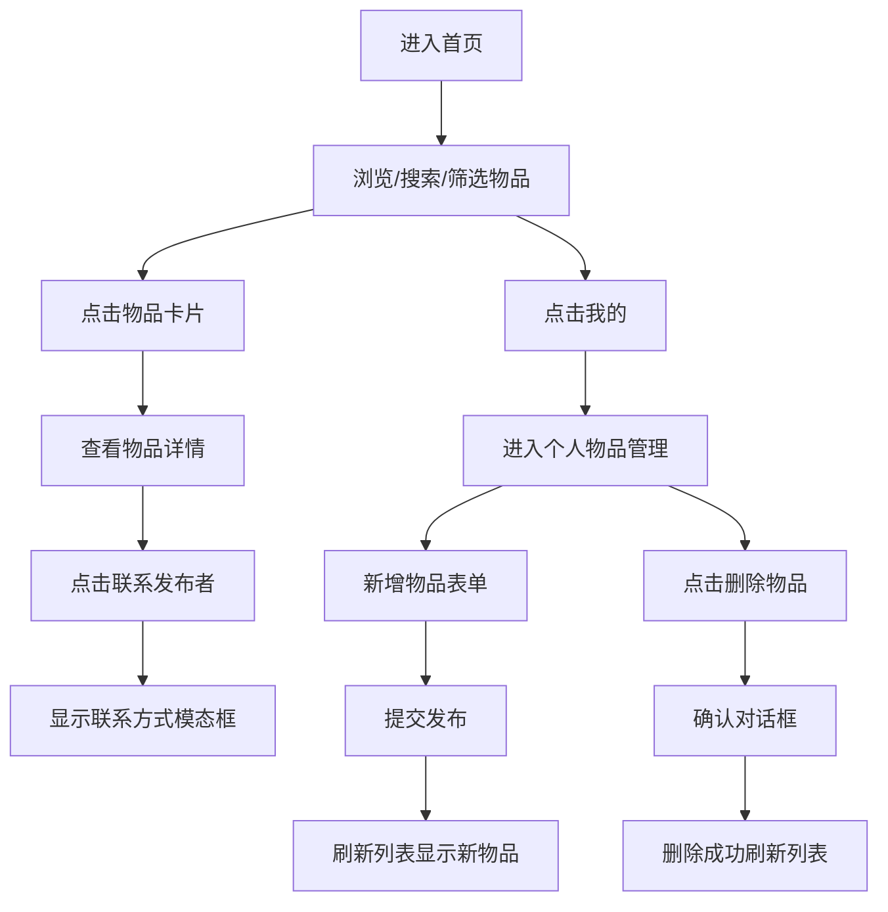

## 1. 产品概述

邻里二手物品交换市场是一个面向小区居民的闲置物品交易平台，让邻居们可以发布闲置物品、互相交换或低价出售，减少浪费的同时增进邻里互动。

- 主要用途：发布、浏览、搜索、交换二手物品，联系物品发布者
- 目标用户：小区居民，有闲置物品需要处理或想淘便宜物品的用户
- 产品价值：低碳环保、促进邻里交流、资源再利用

## 2. 核心功能

### 2.1 用户角色

| 角色 | 注册方式 | 核心权限 |
|------|----------|----------|
| 普通用户 | 默认使用模拟用户ID | 浏览物品、查看详情、联系发布者、发布物品、管理自己的物品 |

### 2.2 功能模块

1. **首页（物品列表）**：搜索栏、分类筛选、物品卡片网格、无限滚动加载
2. **物品详情页**：物品大图、完整描述、价格信息、发布者信息、联系发布者模态框
3. **个人物品管理页**：新增物品表单、已发布物品列表、删除物品确认对话框

### 2.3 页面详情

| 页面名称 | 模块名称 | 功能描述 |
|----------|----------|----------|
| 首页 | 搜索栏 | 关键词实时搜索过滤，300ms防抖，加载动画 |
| 首页 | 分类筛选 | 全部/家具/电器/书籍/衣物/其他，圆角药丸标签，点击高亮 |
| 首页 | 物品网格 | 自适应网格布局（桌面4列/平板2列/手机1列），卡片hover上浮效果 |
| 首页 | 无限滚动 | IntersectionObserver监听底部200px，分页加载每页20条 |
| 详情页 | 物品展示 | 大图400px居中，描述最大5行可展开，价格或交换标签 |
| 详情页 | 联系发布者 | 模态框显示联系方式，半透明遮罩rgba(0,0,0,0.5) |
| 我的页面 | 新增物品 | 表单：标题、描述、价格、图片上传、联系方式 |
| 我的页面 | 物品列表 | 缩略图80px圆角，标题、价格、删除按钮 |
| 我的页面 | 删除确认 | 确认对话框，红色确认按钮(#e53e3e)，灰色取消按钮(#a0aec0) |

## 3. 核心流程

## 4. 用户界面设计

### 4.1 设计风格
- **主色调**：暖色木纹风格，主背景 #fbfaf6，点缀色深橙 #c05621
- **辅助色**：蓝色高亮 #3182ce，红色删除按钮 #e53e3e，灰色取消 #a0aec0
- **导航栏**：高56px，纯白色背景，底部细阴影 #e2e8f0
- **卡片样式**：圆角12px，背景#fff，阴影 0 2px 8px rgba(0,0,0,0.06)，hover上浮6px阴影加深
- **字体**：使用系统默认无衬线字体，正文行高1.6

### 4.2 页面设计概览

| 页面名称 | 模块名称 | UI元素 |
|----------|----------|--------|
| 首页 | 导航栏 | Logo(树叶图标+交换站)、我的按钮、发布按钮 |
| 首页 | 搜索区 | 白底圆角8px搜索框带图标、分类药丸标签 |
| 首页 | 物品卡片 | 固定高度340px、缩略图150x150、标题、价格/交换标签 |
| 详情页 | 主内容区 | 大图400px、标题、价格、描述(可展开)、发布者信息 |
| 详情页 | 模态框 | 半透明遮罩、居中白色面板、微信/电话联系方式 |
| 我的页面 | 表单区 | 各输入框、文件上传、提交按钮 |
| 我的页面 | 列表区 | 每行缩略图80px圆角、标题、价格、删除按钮 |

### 4.3 响应式布局
- 桌面宽屏(>=1024px)：4列网格
- 平板(>=640px且<1024px)：2列网格
- 手机(<640px)：1列网格
- 所有卡片统一高度，网格最小240px最大1fr

### 4.4 动画效果
- 页面切换：淡入淡出 opacity 0.3秒
- 新增卡片：从底部滑入 translateY(30px)→0，0.4秒 ease-out
- 删除卡片：向左飞走 translateX(-200px) + opacity 0，0.3秒
- 图片加载：浅灰占位#e2e8f0，加载完成淡入0.3秒
- 卡片hover：上浮6px，阴影加深
