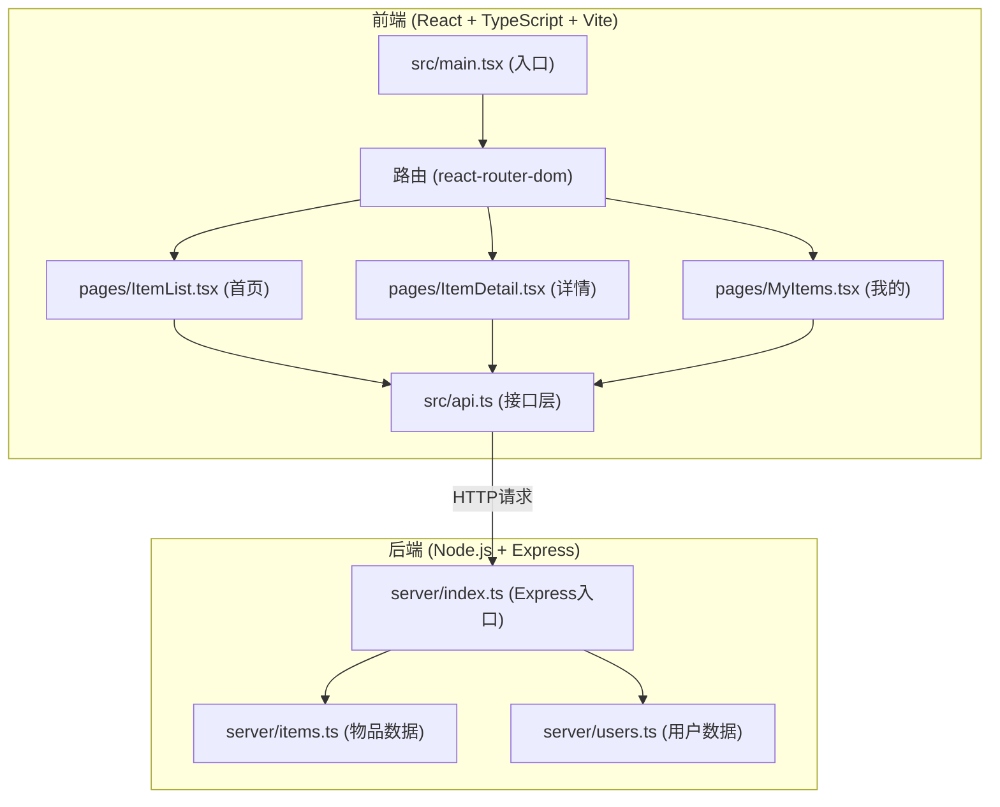
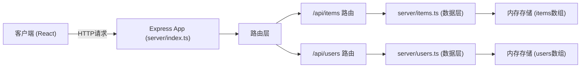
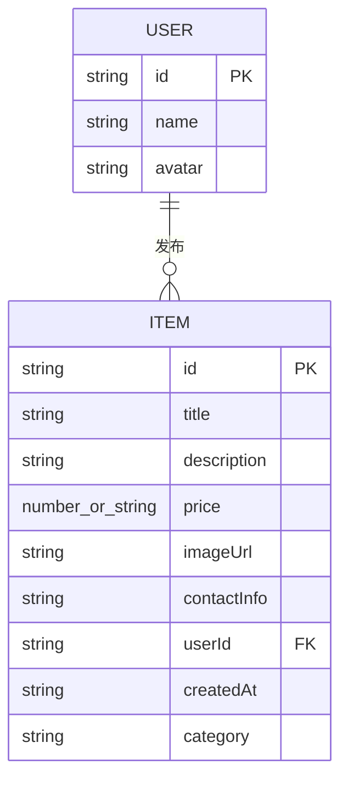

## 1. 架构设计



## 2. 技术描述

- **前端框架**：React 18 + TypeScript
- **构建工具**：Vite 5 + @vitejs/plugin-react
- **路由**：react-router-dom 6
- **HTTP客户端**：axios
- **后端**：Node.js + Express 4
- **跨域处理**：cors 中间件
- **文件上传**：multer
- **ID生成**：uuid
- **图片处理**：sharp（压缩）
- **数据存储**：内存数组（模拟数据）

## 3. 路由定义

| 前端路由 | 用途 |
|----------|------|
| / | 首页 - 物品列表（搜索、筛选、网格展示） |
| /items/:id | 物品详情页 |
| /my-items | 个人物品管理页 |

| 后端API路由 | 方法 | 用途 |
|-------------|------|------|
| /api/items | GET | 获取物品列表（支持分页） |
| /api/items/:id | GET | 获取单个物品详情 |
| /api/items | POST | 发布新物品 |
| /api/items/:id | DELETE | 删除物品 |
| /api/users/:userId | GET | 获取用户信息及其发布的物品 |
| /api/users/:userId/items | GET | 获取用户发布的物品列表 |

## 4. API 定义

```typescript
// 物品数据模型
interface Item {
  id: string;
  title: string;
  description: string;
  price: number | 'exchange';
  imageUrl: string;
  contactInfo: string;
  userId: string;
  createdAt: string;
  category: string;
}

// 用户数据模型
interface User {
  id: string;
  name: string;
  avatar: string;
}

// 列表响应
interface ItemsResponse {
  items: Item[];
  total: number;
  hasMore: boolean;
}
```

## 5. 服务器架构图



## 6. 数据模型

### 6.1 数据模型定义



### 6.2 初始化数据

应用启动时注入模拟用户和示例物品数据，便于功能演示。
