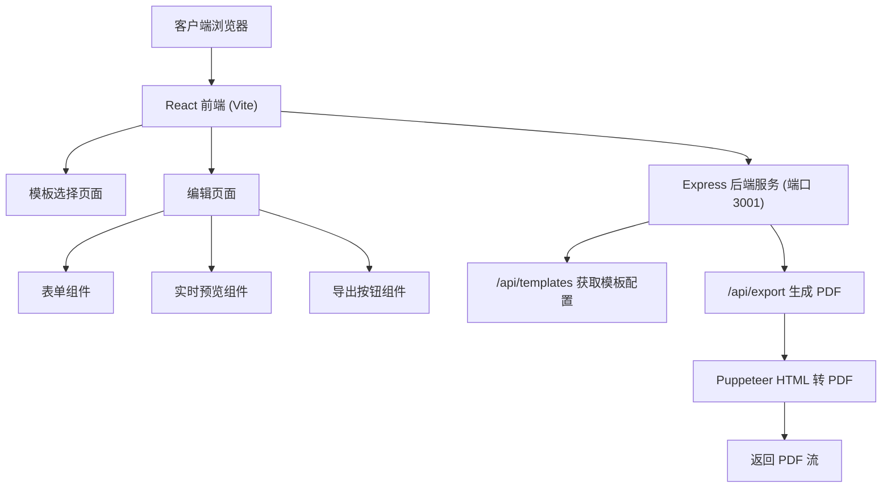
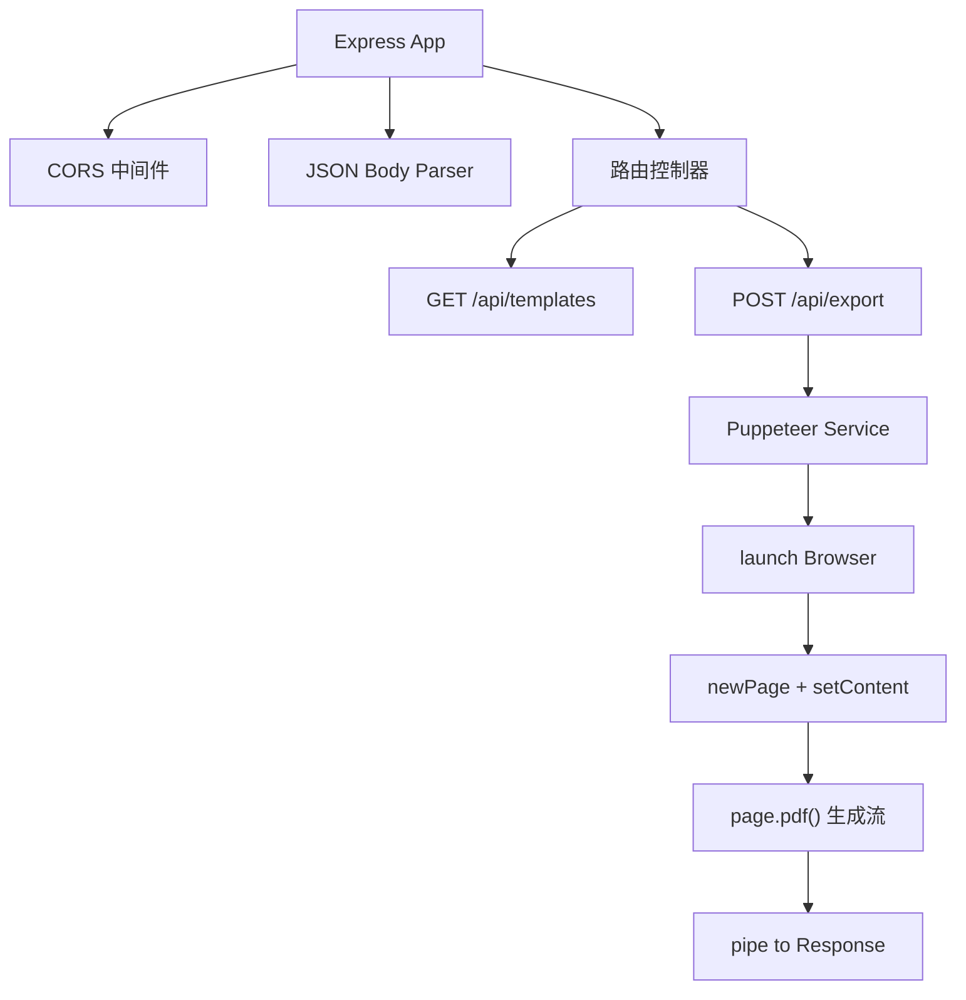
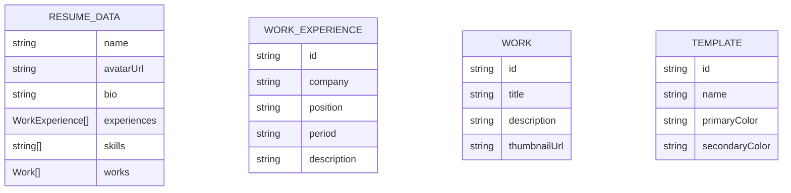

## 1. 架构设计



## 2. 技术描述

- **前端**: React 18 + TypeScript + Vite
- **路由**: react-router-dom
- **状态管理**: React useState/useContext (轻量级场景)
- **样式**: CSS Modules / 内联样式（按用户要求不引入 Tailwind）
- **后端**: Express 4 + TypeScript
- **PDF 生成**: Puppeteer (服务端 HTML 转 PDF)
- **构建工具**: Vite (前端) + ts-node (后端开发)
- **初始化工具**: vite-init (react-express-ts 模板)

## 3. 路由定义

| 路由 | 组件 | 用途 |
|------|------|------|
| `/` | TemplateSelect | 模板选择首页 |
| `/edit/:templateId` | EditPage | 编辑页面，含表单和预览 |

## 4. API 定义

### 4.1 GET /api/templates
获取所有模板配置

**响应格式:**
```typescript
interface Template {
  id: string;
  name: string;
  primaryColor: string;
  secondaryColor: string;
  description: string;
}

// Response: Template[]
```

### 4.2 POST /api/export
将 HTML 内容转换为 PDF 并返回

**请求格式:**
```typescript
interface ExportRequest {
  html: string;
  fileName?: string;
}
```

**响应:**
- Content-Type: `application/pdf`
- Body: PDF 文件二进制流

## 5. 服务端架构



## 6. 数据模型

### 6.1 前端状态数据



### 6.2 TypeScript 类型定义

```typescript
// shared/types.ts
export interface WorkExperience {
  id: string;
  company: string;
  position: string;
  period: string;
  description: string;
}

export interface Work {
  id: string;
  title: string;
  description: string;
  thumbnailUrl: string;
}

export interface ResumeData {
  name: string;
  avatarUrl: string;
  bio: string;
  experiences: WorkExperience[];
  skills: string[];
  works: Work[];
}

export type TemplateId = 'minimal' | 'tech' | 'creative';

export interface TemplateConfig {
  id: TemplateId;
  name: string;
  primaryColor: string;
  secondaryColor: string;
  description: string;
}
```
