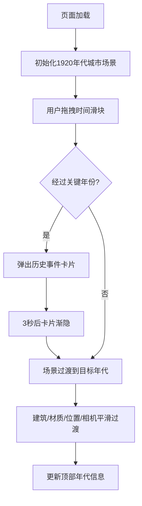

## 1. 产品概述

城市时光机 (City Time Machine) 是一个三维城市风貌与历史变迁时间轴交互式展示系统，用于城市规划展览、景区数字孪生等场景，通过3D可视化技术让用户直观感受城市建筑在不同年代的演变历程。

- 核心目标：通过沉浸式3D交互体验，生动呈现城市记忆和建筑风貌变迁
- 目标用户：城市规划展览馆访客、景区游客、历史文化爱好者
- 市场价值：提升城市文化展示的科技感和互动性，增强用户体验和记忆点

## 2. 核心功能

### 2.1 用户角色

| 角色 | 注册方式 | 核心权限 |
|------|----------|----------|
| 访客用户 | 无需注册 | 浏览3D场景、拖拽时间轴、查看历史事件卡片 |

### 2.2 功能模块

1. **3D城市场景模块**：多栋风格建筑、行道树、路灯、坐标网格地面
2. **时间轴控制模块**：底部滑块控件，支持拖拽切换三个年代阶段
3. **历史事件卡片模块**：关键年份触发半透明毛玻璃信息卡片
4. **顶部信息栏模块**：显示当前年代和建筑数量统计

### 2.3 页面详情

| 页面名称 | 模块名称 | 功能描述 |
|----------|----------|----------|
| 主展示页 | 3D城市场景 | 根据年代索引渲染对应风格的建筑群，包含建筑、行道树、路灯和网格地面，材质和位置随年代平滑过渡 |
| 主展示页 | 时间轴控件 | 水平滑块(600px)，轨道渐变从棕到灰到蓝，左右年代标签，拖拽返回0-2索引值 |
| 主展示页 | 信息卡片 | 经过关键年份(1949/1978/2008)时弹出，宽400px圆角12px，深色半透明毛玻璃背景，显示大事记和像素风简笔画 |
| 主展示页 | 顶部悬浮栏 | 高50px半透明毛玻璃背景，靠右显示当前年代和建筑数量 |

## 3. 核心流程

用户进入页面后，默认展示1920年代的城市风貌。通过拖拽底部时间滑块，场景中的建筑材质、布局间距、相机视角会平滑过渡到对应年代。当滑块经过1949、1978、2008等关键年份时，屏幕中央会弹出历史事件信息卡片，3秒后自动渐隐。

## 4. 用户界面设计

### 4.1 设计风格
- **主色调**：暗色调背景 #0f172a，搭配柔和蓝紫渐变光效
- **年代配色**：
  - 1920年代：砖红色 #b7410e + 米黄 #f5deb3
  - 1980年代：浅灰 #d3d3d3 + 淡蓝 #87ceeb
  - 2020年代：深蓝 #1a1a2e + 亮银 #c0c0c0
- **按钮/控件**：圆角设计，毛玻璃模糊效果
- **字体**：现代无衬线字体，层次分明
- **布局风格**：全屏沉浸式3D场景 + 悬浮UI控件
- **动画**：所有交互过渡0.5秒，ease-out缓出

### 4.2 页面设计概览

| 页面名称 | 模块名称 | UI元素 |
|----------|----------|----------|
| 主展示页 | 3D场景 | Three.js渲染，BoxGeometry建筑，圆锥+圆柱树木，球体+圆柱路灯，半透明网格地面 |
| 主展示页 | 时间轴 | 600px宽水平滑块，渐变轨道，年代标签，底部居中 |
| 主展示页 | 信息卡片 | 400px宽，12px圆角，#1a202c80背景，毛玻璃，居中显示，Canvas像素简笔画 |
| 主展示页 | 顶部栏 | 50px高，#1a202c70背景，毛玻璃，右对齐年代和统计信息 |

### 4.3 响应式设计
- 桌面端优先设计
- 时间轴滑块宽度随屏幕宽度自适应（最小300px，最大600px）
- 信息卡片在移动端调整宽度为90vw
- 3D场景canvas自适应容器尺寸

### 4.4 3D场景指导
- **环境**：暗色空间背景 #0f172a，柔和蓝紫环境光
- **光照**：AmbientLight + DirectionalLight，配合HemisphereLight模拟天光
- **相机**：PerspectiveCamera，初始30度俯角，随年代切换到10度俯角
- **构图**：建筑群居中分布，行道树沿街道排列，路灯间隔设置
- **交互**：OrbitControls允许用户旋转/缩放场景，时间轴驱动过渡动画
- **后处理**：柔和抗锯齿，适度Bloom增强发光材质效果
- **性能**：合并几何体优化，目标帧率≥40fps（12栋建筑+50个树木/路灯实例）
