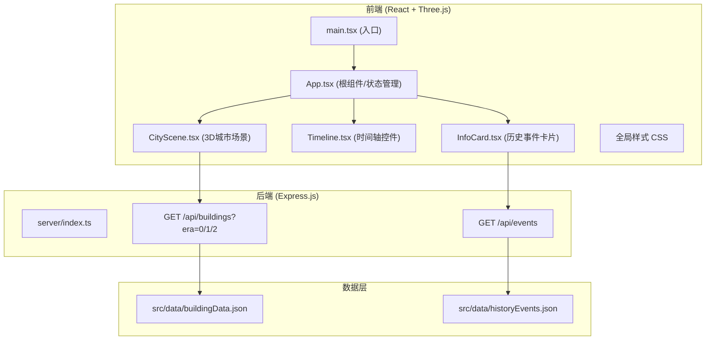
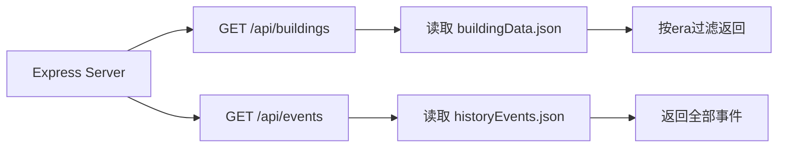
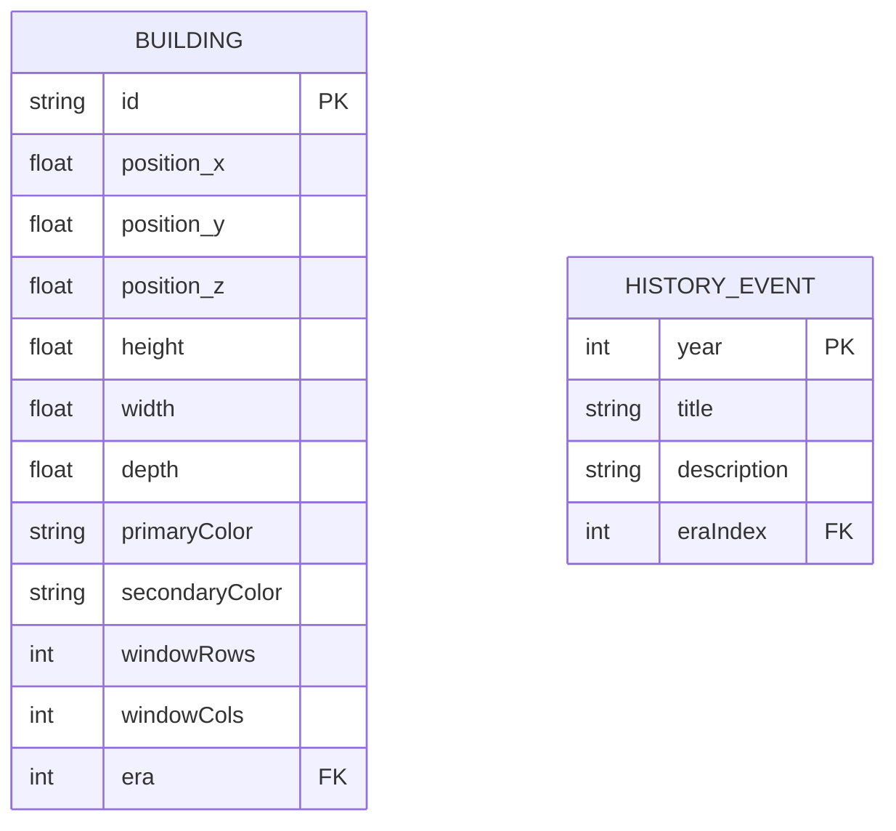

## 1. 架构设计



## 2. 技术说明

- **前端框架**：React 18 + TypeScript
- **构建工具**：Vite（含路径别名@和API代理配置）
- **3D引擎**：Three.js + @react-three/fiber + @react-three/drei
- **状态管理**：React useState/useEffect（轻量级场景，无需额外状态库）
- **样式方案**：全局CSS + 组件内style/CSS Modules
- **后端**：Node.js + Express 4 + CORS
- **数据格式**：静态JSON文件
- **图标**：lucide-react

## 3. 路由定义

| 路由 | 用途 |
|------|------|
| / | 主展示页面（3D场景 + 时间轴 + 信息卡片） |
| GET /api/buildings?era=0/1/2 | 获取指定年代的建筑配置数据 |
| GET /api/events | 获取所有关键历史事件数据 |

## 4. API 定义

### GET /api/buildings?era=0/1/2

请求参数：
- `era`: number (0=1920年代, 1=1980年代, 2=2020年代)

响应数据类型：
```typescript
interface BuildingConfig {
  id: string;
  position: [number, number, number];
  height: number;
  width: number;
  depth: number;
  primaryColor: string;
  secondaryColor: string;
  windowRows: number;
  windowCols: number;
  era: number;
}

type BuildingsResponse = BuildingConfig[];
```

### GET /api/events

响应数据类型：
```typescript
interface HistoryEvent {
  year: number;
  title: string;
  description: string;
  eraIndex: number;
}

type EventsResponse = HistoryEvent[];
```

## 5. 服务端架构



## 6. 数据模型

### 6.1 数据模型定义



### 6.2 项目文件结构

```
auto98/
├── package.json
├── vite.config.js
├── tsconfig.json
├── index.html
├── server/
│   └── index.ts
└── src/
    ├── main.tsx
    ├── App.tsx
    ├── components/
    │   ├── CityScene.tsx
    │   ├── Timeline.tsx
    │   └── InfoCard.tsx
    ├── data/
    │   ├── buildingData.json
    │   └── historyEvents.json
    └── styles/
        └── global.css
```
