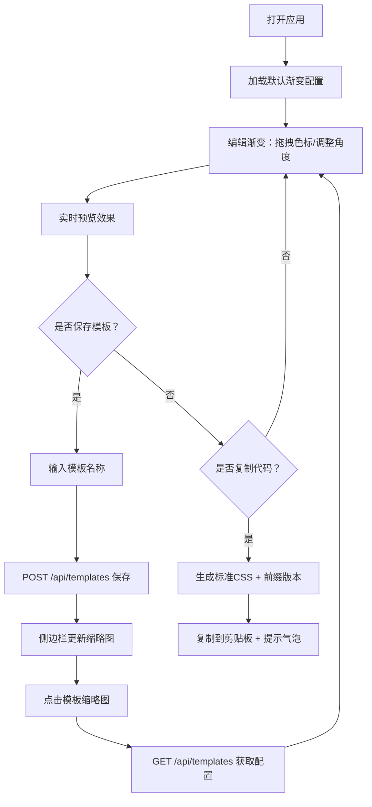

## 1. 产品概述

渐变色拾取与代码生成工具是一款面向前端开发者的专业设计辅助工具，帮助用户通过可视化方式快速创建、调整CSS渐变效果，并一键生成跨浏览器兼容的代码。目标是提升开发效率，降低手动编写渐变代码的复杂度。

- **核心价值**：将设计稿中的渐变效果快速转化为可直接使用的CSS代码
- **目标用户**：前端开发者、UI设计师
- **产品定位**：轻量、高效、精准的渐变设计与代码生成工具

## 2. 核心功能

### 2.1 用户角色
| 角色 | 注册方式 | 核心权限 |
|------|----------|----------|
| 普通用户 | 无需注册 | 使用渐变编辑、预览、代码生成、本地收藏功能 |

### 2.2 功能模块
1. **渐变编辑器**：色标管理、角度控制、颜色选择
2. **实时预览**：多种形状预览、可调整尺寸
3. **代码生成**：标准CSS、带前缀版本、一键复制
4. **模板收藏**：保存/加载/删除渐变模板

### 2.3 页面详情
| 页面名称 | 模块名称 | 功能描述 |
|---------|---------|---------|
| 主页面 | 渐变轨道 | 支持添加/删除/拖拽色标（最多8个），显示百分比偏移，弹性动画过渡 |
| 主页面 | 色标列表 | 展示当前所有色标，支持点击编辑颜色 |
| 主页面 | 角度转盘 | 可拖拽圆形转盘控制渐变角度，支持手动输入0-360度 |
| 主页面 | 颜色选择器 | 支持十六进制、RGB、HSL输入，色相滑块与饱和度-明度面板联动 |
| 主页面 | 预览面板 | 四种预设形状（背景填充、圆形遮罩、文字填充、边框渐变），可拖拽调整大小 |
| 主页面 | 代码展示 | 显示标准CSS和-webkit-前缀代码，一键复制，复制成功提示 |
| 主页面 | 收藏侧边栏 | 以缩略图网格展示收藏模板，点击加载，支持删除 |
| 主页面 | 保存模板 | 弹框输入名称，保存当前渐变配置到后端 |

## 3. 核心流程

### 3.1 渐变编辑流程
用户打开应用 → 默认展示渐变色标 → 拖拽/添加/删除色标调整渐变 → 转动角度转盘或输入数值 → 实时预览效果 → 点击复制按钮获取CSS代码

### 3.2 模板收藏流程
用户编辑好渐变 → 点击保存按钮 → 弹出输入框填写名称 → 确认保存到后端 → 右侧边栏显示新模板缩略图 → 点击模板加载配置

### 3.3 Mermaid流程图

## 4. 用户界面设计

### 4.1 设计风格
- **设计语言**：现代简约、专业工具感
- **主色调**：浅灰背景 #f0f2f5，白色卡片 #ffffff
- **强调色**：选用清新的蓝色系作为交互元素主色
- **圆角**：卡片圆角 12px，按钮圆角 8px
- **阴影**：卡片阴影 0 2px 8px rgba(0,0,0,0.1)
- **字体**：现代无衬线字体，清晰易读
- **动效**：所有交互元素 0.3s ease 平滑过渡，色标拖拽 0.2s 弹性动画

### 4.2 页面设计概述
| 页面名称 | 模块名称 | UI元素 |
|---------|---------|--------|
| 主页面 | 整体布局 | 三栏布局：左侧编辑区 + 中间预览区 + 右侧收藏栏 |
| 主页面 | 渐变轨道 | 水平长条，色标为圆形，拖拽时光标变化 |
| 主页面 | 角度转盘 | 圆形表盘，指针可拖拽，中心显示角度数值 |
| 主页面 | 颜色选择器 | 饱和度面板 + 色相滑块 + 数值输入框 |
| 主页面 | 预览区 | 卡片式容器，底部或右下角拖拽调整手柄 |
| 主页面 | 代码区块 | 等宽字体，背景深色，复制按钮在右上角 |
| 主页面 | 收藏侧边栏 | 固定宽度280px，缩略图网格，悬停显示删除按钮 |

### 4.3 响应式设计
- **桌面端（≥1000px）**：左侧编辑区 + 中间预览区 + 右侧边栏三栏布局
- **平板/移动端（<1000px）**：编辑器与预览区上下排列，右侧边栏折叠为底部抽屉
- **触控优化**：色标和转盘增大触控热区，手势滑动支持

## 5. 性能约束
- 拖拽色标或调整角度时，预览更新延迟 ≤ 16ms（60FPS）
- 代码生成与复制操作响应时间 < 50ms
- 首次加载时间 < 2s
