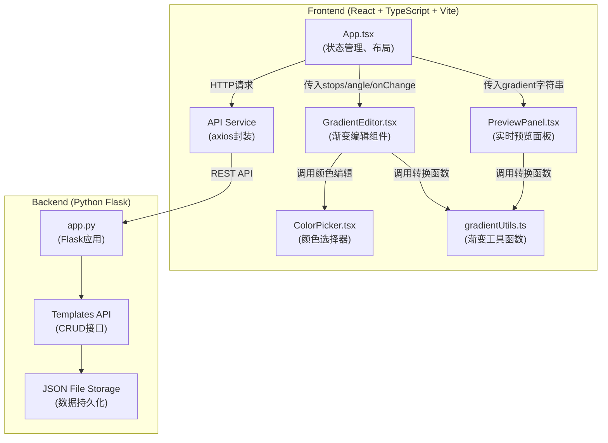
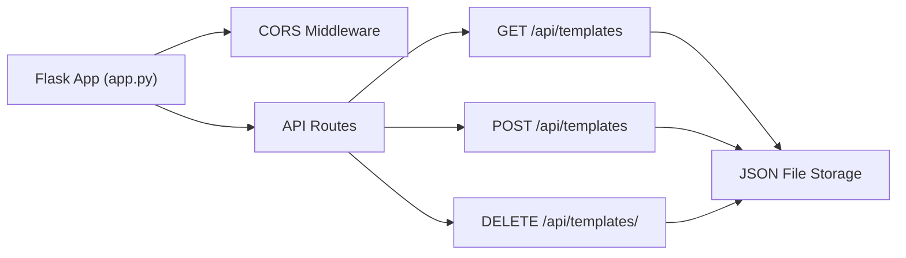

## 1. 架构设计



## 2. 技术描述

### 2.1 前端技术栈
- **框架**: React 18 + TypeScript
- **构建工具**: Vite 5 + @vitejs/plugin-react
- **状态管理**: React useState/useReducer (组件内状态)
- **样式方案**: CSS Modules + 内联样式
- **第三方库**:
  - `re-resizable` - 可拖拽调整大小组件
  - `react-colorful` - 颜色选择器组件
  - `axios` - HTTP请求库

### 2.2 后端技术栈
- **框架**: Flask (Python)
- **数据存储**: JSON文件（轻量级，无需数据库）
- **CORS**: flask-cors 处理跨域

### 2.3 初始化方式
- 前端: 手动配置 Vite + React + TypeScript 项目结构
- 后端: 单文件 Flask 应用

## 3. 项目文件结构

```
auto18/
├── index.html                 # 入口HTML
├── package.json               # 前端依赖
├── tsconfig.json              # TypeScript配置
├── vite.config.js             # Vite配置
├── src/
│   ├── App.tsx                # 主应用组件
│   ├── main.tsx               # 应用入口
│   ├── components/
│   │   ├── GradientEditor.tsx # 渐变编辑器
│   │   ├── PreviewPanel.tsx   # 预览面板
│   │   └── ColorPicker.tsx    # 颜色选择器
│   ├── utils/
│   │   └── gradientUtils.ts   # 渐变工具函数
│   ├── types/
│   │   └── index.ts           # TypeScript类型定义
│   ├── services/
│   │   └── api.ts             # API服务封装
│   └── styles/
│       └── App.css            # 全局样式
└── src/backend/
    ├── app.py                 # Flask后端应用
    └── templates.json         # 模板数据存储
```

## 4. 数据流向

### 4.1 核心数据流
1. **App.tsx** 维护全局状态：`colorStops`、`angle`、`previewSize`
2. 状态通过 props 传递给 **GradientEditor.tsx** 和 **PreviewPanel.tsx**
3. **GradientEditor.tsx** 通过 `onChange` 回调将更新后的数据传回 **App.tsx**
4. **gradientUtils.ts** 提供纯函数，将 `colorStops + angle` 转换为 CSS 渐变字符串
5. **PreviewPanel.tsx** 接收渐变字符串并渲染

### 4.2 API 数据流
1. **App.tsx** 调用 **api.ts** 中的服务函数
2. **api.ts** 使用 axios 发送 HTTP 请求到 Flask 后端
3. Flask 后端操作 `templates.json` 文件进行数据持久化
4. 返回数据经 **api.ts** 解析后传递给 **App.tsx**

## 5. TypeScript 类型定义

```typescript
// 色标对象
interface ColorStop {
  id: string;
  color: string;  // hex颜色值
  position: number; // 0-100 百分比
}

// 渐变配置
interface GradientConfig {
  stops: ColorStop[];
  angle: number;
}

// 模板对象
interface GradientTemplate {
  id: string;
  name: string;
  config: GradientConfig;
  createdAt: string;
}

// API响应
interface ApiResponse<T> {
  success: boolean;
  data?: T;
  error?: string;
}
```

## 6. API 接口定义

### 6.1 获取模板列表
- **Method**: `GET /api/templates`
- **Response**:
```json
{
  "success": true,
  "data": [
    {
      "id": "uuid-1",
      "name": "海洋蓝",
      "config": {
        "stops": [
          {"id": "s1", "color": "#00d4ff", "position": 0},
          {"id": "s2", "color": "#0066ff", "position": 100}
        ],
        "angle": 135
      },
      "createdAt": "2024-01-01T00:00:00Z"
    }
  ]
}
```

### 6.2 保存模板
- **Method**: `POST /api/templates`
- **Request Body**:
```json
{
  "name": "夕阳红",
  "config": {
    "stops": [...],
    "angle": 90
  }
}
```
- **Response**: 返回创建的模板对象（含id）

### 6.3 删除模板
- **Method**: `DELETE /api/templates/<id>`
- **Response**:
```json
{
  "success": true,
  "message": "Template deleted"
}
```

## 7. 后端服务架构



### 7.1 后端模块说明
- **Flask App**: 应用入口，初始化CORS和路由
- **CORS Middleware**: 处理跨域请求，允许前端访问
- **API Routes**: 三个RESTful接口处理模板CRUD
- **JSON File Storage**: 使用JSON文件进行轻量级数据持久化

## 8. 性能优化策略

1. **使用 useMemo 缓存渐变字符串计算**，避免重复计算
2. **使用 useCallback 优化事件处理函数**，减少子组件重渲染
3. **拖拽操作使用 requestAnimationFrame** 节流，保证60FPS
4. **颜色选择器使用 react-colorful**，轻量高性能
5. **后端使用内存缓存**，避免频繁读写JSON文件
