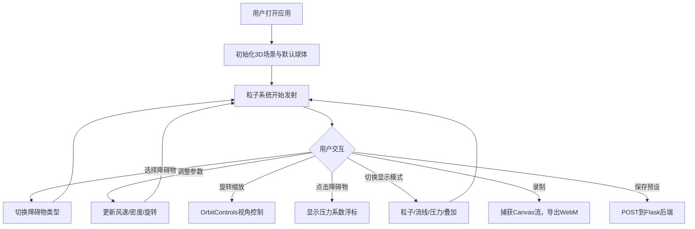

## 1. 产品概述

空气动力学流场可视化模拟器——一款基于 WebGL 的 3D 交互式气流模拟应用，让用户无需物理风洞设备即可直观观察气流绕过不同形状物体时的流动模式与压力分布。面向工程师、学生和爱好者，解决快速可视化和理解空气动力学现象（层流、湍流、涡旋脱落）的互动演示需求。

## 2. 核心功能

### 2.1 功能模块

1. **3D 场景主页**：3D 风洞场景，粒子流场可视化，障碍物选择与交互，控制面板，录制回放

### 2.2 页面详情

| 页面名称 | 模块名称 | 功能描述 |
|---------|---------|---------|
| 3D 场景主页 | 障碍物选择器 | 从10种预设物体中选择障碍物：球体、圆柱体、机翼剖面、汽车模型、金字塔、平板、楔形、半球、凹面镜、自定义 |
| 3D 场景主页 | 粒子系统 | 左侧平面发射5000个浅蓝#87CEEB到白色渐变粒子，恒定速度右行，遇障碍物根据法线/曲率偏转，形成绕流/涡旋/分离区，粒子大小0.08-0.3单位，寿命6秒，2秒半透明渐变拖尾 |
| 3D 场景主页 | 交互控制 | OrbitControls旋转视角（阻尼0.1），滚轮缩放，点击障碍物显示实时压力系数浮标（蓝到红映射-1.5~1.5），压力云图半透明彩色贴图渲染在物体表面 |
| 3D 场景主页 | 参数控制面板 | 风速1-20m/s默认8，粒子密度1000-10000默认5000，障碍物旋转角度-180~180三轴独立，显示模式（粒子/流线/压力云图/叠加），0.5秒平滑过渡 |
| 3D 场景主页 | 录制回放 | 最长30秒动画录制，Canvas.captureStream导出WebM，时间轴显示当前帧统计信息（平均速度、湍流强度） |

## 3. 核心流程

用户打开应用 → 看到默认球体障碍物和粒子流场 → 可切换障碍物类型 → 调整风速/粒子密度/旋转角度 → 切换显示模式（粒子/流线/压力/叠加） → 鼠标拖拽旋转视角，点击查看压力系数 → 可录制动画并导出WebM → 可保存当前参数组合为预设

## 4. 用户界面设计

### 4.1 设计风格

- **主背景色**：深空蓝 #0B0C10
- **辅助面板**：半透明毛玻璃效果（背景rgba(30,40,60,0.8)，模糊10px，圆角12px）
- **强调色**：发光青色 #45A29E，悬停亮度提升20%
- **粒子色**：浅蓝 #87CEEB 到白色渐变
- **压力映射**：蓝到红映射 -1.5 到 1.5
- **字体**：显示字体 Orbitron（科技感），UI字体 Rajdhani
- **布局**：全屏3D场景 + 右侧浮动控制面板
- **按钮风格**：圆角8px，发光青色边框/填充，暗色文字

### 4.2 页面设计概览

| 页面名称 | 模块名称 | UI元素 |
|---------|---------|--------|
| 3D场景主页 | 3D视口 | 全屏WebGL画布，深空蓝背景，粒子发射器左侧淡蓝半透明平面标示，障碍物居中显示 |
| 3D场景主页 | 控制面板 | 右侧毛玻璃浮动面板，滑块（发光青色轨道），模式切换按钮组，录制按钮，预设管理 |
| 3D场景主页 | 压力浮标 | 点击障碍物时在3D空间中显示数值浮标，蓝到红色映射 |
| 3D场景主页 | 录制面板 | 底部时间轴，统计信息（平均速度、湍流强度），导出按钮 |

### 4.3 响应式适配

- 桌面优先设计
- 屏幕宽度 < 768px 时，控制面板折叠为底部抽屉式，可向上拖拽展开
- 触摸设备支持 OrbitControls 触摸手势

### 4.4 3D 场景指引

- **环境**：深空蓝暗色背景，无HDRI，纯色雾效营造深度
- **光照**：环境光 + 方向光，柔和照明突出粒子与障碍物
- **相机**：透视相机，初始位置(0, 5, 15)，看向原点，OrbitControls阻尼0.1
- **障碍物材质**：半透明材质（透明度0.6）+ 网格线，方便观察内部粒子
- **粒子效果**：浅蓝到白色渐变流光，2秒半透明拖尾尾迹
- **后处理**：无额外后处理，保持60FPS性能
- **性能预算**：粒子数 > 8000 自动降级（粒子大小减半，取消尾迹，颜色离散化）

## 5. 性能要求

- 60FPS 流畅体验
- 粒子数 > 8000 时自动低质量模式（粒子大小减半，取消尾迹，颜色离散化）
- 参数调整后 0.5 秒内平滑过渡
- 最长 30 秒录制
