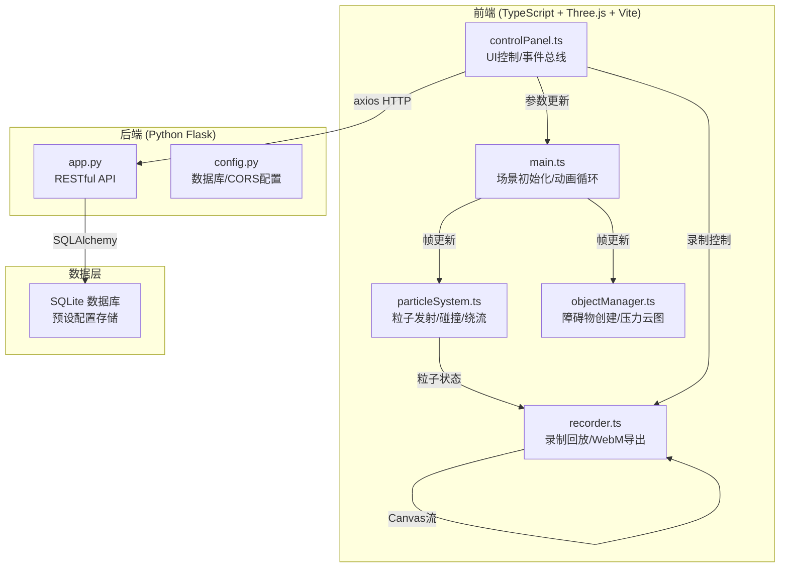
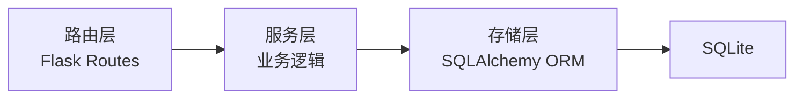
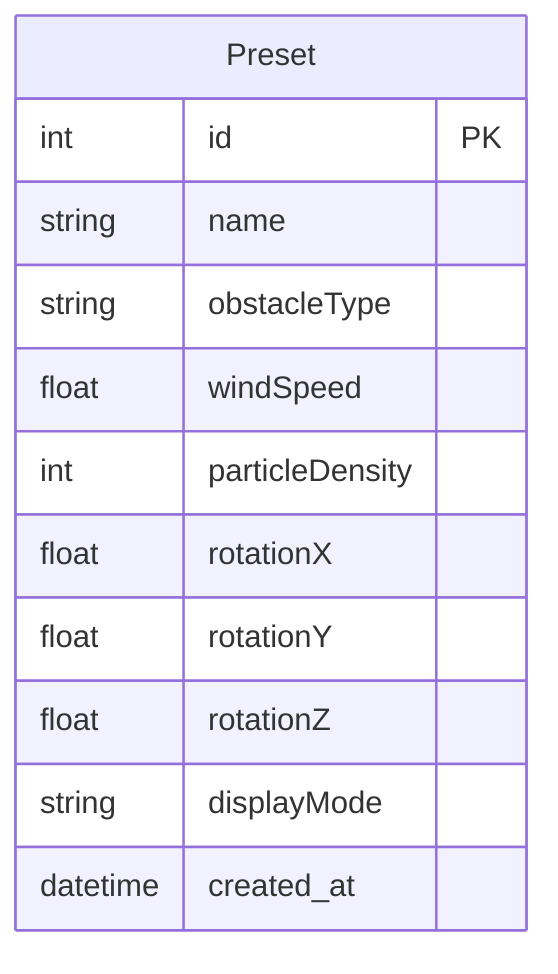

## 1. 架构设计



## 2. 技术说明

- **前端**：TypeScript + Three.js + Vite
- **3D渲染**：Three.js（场景、相机、渲染器、OrbitControls、BufferGeometry粒子系统）
- **构建工具**：Vite
- **HTTP客户端**：axios
- **后端**：Python Flask + flask-cors
- **数据库**：SQLite（通过 Flask SQLAlchemy）
- **模块通信**：自定义事件总线（EventEmitter模式）

## 3. 路由定义

| 路由 | 用途 |
|------|------|
| / | 主页面，加载3D风洞场景 |

## 4. API 定义

### 4.1 保存预设

```
POST /preset
Content-Type: application/json

Request Body:
{
  "name": "string",
  "obstacleType": "sphere" | "cylinder" | "airfoil" | "car" | "pyramid" | "flatplate" | "wedge" | "hemisphere" | "concavemirror" | "custom",
  "windSpeed": number,       // 1-20
  "particleDensity": number, // 1000-10000
  "rotationX": number,       // -180 to 180
  "rotationY": number,       // -180 to 180
  "rotationZ": number,       // -180 to 180
  "displayMode": "particles" | "streamlines" | "pressure" | "overlay"
}

Response:
{
  "id": number,
  "name": "string",
  "message": "Preset saved"
}
```

### 4.2 获取预设列表

```
GET /presets

Response:
[
  {
    "id": number,
    "name": "string",
    "obstacleType": "string",
    "windSpeed": number,
    "particleDensity": number,
    "rotationX": number,
    "rotationY": number,
    "rotationZ": number,
    "displayMode": "string",
    "created_at": "string"
  }
]
```

### 4.3 删除预设

```
DELETE /preset/<id>

Response:
{
  "message": "Preset deleted"
}
```

## 5. 服务器架构图



## 6. 数据模型

### 6.1 数据模型定义



### 6.2 数据定义语言

```sql
CREATE TABLE preset (
    id INTEGER PRIMARY KEY AUTOINCREMENT,
    name VARCHAR(100) NOT NULL,
    obstacle_type VARCHAR(50) NOT NULL,
    wind_speed REAL DEFAULT 8.0,
    particle_density INTEGER DEFAULT 5000,
    rotation_x REAL DEFAULT 0.0,
    rotation_y REAL DEFAULT 0.0,
    rotation_z REAL DEFAULT 0.0,
    display_mode VARCHAR(20) DEFAULT 'particles',
    created_at DATETIME DEFAULT CURRENT_TIMESTAMP
);
```

## 7. 文件组织

```
├── package.json
├── index.html
├── tsconfig.json
├── vite.config.js
├── src/
│   ├── main.ts           # 场景入口
│   ├── particleSystem.ts  # 粒子系统
│   ├── objectManager.ts   # 障碍物管理
│   ├── controlPanel.ts    # 控制面板
│   └── recorder.ts        # 录制回放
└── backend/
    ├── app.py             # Flask应用
    └── config.py          # 配置
```

## 8. 核心算法

### 8.1 粒子碰撞与绕流

- 对每个粒子每帧进行射线检测（Raycaster）或距离场检测
- 碰撞时根据表面法线反射速度分量
- 根据曲率调整切向速度，模拟附面层效应
- 在分离点附近引入随机扰动模拟涡旋脱落

### 8.2 压力系数计算

- 使用简化的伯努利方程：Cp = 1 - (V/V∞)²
- 在障碍物表面采样点计算局部速度
- 映射到 -1.5 ~ 1.5 范围，蓝到红色渐变

### 8.3 性能优化

- 使用 BufferGeometry + Points 渲染粒子（GPU实例化）
- 粒子数 > 8000 自动降级：大小减半，取消尾迹，颜色离散化
- 碰撞检测使用空间哈希加速
- 参数变化使用 lerp 插值实现 0.5 秒平滑过渡
