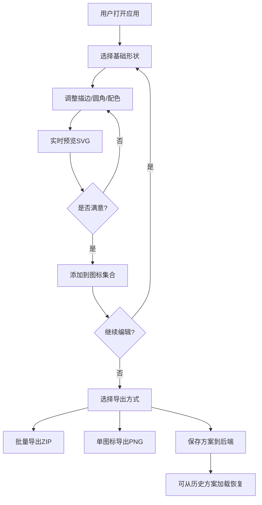

## 1. 产品概述

图标工厂（Icon Factory）是一款面向独立开发者和小型设计团队的在线图标编辑与批量导出工具，旨在解决手动绘制图标效率低、难以保持视觉一致性的痛点。用户可通过选择基础形状、调整描边/圆角/配色，实时预览并批量导出风格统一的SVG图标集。

## 2. 核心功能

### 2.1 用户角色

| 角色 | 注册方式 | 核心权限 |
|------|----------|----------|
| 设计者 | 无需注册 | 编辑图标、管理集合、导出文件、保存/加载方案 |

### 2.2 功能模块

1. **主编辑页**：左侧图标编辑面板 + 右侧实时预览画布 + 底部集合列表 + 导出面板

### 2.3 页面详情

| 页面名称 | 模块名称 | 功能描述 |
|----------|----------|----------|
| 主编辑页 | 形状选择器 | 提供8种基础形状（正方形、圆形、三角形、十字、星形、箭头、心形、菱形），每种带预览缩略图 |
| 主编辑页 | 描边编辑器 | 描边粗细滑块（1-10px，步长0.5）、描边颜色选择器（色相环+十六进制输入） |
| 主编辑页 | 圆角编辑器 | 圆角滑块（0-20px，步长0.5） |
| 主编辑页 | 填充编辑器 | 纯色填充、线性渐变、径向渐变、无填充四种模式，渐变模式支持2+色标拖拽编辑 |
| 主编辑页 | 实时预览画布 | 根据编辑器参数实时渲染SVG，背景可切换透明网格/纯色，图标居中自适应缩放 |
| 主编辑页 | 集合管理 | 添加多个图标配置到集合，列表展示微缩图和名称，支持删除和选中编辑 |
| 主编辑页 | 批量导出 | 一键导出ZIP（内含SVG文件+JSON清单）/ 单图标导出PNG（128/256/512，透明或白色背景） |
| 主编辑页 | 方案保存与加载 | 保存当前配置为方案（名称+配色+图标列表）至后端SQLite，下拉菜单加载历史方案 |

## 3. 核心流程

用户打开应用 → 在左侧面板选择形状并调整参数 → 右侧实时预览SVG效果 → 满意后添加到图标集合 → 继续编辑下一个图标 → 完成集合后选择批量导出（ZIP/PNG）或保存方案至后端 → 可随时从历史方案加载恢复编辑状态

## 4. 用户界面设计

### 4.1 设计风格

- **主色调**：深色主题 - 主背景 #1c1c2e，面板背景 #28283a，控件底色 #3a3a4e
- **强调色**：#6c63ff（紫蓝）用于交互高亮、滑块拖动态、按钮悬停
- **辅助色**：#4A90D9 用于分隔线悬停高亮
- **按钮风格**：圆角4px，深色底色，悬停时微发光
- **字体**：JetBrains Mono（数值显示）+ Outfit（界面文本）
- **布局**：经典左编辑右预览两栏，可拖拽分隔线
- **图标风格**：简洁几何线条风，与深色主题匹配

### 4.2 页面设计概览

| 页面名称 | 模块名称 | UI元素 |
|----------|----------|--------|
| 主编辑页 | 左侧编辑面板 | 形状网格(4x2)、描边滑块+数值、色相环+输入框、圆角滑块、填充模式切换、渐变色标拖拽条 |
| 主编辑页 | 分隔线 | 4px宽拖拽手柄，悬停高亮#4A90D9 |
| 主编辑页 | 右侧预览区 | SVG画布（背景切换按钮）、图标集合列表（微缩图+名称）、导出按钮组 |
| 主编辑页 | Toast通知 | 底部弹出，持续3秒自动消失 |

### 4.3 响应式设计

- 桌面优先设计，最小支持1280px宽度
- 预览画布随窗口resize自动调整，保持图标比例
- 编辑面板宽度可拖拽（300-600px）

### 4.4 交互动效

- 预览图标切换：0.3秒 ease-in-out 淡入淡出
- 滑块拖动：圆形按钮16px，拖动时背景#6c63ff + scale(1.15)缩放动画
- 导出按钮：点击后loading旋转1.5秒 → 下载/成功提示toast
- 渐变色标拖拽：平滑跟随动画
- 所有交互反馈延迟 ≤ 400ms
