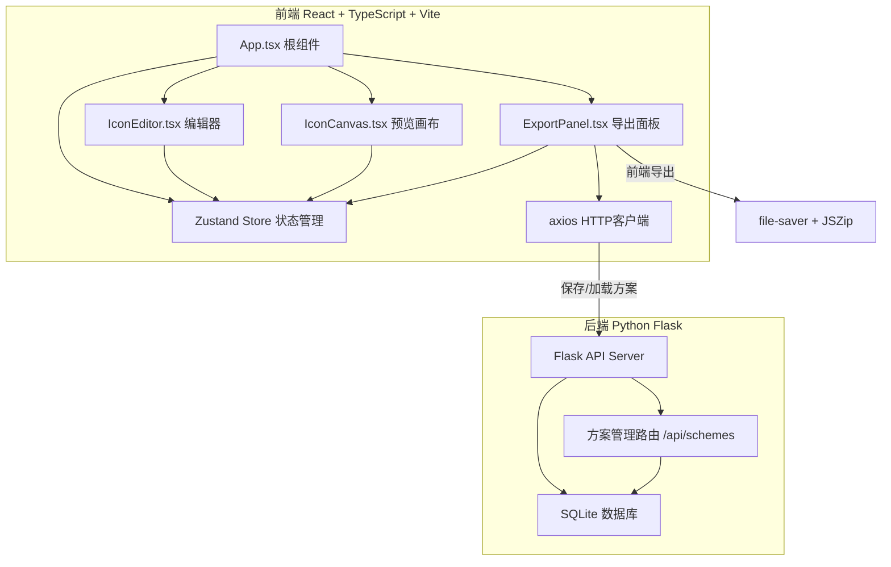
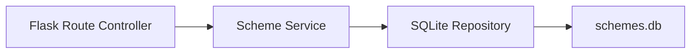
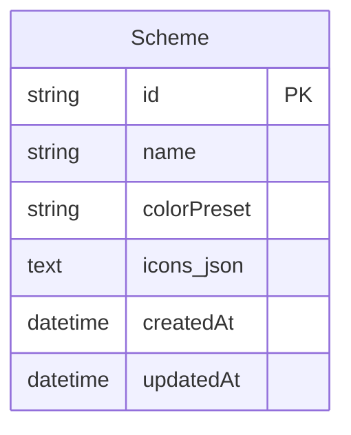

## 1. 架构设计



## 2. 技术说明

- **前端**：React@18 + TypeScript + Vite + Tailwind CSS + Zustand
- **初始化工具**：vite-init (react-ts 模板)
- **后端**：Python Flask + SQLite
- **数据库**：SQLite（方案存储）
- **关键依赖**：
  - re-resizable：编辑面板宽度拖拽
  - file-saver：前端文件下载
  - jszip：前端ZIP打包
  - axios：HTTP请求
  - zustand：状态管理

## 3. 路由定义

| 路由 | 用途 |
|------|------|
| / | 主编辑页面（单页应用，无路由切换） |

## 4. API 定义

### 4.1 TypeScript 类型定义

```typescript
interface IconConfig {
  id: string;
  name: string;
  shape: 'square' | 'circle' | 'triangle' | 'cross' | 'star' | 'arrow' | 'heart' | 'diamond';
  strokeWidth: number;
  strokeColor: string;
  borderRadius: number;
  fillType: 'solid' | 'linear-gradient' | 'radial-gradient' | 'none';
  fillColor: string;
  gradientStops: { offset: number; color: string }[];
  gradientAngle: number;
}

interface Scheme {
  id: string;
  name: string;
  colorPreset: string;
  icons: IconConfig[];
  createdAt: string;
  updatedAt: string;
}
```

### 4.2 API 端点

| 方法 | 路径 | 请求体 | 响应 | 用途 |
|------|------|--------|------|------|
| GET | /api/schemes | - | `{ schemes: Scheme[] }` | 获取所有方案列表 |
| GET | /api/schemes/:id | - | `{ scheme: Scheme }` | 获取单个方案详情 |
| POST | /api/schemes | `{ name, colorPreset, icons }` | `{ scheme: Scheme }` | 创建新方案 |
| PUT | /api/schemes/:id | `{ name, colorPreset, icons }` | `{ scheme: Scheme }` | 更新方案 |
| DELETE | /api/schemes/:id | - | `{ success: boolean }` | 删除方案 |

## 5. 服务端架构图



## 6. 数据模型

### 6.1 数据模型定义



### 6.2 数据定义语言

```sql
CREATE TABLE IF NOT EXISTS schemes (
    id TEXT PRIMARY KEY,
    name TEXT NOT NULL,
    color_preset TEXT DEFAULT '',
    icons_json TEXT NOT NULL DEFAULT '[]',
    created_at TIMESTAMP DEFAULT CURRENT_TIMESTAMP,
    updated_at TIMESTAMP DEFAULT CURRENT_TIMESTAMP
);
```

## 7. 文件结构与调用关系

```
项目根目录/
├── package.json                    # 前端依赖与脚本
├── index.html                      # 入口HTML
├── tsconfig.json                   # TypeScript配置
├── vite.config.ts                  # Vite构建配置
├── src/
│   ├── App.tsx                     # 根组件 → 管理布局，分发iconConfig
│   ├── main.tsx                    # 入口
│   ├── store/
│   │   └── iconStore.ts            # Zustand store → 全局状态
│   ├── components/
│   │   ├── IconEditor.tsx          # 编辑器 → 输出iconConfig到store
│   │   ├── IconCanvas.tsx          # 预览画布 ← 读取iconConfig渲染SVG
│   │   ├── ExportPanel.tsx         # 导出面板 ← 读取集合，调用file-saver/axios
│   │   ├── ShapeSelector.tsx       # 形状选择器子组件
│   │   ├── GradientEditor.tsx      # 渐变编辑器子组件
│   │   ├── ColorPicker.tsx         # 颜色选择器子组件
│   │   └── IconCollection.tsx      # 图标集合列表子组件
│   ├── utils/
│   │   ├── svgRenderer.ts          # SVG生成工具
│   │   └── exportUtils.ts          # 导出工具（PNG/ZIP生成）
│   ├── types/
│   │   └── index.ts                # TypeScript类型定义
│   └── styles/
│       └── main.css                # 全局样式与CSS变量
├── backend/
│   ├── app.py                      # Flask应用入口
│   ├── models.py                   # 数据模型
│   ├── routes.py                   # API路由
│   ├── requirements.txt            # Python依赖
│   └── schemes.db                  # SQLite数据库（运行时生成）
```

### 数据流向

1. **编辑流向**：用户交互 → IconEditor → Zustand Store → IconCanvas（实时预览）
2. **导出流向**：ExportPanel → 读取Store集合 → svgRenderer/exportUtils → file-saver下载
3. **方案保存流向**：ExportPanel → axios POST → Flask API → SQLite
4. **方案加载流向**：用户选择方案 → axios GET → Flask API → SQLite → Zustand Store → 编辑器+画布同步恢复
