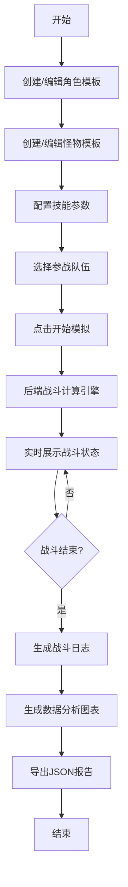

## 1. 产品概述

游戏数值平衡模拟器是一款面向游戏策划和独立游戏开发者的专业工具，旨在解决回合制RPG游戏中手动调整角色属性、技能伤害和怪物数值时难以预测对局结果的问题。通过可视化的战斗模拟和详细的数据分析报告，帮助开发者快速迭代和优化游戏数值设计。

- 核心价值：将繁琐的手动数值测试转化为自动化模拟，大幅提升数值平衡调整效率
- 目标用户：游戏策划、独立游戏开发者、数值设计师
- 市场定位：专业游戏开发辅助工具，填补游戏数值设计可视化工具的市场空白

## 2. 核心功能

### 2.1 用户角色

| 角色 | 注册方式 | 核心权限 |
|------|----------|----------|
| 普通用户 | 无需注册，直接使用 | 创建/编辑角色与怪物模板、执行战斗模拟、查看战斗日志、生成分析报告、导出数据 |

### 2.2 功能模块

1. **角色/怪物编辑模块**：创建和管理角色与怪物模板，属性可视化编辑，技能配置
2. **战斗模拟模块**：回合制自动战斗推演，实时状态展示，模拟进度控制
3. **战斗日志模块**：时间线式日志回放，伤害飘字效果，筛选与跳转功能
4. **数据分析模块**：多维度战斗数据图表展示，JSON格式导出

### 2.3 页面详情

| 页面名称 | 模块名称 | 功能描述 |
|-----------|-------------|---------------------|
| 主页面 | 左侧编辑面板 | 角色/怪物卡片列表，新增/删除模板，点击卡片进入编辑模式，滑块实时调节属性值 |
| 主页面 | 中间控制面板 | 队伍配置（最多4v4），开始模拟按钮，战斗过程实时状态展示（回合数、存活单位、血量变化） |
| 主页面 | 右侧日志面板 | 战斗日志时间线，按回合分组展示，筛选功能，跳转指定回合，伤害数值动画效果 |
| 主页面 | 分析报告区域 | 柱状图展示伤害输出对比，饼图展示关键数据占比，导出JSON按钮 |

## 3. 核心流程

用户首先在左侧面板创建并配置角色和怪物模板，通过卡片上的滑块调整各项属性值并配置技能。然后在中间区域选择参战队伍（最多4个角色对4个怪物），点击"开始模拟"按钮触发战斗。系统自动进行回合制战斗推演，实时展示当前回合数和双方血量变化。战斗结束后，右侧面板展示完整战斗日志，下方显示数据分析图表。用户可筛选日志、跳转到指定回合，或导出JSON格式的分析报告用于进一步分析。

## 4. 用户界面设计

### 4.1 设计风格

- **整体风格**：深色游戏化UI，科技感与游戏美学结合
- **主色调**：深灰蓝 #1a1a2e（背景），暗紫 #16213e（次级背景），亮橙 #e94560（强调色）
- **字体**：JetBrains Mono 等宽字体，增强科技感
- **按钮样式**：圆角矩形（圆角8px），半透明底色，悬停时变为纯色，0.3秒过渡动画
- **进度条**：颜色根据数值从绿色（低）渐变到红色（高）
- **图标风格**：游戏化职业/种族图标，Lucide图标库补充

### 4.2 页面设计概述

| 页面名称 | 模块名称 | UI元素 |
|-----------|-------------|-------------|
| 主页面 | 左侧编辑面板 | 卡片式布局，属性进度条，滑块控件，技能编辑弹窗，职业图标，颜色渐变动画 |
| 主页面 | 中间控制面板 | 队伍槽位，开始按钮（脉冲动画），实时状态面板，回合计数器，血量条动画 |
| 主页面 | 右侧日志面板 | 时间线布局，深色日志卡片，伤害数值飘字动画（暴击放大1.5倍橙色高亮），Miss红色特效，筛选下拉框 |
| 主页面 | 分析报告区域 | 渐变柱状图（蓝紫-橙红），圆环饼图，悬停缩放动画，导出按钮 |

### 4.3 响应式设计

- **桌面端**（>1024px）：三栏布局，可拖拽调整面板宽度（拖拽手柄6px，col-resize光标）
- **平板/移动端**（≤1024px）：左右面板折叠为可展开侧边栏，中间面板全宽展示，侧边栏展开带动画过渡
- **触摸优化**：滑块和按钮尺寸适配触摸操作，确保最小点击区域44x44px

### 4.4 交互动效

- **滑块调节**：0.3秒平滑过渡动画，伴随轻微拨动音效
- **伤害数值**：暴击时数值放大1.5倍，橙色高亮，0.5秒后淡出
- **闪避效果**："Miss"红色飘字效果
- **图表交互**：鼠标悬停扇区时显示具体数值和占比，0.2秒缩放动画
- **面板拖拽**：6px宽拖拽手柄，悬停时变为col-resize光标
- **日志滚动**：自动滚动到最新回合，平滑滚动效果
