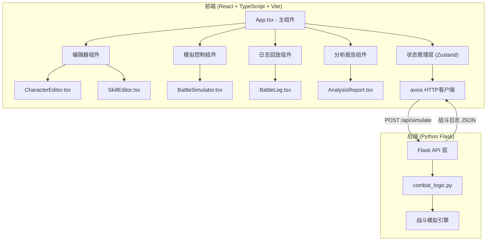
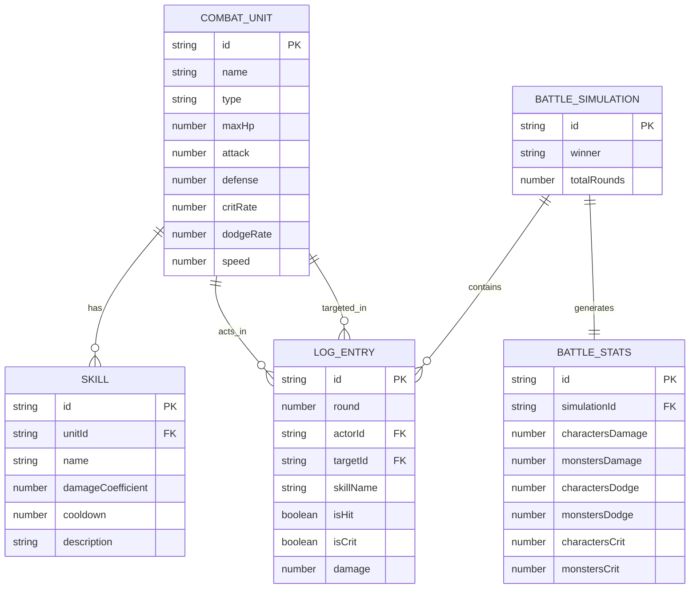

## 1. 架构设计

本项目采用前后端分离架构，前端负责界面展示、状态管理和用户交互，后端专注于战斗模拟的核心逻辑计算。



## 2. 技术描述

### 前端技术栈
- **框架**：React@18 + TypeScript@5
- **构建工具**：Vite@5
- **状态管理**：Zustand@4
- **图表库**：Recharts@2
- **HTTP客户端**：Axios@1
- **图标库**：Lucide React@0.344
- **样式方案**：TailwindCSS@3 + CSS Variables

### 后端技术栈
- **Web框架**：Flask@3
- **Python版本**：3.9+
- **跨域支持**：Flask-CORS@4

### 初始化工具
使用 vite-init 创建 React + TypeScript 项目模板

## 3. 目录结构

```
项目根目录
├── package.json              # 前端依赖配置
├── tsconfig.json             # TypeScript 配置
├── vite.config.js            # Vite 构建配置
├── index.html                # 入口 HTML
├── requirements.txt          # Python 依赖
├── src/
│   ├── App.tsx               # 主应用组件
│   ├── main.tsx              # 入口文件
│   ├── index.css             # 全局样式
│   ├── types/                # TypeScript 类型定义
│   │   └── index.ts
│   ├── store/                # 状态管理
│   │   └── useGameStore.ts
│   ├── utils/                # 工具函数
│   │   ├── audio.ts          # 音效播放
│   │   └── color.ts          # 颜色计算
│   ├── components/
│   │   ├── editor/           # 编辑器组件
│   │   │   ├── CharacterEditor.tsx
│   │   │   └── SkillEditor.tsx
│   │   ├── simulation/       # 模拟组件
│   │   │   ├── BattleSimulator.tsx
│   │   │   └── BattleLog.tsx
│   │   └── analysis/         # 分析组件
│   │       └── AnalysisReport.tsx
│   └── modules/
│       └── combatEngine/     # 后端 Python 模块
│           ├── combat_logic.py
│           └── app.py        # Flask API
└── .trae/
    └── documents/
        ├── PRD.md
        └── technical-architecture.md
```

## 4. 类型定义

```typescript
// 技能定义
interface Skill {
  id: string;
  name: string;
  damageCoefficient: number;  // 伤害系数 0.5-3.0
  cooldown: number;           // 冷却回合数
  currentCooldown: number;    // 当前冷却剩余
  description: string;        // 特效描述
}

// 战斗单位（角色/怪物）
interface CombatUnit {
  id: string;
  name: string;
  type: 'character' | 'monster';
  icon: string;               // 职业/种族图标
  maxHp: number;              // 最大生命值 100-2000
  currentHp: number;          // 当前生命值
  attack: number;             // 攻击力 10-500
  defense: number;            // 防御力 5-300
  critRate: number;           // 暴击率 0-100%
  dodgeRate: number;          // 闪避率 0-50%
  speed: number;              // 速度 1-200
  skills: Skill[];            // 最多3个技能
  isAlive: boolean;
}

// 战斗日志条目
interface LogEntry {
  id: string;
  round: number;
  actorId: string;
  actorName: string;
  targetId: string;
  targetName: string;
  skillName: string;
  isHit: boolean;
  isCrit: boolean;
  damage: number;
  timestamp: number;
}

// 战斗模拟请求
interface SimulateRequest {
  characters: CombatUnit[];   // 最多4个
  monsters: CombatUnit[];     // 最多4个
  maxRounds?: number;         // 默认100
}

// 战斗模拟响应
interface SimulateResponse {
  success: boolean;
  winner: 'characters' | 'monsters' | 'draw';
  totalRounds: number;
  logs: LogEntry[];
  stats: BattleStats;
}

// 战斗统计数据
interface BattleStats {
  totalDamageBySide: {
    characters: number;
    monsters: number;
  };
  totalHealing: number;
  dodgeCount: {
    characters: number;
    monsters: number;
  };
  critCount: {
    characters: number;
    monsters: number;
  };
  damageByUnit: Record<string, number>;
}
```

## 5. API 定义

### POST /api/simulate
发起战斗模拟请求

**请求体：**
```json
{
  "characters": [
    {
      "id": "char1",
      "name": "战士",
      "type": "character",
      "icon": "⚔️",
      "maxHp": 1000,
      "currentHp": 1000,
      "attack": 150,
      "defense": 100,
      "critRate": 20,
      "dodgeRate": 10,
      "speed": 80,
      "skills": [
        {
          "id": "skill1",
          "name": "猛击",
          "damageCoefficient": 1.5,
          "cooldown": 2,
          "currentCooldown": 0,
          "description": "造成150%攻击力伤害"
        }
      ],
      "isAlive": true
    }
  ],
  "monsters": [...],
  "maxRounds": 100
}
```

**响应体：**
```json
{
  "success": true,
  "winner": "characters",
  "totalRounds": 25,
  "logs": [
    {
      "id": "log1",
      "round": 1,
      "actorId": "char1",
      "actorName": "战士",
      "targetId": "mon1",
      "targetName": "哥布林",
      "skillName": "普通攻击",
      "isHit": true,
      "isCrit": false,
      "damage": 85,
      "timestamp": 1718567890000
    }
  ],
  "stats": {
    "totalDamageBySide": {
      "characters": 2500,
      "monsters": 1800
    },
    "totalHealing": 0,
    "dodgeCount": {
      "characters": 3,
      "monsters": 5
    },
    "critCount": {
      "characters": 8,
      "monsters": 4
    },
    "damageByUnit": {
      "char1": 1500,
      "char2": 1000
    }
  }
}
```

## 6. 数据模型

### 6.1 实体关系图



## 7. 核心战斗逻辑（后端）

### 战斗流程算法：
1. **初始化**：深拷贝所有单位，初始化技能冷却为0
2. **回合循环**（最多100回合）：
   - 按速度排序所有存活单位
   - 每个单位行动：
     - 检查是否存活
     - 减少所有技能冷却
     - AI决策：选择技能（优先冷却结束的高伤害技能）和目标（优先血量最低的敌人）
     - 命中判定：随机数 vs 目标闪避率
     - 暴击判定：随机数 vs 攻击者暴击率
     - 伤害计算：攻击 * 技能系数 * (暴击?1.5:1) * (1 - 防御/(防御+100))
     - 更新目标生命值
     - 记录日志条目
3. **胜负判定**：检查一方是否全灭，或达到最大回合数
4. **统计计算**：汇总伤害、闪避、暴击等数据

### 性能优化：
- 使用纯Python原生数据结构，避免外部依赖
- 每回合计算复杂度 O(n log n) 排序 + O(n) 行动，n≤8
- 100回合计算时间 < 100ms，远低于3秒要求

## 8. 前端性能优化

1. **战斗日志虚拟滚动**：使用 Intersection Observer 或自定义虚拟滚动，仅渲染可见区域日志条目，确保500条日志滚动帧率≥55fps
2. **状态更新批处理**：模拟过程中使用 requestAnimationFrame 批量更新状态，避免频繁重渲染
3. **组件记忆化**：使用 React.memo、useMemo、useCallback 优化重渲染
4. **图表懒加载**：分析报告图表仅在模拟完成后渲染
5. **Web Audio API**：音效使用轻量级AudioContext，不加载外部音频文件
