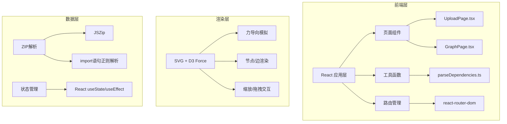

## 1. 架构设计



## 2. 技术描述

- **前端框架**: React@18 + TypeScript@5
- **构建工具**: Vite@5 + @vitejs/plugin-react@4
- **路由**: react-router-dom@6
- **力导向图**: d3-force@3
- **ZIP解析**: jszip@3
- **图标**: lucide-react@0.344
- **状态管理**: React Hooks (useState, useEffect, useRef, useCallback)

## 3. 路由定义

| 路由 | 用途 |
|------|------|
| / | 上传页面，接收ZIP文件并解析 |
| /graph | 力导向图页面，展示依赖关系可视化 |

## 4. 数据模型

### 4.1 类型定义

```typescript
// 文件节点
interface FileNode {
  id: string;           // 文件路径标识
  name: string;         // 文件名
  path: string;         // 完整路径
  type: 'component' | 'util' | 'config' | 'style' | 'other';
  lineCount: number;    // 行数
  imports: string[];    // 导入的文件路径列表
  importedBy: string[]; // 被哪些文件导入
  x?: number;           // 力导向X坐标
  y?: number;           // 力导向Y坐标
  fx?: number;          // 固定X坐标（拖拽后）
  fy?: number;          // 固定Y坐标（拖拽后）
  radius: number;       // 节点半径
}

// 依赖边
interface DependencyEdge {
  id: string;
  source: string;       // 源文件ID
  target: string;       // 目标文件ID
  depth: number;        // 依赖深度（用于颜色渐变）
}

// 解析结果
interface ParseResult {
  nodes: FileNode[];
  edges: DependencyEdge[];
  stats: {
    totalFiles: number;
    totalDependencies: number;
    fileTypes: Record<string, number>;
  };
}

// 上传文件信息
interface UploadedFile {
  name: string;
  size: number;
  lastModified: Date;
  file: File;
}
```

### 4.2 文件类型判断规则

| 文件类型 | 匹配规则 |
|---------|----------|
| component | \*.tsx, \*.jsx 且路径包含 components/ 或 pages/ |
| util | \*.ts, \*.js 且路径包含 utils/ 或 helpers/ 或 lib/ |
| config | vite.config.*, webpack.config.*, tsconfig.*, package.json, .eslintrc* |
| style | \*.css, \*.scss, \*.less, \*.style.* |
| other | 不匹配以上规则 |

## 5. 核心模块说明

### 5.1 parseDependencies.ts 核心流程

1. **ZIP读取**: 使用 JSZip 异步读取ZIP文件内容
2. **文件过滤**: 
   - 忽略 node_modules/, dist/, build/, .git/ 目录
   - 仅保留 .js, .jsx, .ts, .tsx 后缀文件
3. **Import解析**: 正则匹配 ES6 import / CommonJS require 语句
   - `import ... from 'path'`
   - `import 'path'`
   - `require('path')`
4. **路径解析**: 
   - 相对路径解析: `./utils` → 基于当前文件路径
   - 别名映射: `@/components` → src/components
5. **依赖图构建**: 建立节点间的导入/被导入双向关系

### 5.2 GraphPage.tsx 渲染流程

1. **数据初始化**: 接收路由传递的 nodes 和 edges 数据
2. **力模拟创建**: d3.forceSimulation 配置
   - force('link'): 边力
   - force('charge'): 节点斥力
   - force('center'): 中心引力
   - force('collision'): 碰撞检测
3. **SVG渲染**: 使用 React 渲染 <svg> 元素
   - <defs>: 箭头标记定义
   - <g.links>: 所有边 <line>
   - <g.nodes>: 所有节点 <g>（包含 <circle> + <text>）
4. **交互绑定**:
   - 缩放: d3.zoom() 绑定到SVG
   - 拖拽: d3.drag() 绑定到节点，更新 fx/fy
   - 悬停/点击: React 事件处理器

### 5.3 性能优化策略

1. **节点半径计算**: `Math.min(60, Math.max(20, Math.sqrt(lineCount) * 2))`
2. **批量渲染**: 使用 requestAnimationFrame 分批更新节点位置
3. **事件节流**: 滚动/缩放事件使用 requestAnimationFrame 节流
4. **选择器优化**: 高亮时仅更新 opacity 属性，避免重排
5. **力模拟衰减**: 模拟冷却后停止 tick 事件监听
