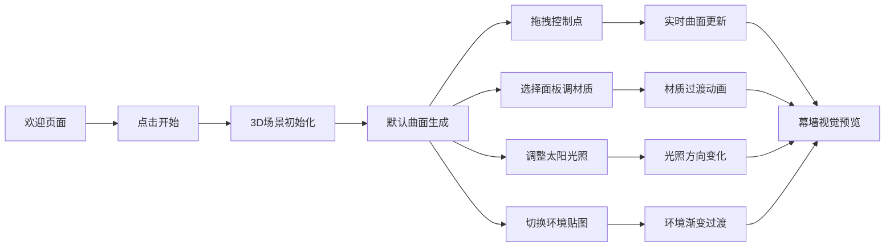

## 1. 产品概述

参数化曲面幕墙设计器是一款面向建筑设计师的浏览器端3D交互应用，解决传统CAD软件中手动调整复杂曲面网格效率低、难以实时预览光照反射效果的痛点。用户通过拖拽控制点即可生成平滑的Catmull-Rom样条曲面幕墙，并实时调整面板材质与光照环境，直观呈现建筑表皮的视觉效果。

- **目标用户**：建筑设计师、幕墙设计师、建筑可视化从业者
- **核心价值**：参数化快速建模、实时材质预览、光照模拟、所见即所得

## 2. 核心功能

### 2.1 用户角色

| 角色 | 注册方式 | 核心权限 |
|------|----------|----------|
| 建筑设计师 | 无需注册，直接使用 | 创建曲面幕墙、调整材质、模拟光照、导出预览 |

### 2.2 功能模块

1. **主场景区**：3D视口展示幕墙曲面、控制点、光照效果
2. **侧边控制面板**：控制点编辑、材质参数调节、光照环境控制
3. **迷你地图**：俯视图展示控制点布局与相机朝向
4. **环境预设系统**：晴空/黄昏/阴天三种环境贴图切换

### 2.3 页面详情

| 页面名称 | 模块名称 | 功能描述 |
|----------|----------|----------|
| 主应用页 | 3D场景渲染 | 全屏Three.js渲染，支持轨道控制器旋转缩放 |
| 主应用页 | 控制点编辑 | 至少6个金色可拖拽球体，实时更新曲面 |
| 主应用页 | 材质面板 | 批量选择面板，调节颜色/透明度/金属度/粗糙度 |
| 主应用页 | 光照控制盘 | 圆形拖拽控制太阳方位角与高度角 |
| 主应用页 | 环境切换 | 三种预设环境贴图1秒渐变过渡 |
| 主应用页 | 迷你小地图 | 150x150px俯视图，显示控制点与相机方向 |

## 3. 核心流程

用户打开应用 → 进入欢迎界面 → 点击开始进入设计器 → 默认生成6个控制点的曲面 → 拖拽控制点调整曲面形状 → 选择面板批量调整材质 → 拖动光照控制盘调整太阳角度 → 切换环境贴图观察反射效果 → 实时预览幕墙视觉表现

## 4. 用户界面设计

### 4.1 设计风格

- **主色调**：深蓝灰色系（#1a1a2e → #16213e 渐变背景）
- **强调色**：金色高光（用于控制点、选中高亮、控制盘图标）
- **交互反馈色**：蓝色发光描边 #4488ff
- **面板色**：半透明深灰 rgba(30,30,50,0.85)
- **视觉风格**：科技感、精致、专业建筑设计工具氛围
- **动效风格**：平滑过渡、淡入淡出、发光反馈

### 4.2 页面设计概览

| 页面名称 | 模块名称 | UI元素 |
|----------|----------|--------|
| 欢迎页 | 标题区 | 半透明标题文字、金色装饰线、开始按钮 |
| 设计器主页面 | 左侧面板 | 280px宽半透明浮动面板，分区卡片式布局，细分割线 |
| 设计器主页面 | 控制点编辑区 | 坐标输入框、添加/删除控制点按钮 |
| 设计器主页面 | 材质调节区 | 颜色选择器、滑动条（透明度/金属度/粗糙度） |
| 设计器主页面 | 光照控制区 | 120px圆形光照控制盘、太阳图标、角度数值 |
| 设计器主页面 | 环境切换区 | 三个环境预设按钮、选中状态高亮 |
| 设计器主页面 | 迷你地图 | 150x150px右下角悬浮、边框交互发光 |
| 设计器主页面 | 汉堡菜单 | 窄屏时左侧滑出抽屉 |

### 4.3 响应式

- **桌面端**（>768px）：左侧固定面板 + 主场景 + 右下角小地图
- **移动端/窄屏**（<768px）：左侧汉堡菜单按钮，点击抽屉滑出控制面板
- **触摸优化**：控制点拖拽支持触摸操作，滑动条支持触控

### 4.4 3D场景指引

- **环境与氛围**：三种预设HDR环境（晴空明亮、黄昏暖调、阴天柔和），背景与环境光同步渐变
- **光照设置**：主方向光模拟太阳，可调节方位角与高度角，强度随高度角变化；环境光配合环境贴图
- **相机设置**：PerspectiveCamera，轨道控制器支持旋转/缩放/平移，初始视角45度俯视
- **构图与焦点**：曲面幕墙居中展示，金色控制点醒目，高光反射为视觉焦点
- **交互与动画**：控制点拖拽实时更新曲面（≥30FPS），材质过渡0.2秒，环境切换1秒渐变
- **后处理效果**：面板高光反射、材质金属质感、环境贴图反射
- **资源与性能**：300-500个四边形面板，整体保持40FPS以上
