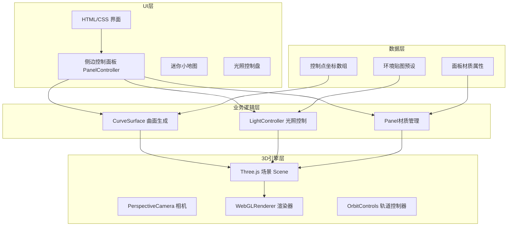

## 1. 架构设计



## 2. 技术选型

- **前端框架**：原生 TypeScript + Vite（无React，按需求指定文件结构）
- **3D引擎**：Three.js @0.160+（含 @types/three）
- **UI调试**：lil-gui（辅助调试，不替代主UI面板）
- **构建工具**：Vite @5+，内置TypeScript支持
- **语言**：TypeScript 严格模式，target ES2020

## 3. 文件组织结构

```
project-root/
├── package.json
├── index.html
├── tsconfig.json
├── vite.config.js
└── src/
    ├── main.ts              # 场景初始化与主循环
    ├── CurveSurface.ts      # Catmull-Rom样条曲面生成
    ├── PanelController.ts   # 侧边栏UI控制面板
    └── LightController.ts   # 环境贴图与日光源管理
```

### 3.1 模块职责

| 模块 | 职责 | 数据流向 |
|------|------|----------|
| main.ts | 场景初始化、相机/渲染器配置、动画循环、模块协调 | 接收各模块输出 → 渲染场景 |
| CurveSurface.ts | 控制点 → Catmull-Rom样条 → 四边形网格 → BufferGeometry | 控制点数组 → 曲面网格数据 |
| PanelController.ts | UI控件监听、用户交互、调用业务模块 | 用户操作 → 调用CurveSurface/LightController |
| LightController.ts | 环境贴图切换、太阳光照角度、材质反射更新 | 角度/环境参数 → 场景光照变化 |

## 4. 核心数据模型

### 4.1 控制点数据

```typescript
interface ControlPoint {
    id: string;
    x: number;
    y: number;
    z: number;
}
```

### 4.2 面板材质数据

```typescript
interface PanelMaterial {
    color: string;      // hex颜色
    opacity: number;    // 0.3 - 0.9
    metalness: number;  // 0.0 - 1.0
    roughness: number;  // 0.0 - 1.0
}
```

### 4.3 光照数据

```typescript
interface SunLight {
    azimuth: number;    // 方位角 0-360度
    altitude: number;   // 高度角 0-90度
    intensity: number;  // 光照强度
}

type EnvMapType = 'clearSky' | 'sunset' | 'cloudy';
```

## 5. 核心算法

### 5.1 Catmull-Rom 样条曲面生成

1. 接收 m×n 个控制点（至少2×3 = 6个）
2. 在U方向和V方向分别计算Catmull-Rom样条
3. 生成细分曲面网格（保证300-500个四边形面板）
4. 输出 BufferGeometry（含position、normal、uv属性）
5. 控制点变化时调用 updateControlPoints 实时更新

### 5.2 太阳角度计算

1. 方位角(azimuth)：绕Y轴旋转角度，0度为正Z方向
2. 高度角(altitude)：与水平面夹角，0度为水平，90度为天顶
3. 方向向量计算：`dir = (sin(az) * cos(alt), sin(alt), cos(az) * cos(alt))`

### 5.3 材质过渡动画

1. 记录起始材质参数与目标材质参数
2. 使用 requestAnimationFrame 在0.2秒内插值
3. 支持透明度、金属度、粗糙度、颜色的平滑过渡

## 6. 性能优化策略

- **几何体复用**：使用 BufferGeometry，更新时仅修改position属性
- **材质批量**：选中面板使用统一材质实例，避免大量材质创建
- **帧率控制**：拖拽操作时使用节流，保证≥30FPS，目标40FPS+
- **射线检测优化**：面板选择使用 Raycaster，合理设置检测层级

## 7. 构建与运行

- **开发命令**：`npm run dev`
- **构建命令**：`npm run build`
- **依赖安装**：`npm install`
- **入口文件**：index.html
