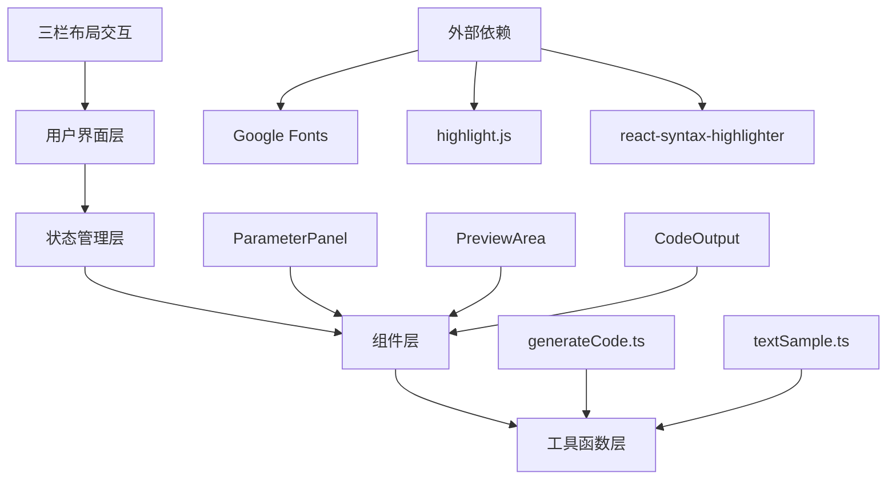

## 1. 架构设计



## 2. 技术描述

- **前端框架**：React 18 + TypeScript
- **构建工具**：Vite 5
- **状态管理**：React Hooks (useState, useEffect, useMemo, useCallback)
- **代码高亮**：react-syntax-highlighter + highlight.js
- **字体加载**：@fontsource 系列字体包（Roboto, Noto Sans SC, Playfair Display, Source Code Pro）
- **性能优化**：React.memo, useMemo, useCallback, requestAnimationFrame

## 3. 目录结构

```
e:\solo\SoloAutoDemoDuo\tasks\auto35\
├── index.html                      # 入口HTML
├── package.json                    # 依赖配置
├── tsconfig.json                   # TypeScript配置
├── vite.config.js                  # Vite配置
└── src\
    ├── App.tsx                     # 主应用组件
    ├── components\
    │   ├── ParameterPanel.tsx      # 参数控制面板
    │   ├── PreviewArea.tsx         # 预览区域
    │   └── CodeOutput.tsx          # 代码输出面板
    └── utils\
        ├── generateCode.ts         # CSS代码生成
        └── textSample.ts           # 多语言示例文本
```

## 4. 类型定义

```typescript
interface TypographyParams {
  fontFamily: string;
  fontSize: number;      // 12-80px
  lineHeight: number;    // 1.0-2.5
  letterSpacing: number; // -0.1 to 0.5em
  textAlign: 'left' | 'center' | 'right' | 'justify';
  containerWidth: number; // 320-1280px
}

interface FontOption {
  name: string;
  label: string;
  cssValue: string;
  category: 'chinese' | 'english' | 'monospace' | 'serif';
}
```

## 5. 核心模块说明

### 5.1 App.tsx - 主布局组件
- 管理全局排版参数状态
- 处理响应式布局切换（监听window.resize）
- 控制左侧参数面板折叠/展开状态
- 协调子组件间的参数传递

### 5.2 ParameterPanel.tsx - 参数控制面板
- 字体选择器：5种字体卡片网格，选中高亮过渡
- 滑块组件：自定义样式，渐变轨道随值变化
- 对齐方式按钮组：4种对齐切换
- 所有控件通过onParamsChange回调向上传递

### 5.3 PreviewArea.tsx - 预览区域
- 使用React.memo包装，避免不必要重渲染
- 文本过渡动画：0.3s CSS transition
- 行数计算：使用DOM Range API精确计算
- 平均字符数：总字符数 / 行数
- 光标动画：伪元素实现闪烁下划线

### 5.4 CodeOutput.tsx - 代码输出
- 调用generateCode生成CSS字符串
- react-syntax-highlighter实现语法高亮
- 一键复制：navigator.clipboard.writeText
- 复制反馈：0.2s背景色过渡动画

### 5.5 generateCode.ts - 代码生成
- 纯函数，无React依赖
- 接收TypographyParams，返回格式化CSS
- 支持CSS变量和Tailwind类名两种输出格式

## 6. 性能优化策略

1. **状态最小化**：仅在App.tsx中维护单一状态源
2. **React.memo**：PreviewArea和CodeOutput使用memo包装
3. **useCallback**：事件处理函数使用useCallback缓存
4. **useMemo**：计算行数和平均字符数使用useMemo
5. **CSS过渡**：优先使用transform和opacity属性实现动画
6. **字体预加载**：关键字体使用font-display: swap
7. **节流处理**：滑块事件使用requestAnimationFrame节流

## 7. 数据模型

### 7.1 字体配置
```typescript
const FONT_OPTIONS: FontOption[] = [
  { name: 'noto-sans-sc', label: 'Noto Sans SC', cssValue: '"Noto Sans SC", sans-serif', category: 'chinese' },
  { name: 'roboto', label: 'Roboto', cssValue: '"Roboto", sans-serif', category: 'english' },
  { name: 'playfair-display', label: 'Playfair Display', cssValue: '"Playfair Display", serif', category: 'serif' },
  { name: 'source-code-pro', label: 'Source Code Pro', cssValue: '"Source Code Pro", monospace', category: 'monospace' },
  { name: 'system-ui', label: 'System UI', cssValue: 'system-ui, -apple-system, sans-serif', category: 'english' }
];
```

### 7.2 默认参数
```typescript
const DEFAULT_PARAMS: TypographyParams = {
  fontFamily: 'noto-sans-sc',
  fontSize: 16,
  lineHeight: 1.6,
  letterSpacing: 0,
  textAlign: 'left',
  containerWidth: 720
};
```
